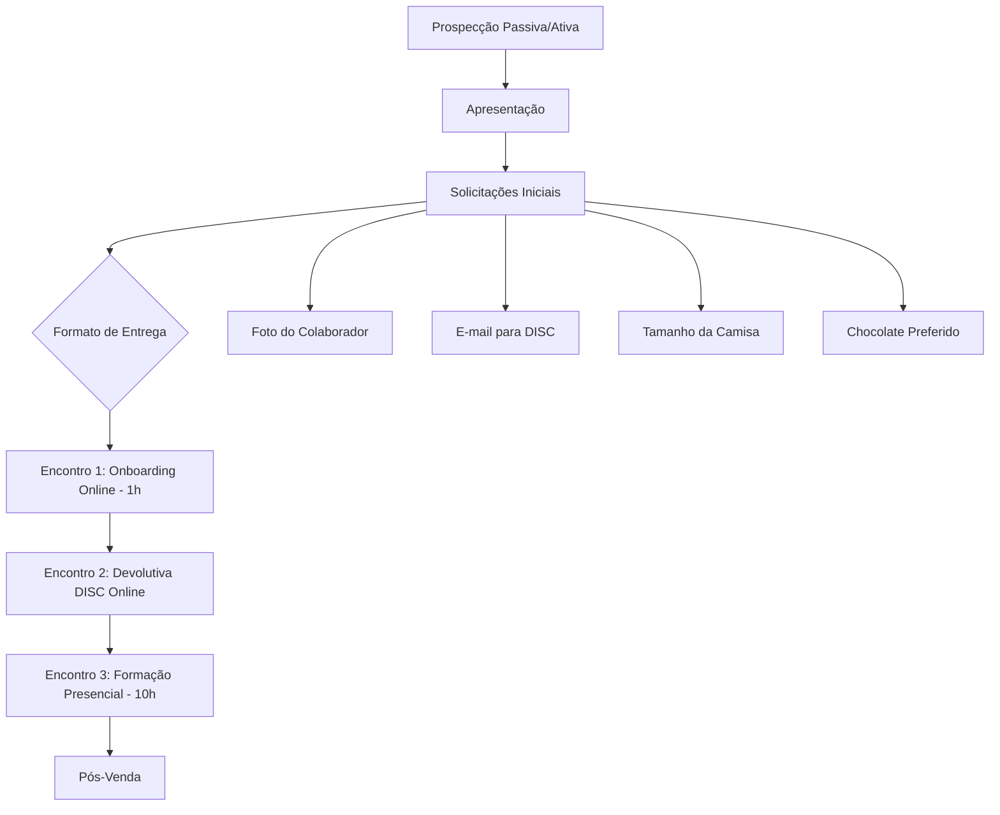
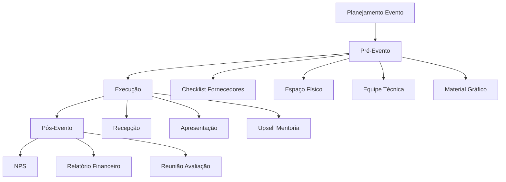

# Análise Completa Mottivme Educação
## Mapeamento Cirúrgico da Vertical Educacional

### 📊 VISÃO GERAL EXECUTIVA

A **Mottivme Educação** representa uma vertical estratégica focada em **mentoria empresarial** e **eventos de alto valor**, com produtos que variam de **R$ 497 a R$ 36.000**, operando através de:

- **Mentorias Individuais e em Grupo**
- **Eventos/Imersões Presenciais**
- **Formações Especializadas**
- **Consultoria Estratégica Empresarial**

---

## 🎯 ESTEIRA DE PRODUTOS EDUCACIONAIS

### **Produtos Identificados:**

| Produto | Valor | Formato | Duração | Status Automação |
|---------|-------|---------|---------|------------------|
| **Mentoria 10K** | R$ 1.497 - R$ 2.000 | Individual/Grupo | 3 encontros | 20% Manual |
| **Formação Consultor Emagrecimento** | R$ 497 | Online | - | 90% Manual |
| **Formação Aromaterapia** | R$ 497 | Online | - | 90% Manual |
| **Desafio 14 dias Alpha Fit** | R$ 497 | Online | 14 dias | 70% Manual |
| **Imersão "O Mapa do Seu Negócio"** | R$ 1.497 (50% desc) / R$ 1.497 normal | Presencial | 1-2 dias | 95% Manual |
| **Mentoria VIP Pós-Imersão** | R$ 1.497 - R$ 2.000 | Híbrido | - | 85% Manual |
| **Consultoria Estratégica Completa** | R$ 15.000 - R$ 36.000 | Presencial | 3-6 meses | 100% Manual |

### **Análise de Receita Potencial:**
- **Evento com 40 pessoas**: R$ 44.940 (com upsells)
- **Consultoria Premium**: R$ 15.000 - R$ 36.000 por cliente
- **Mentorias Recorrentes**: R$ 1.497 - R$ 2.000 por ciclo

---

## 🔄 FLUXOS DE PROCESSO IDENTIFICADOS

### **1. FLUXO DE VENDAS MENTORIA**



### **2. FLUXO DE EVENTOS/IMERSÕES**



---

## 🏢 ORGANOGRAMA MOTTIVME EDUCAÇÃO

### **Estrutura Organizacional Identificada:**

```
CEO - Marcos Daniel
├── Secretaria Executiva
│   ├── Agendamento de Reuniões
│   ├── Confirmações de Encontros
│   ├── Reserva de Salas/Hotéis
│   └── Pautas Reuniões Estratégicas
│
├── Diretora de Operações - Hallen
│   ├── Gerente Operações
│   ├── Especialista C.S (Customer Success)
│   ├── Onboarding
│   ├── Pós-Venda
│   ├── ADM/Financeiro
│   └── Jurídico
│
├── Comercial - Marcos Daniel
│   ├── Gestor Comercial
│   ├── Pré-Vendas
│   └── Vendas
│
├── Marketing
│   ├── Videomaker
│   ├── Editor de Vídeo
│   ├── Designer/Social Media
│   ├── Tráfego
│   └── Copywriter
│
└── Consultores Estratégicos
    ├── Especialistas em Diagnósticos
    │   ├── Processos
    │   ├── Pessoas e Liderança
    │   ├── Sistemas e Tecnologia
    │   └── Cultura
    ├── Especialistas em Criações
    └── Especialistas em Implantações
```

---

## 🎪 ESTRUTURA DE EVENTOS DETALHADA

### **Departamentos para Eventos:**

#### **1. Coordenação Geral**
- **Responsável**: Definir datas, capacidade, local
- **Meta**: 40 participantes por evento
- **Receita Alvo**: R$ 44.940 por evento

#### **2. Departamento Financeiro**
- **Contas a Pagar**: Hallen
- **Contas a Receber**: Daniel
- **Ferramentas**: EventBrite, Maquinetas, PIX

#### **3. Departamento Técnico**
- Som, Iluminação, Projeção
- Fotografia/Filmagem
- Material Gráfico, Certificados

#### **4. Departamento Comercial**
- Pré-Venda: Inside Sales
- Pós-Venda: NPS, Check-list
- Marketing: Inbound, Artes

---

## 🤖 OPORTUNIDADES DE AUTOMAÇÃO IDENTIFICADAS

### **QUICK WINS (ROI 300-500%)**

| Processo | Automação | Impacto | Investimento |
|----------|-----------|---------|--------------|
| **Agendamento Mentorias** | Calendly + Zapier | 80% redução tempo | R$ 500/mês |
| **Envio DISC** | Automação por e-mail | 90% automático | R$ 300/mês |
| **Follow-up Pós-Evento** | Sequência automatizada | 70% automático | R$ 400/mês |
| **Cobrança Eventos** | EventBrite + Notificações | 85% automático | R$ 600/mês |

### **IA FOUNDATION (ROI 400-600%)**

| Processo | IA/Automação | Impacto | Investimento |
|----------|---------------|---------|--------------|
| **Qualificação Leads** | ChatGPT + Formulários | 60% automático | R$ 1.500/mês |
| **Criação Conteúdo** | IA para Posts/E-mails | 50% automático | R$ 800/mês |
| **Análise NPS** | IA para Insights | 70% automático | R$ 600/mês |
| **Gestão Eventos** | CRM + IA Preditiva | 40% automático | R$ 2.000/mês |

### **ADVANCED AI (ROI 500-800%)**

| Processo | IA Avançada | Impacto | Investimento |
|----------|-------------|---------|--------------|
| **Mentoria Personalizada** | IA Coach Assistant | 30% automático | R$ 3.000/mês |
| **Análise Comportamental** | IA + DISC Avançado | 50% automático | R$ 2.500/mês |
| **Previsão Vendas** | ML para Eventos | 60% precisão | R$ 2.000/mês |

---

## 📈 ROADMAP DE IMPLEMENTAÇÃO

### **FASE 1: OTIMIZAÇÃO (0-3 meses)**
- **Investimento**: R$ 15.000
- **ROI Esperado**: 400%
- **Foco**: Automação básica, CRM, agendamentos

### **FASE 2: IA FOUNDATION (3-6 meses)**
- **Investimento**: R$ 25.000
- **ROI Esperado**: 500%
- **Foco**: Qualificação IA, conteúdo automatizado

### **FASE 3: ADVANCED AI (6-12 meses)**
- **Investimento**: R$ 40.000
- **ROI Esperado**: 700%
- **Foco**: Mentoria assistida por IA, análise preditiva

---

## 🎯 KPIs ESPECÍFICOS MOTTIVME EDUCAÇÃO

### **Comerciais:**
- **Taxa Conversão Evento**: 15-25%
- **Ticket Médio Mentoria**: R$ 1.748
- **Upsell Pós-Evento**: 30-40%
- **Recorrência Clientes**: 60%

### **Operacionais:**
- **Tempo Onboarding**: 2h → 30min
- **NPS Eventos**: >8.5
- **Ocupação Eventos**: 85%+
- **Margem Líquida**: 70%+

### **Automação:**
- **Processos Automatizados**: 20% → 70%
- **Tempo Resposta**: 24h → 2h
- **Eficiência Equipe**: +150%

---

## 💰 IMPACTO FINANCEIRO PROJETADO

### **Cenário Atual (Manual):**
- **Receita Mensal**: R$ 80.000
- **Margem**: 45%
- **Equipe**: 8 pessoas

### **Cenário Otimizado (12 meses):**
- **Receita Mensal**: R$ 200.000 (+150%)
- **Margem**: 70% (+25pp)
- **Equipe**: 6 pessoas (-25%)
- **ROI Consolidado**: 650%

---

## 🚀 PRÓXIMOS PASSOS RECOMENDADOS

### **IMEDIATO (7 dias):**
1. **Auditoria Técnica** dos processos atuais
2. **Implementação Calendly** para agendamentos
3. **Setup EventBrite** otimizado

### **CURTO PRAZO (30 dias):**
1. **CRM específico** para educação
2. **Automação e-mail** marketing
3. **Dashboard KPIs** em tempo real

### **MÉDIO PRAZO (90 dias):**
1. **IA para qualificação** de leads
2. **Plataforma integrada** eventos
3. **Análise preditiva** de vendas

---

## 📋 CONCLUSÃO EXECUTIVA

A **Mottivme Educação** possui um **potencial de crescimento exponencial** através da automação e IA, com oportunidades de:

- **Triplicar a receita** em 12 meses
- **Reduzir custos operacionais** em 30%
- **Aumentar satisfação do cliente** (NPS >9.0)
- **Escalar sem aumentar equipe**

**ROI Consolidado Projetado**: **650% em 12 meses**
**Payback**: **4-6 meses**

A integração com a **Mottivme Sales** criará uma **máquina de crescimento** sustentável e escalável.