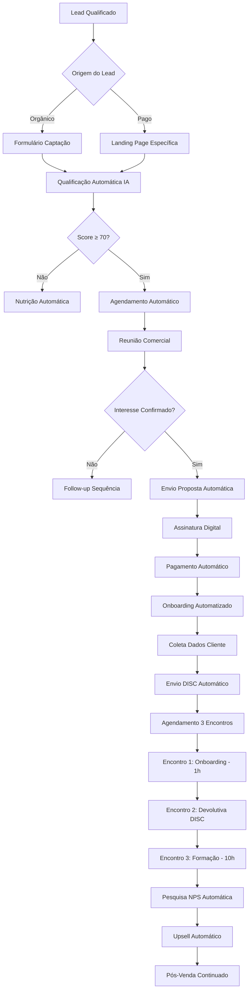
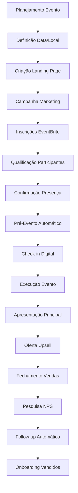
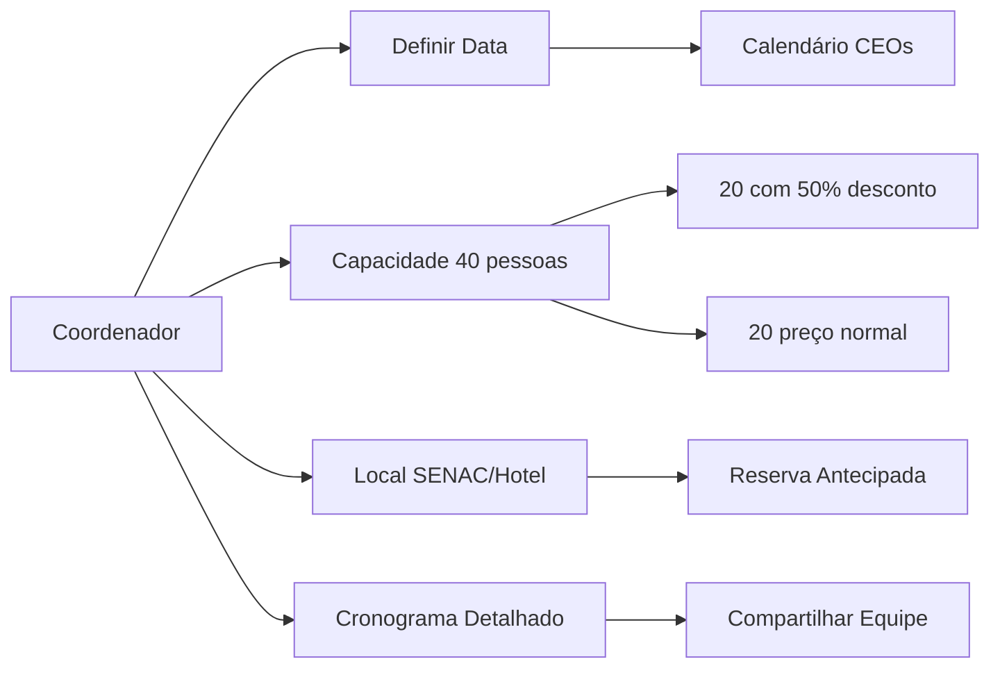
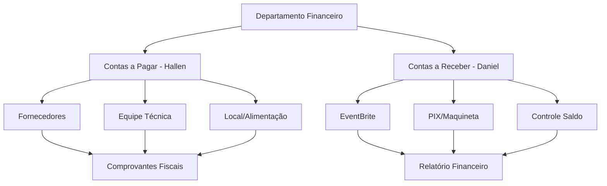
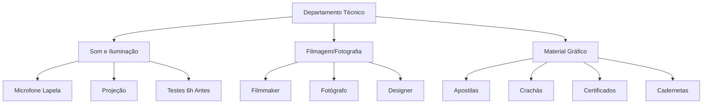
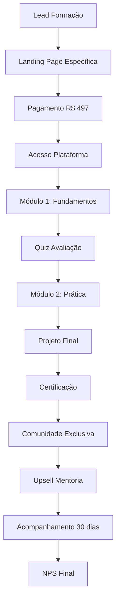
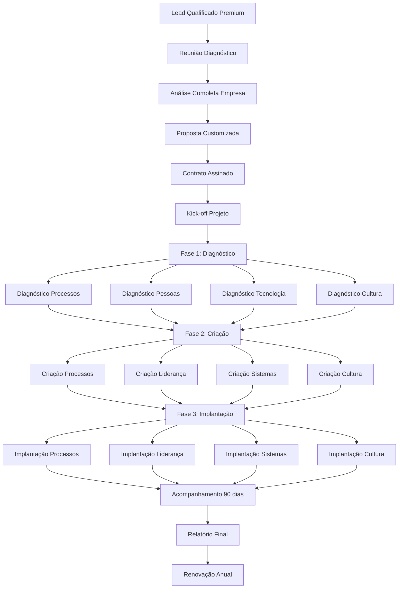

# Fluxogramas Processualizados - Mottivme Educação
## Mapeamento Cirúrgico de Todos os Processos

---

## 🎯 FLUXO 1: VENDAS DE MENTORIA INDIVIDUAL

### **Processo Atual vs Otimizado**

### **Detalhamento por Etapa:**

#### **ETAPA 1: CAPTAÇÃO E QUALIFICAÇÃO**
- **Atual**: 100% manual, 48h resposta
- **Otimizado**: 80% automático, 2h resposta
- **Ferramentas**: ChatGPT API, Typeform, Zapier

#### **ETAPA 2: COMERCIAL**
- **Atual**: Agendamento manual, proposta manual
- **Otimizado**: Calendly + proposta automática
- **Ferramentas**: Calendly, PandaDoc, Stripe

#### **ETAPA 3: ONBOARDING**
- **Atual**: E-mails manuais, coleta manual
- **Otimizado**: Sequência automatizada
- **Ferramentas**: ActiveCampaign, Typeform

#### **ETAPA 4: ENTREGA**
- **Atual**: Agendamentos manuais
- **Otimizado**: Sistema integrado
- **Ferramentas**: Zoom + CRM + Calendário

---

## 🎪 FLUXO 2: EVENTOS E IMERSÕES

### **Processo Completo de Eventos**

### **Departamentos e Responsabilidades:**

#### **COORDENAÇÃO GERAL**

#### **FINANCEIRO**

#### **TÉCNICO**

### **Automações Específicas para Eventos:**

| Processo | Automação | Ferramenta | ROI |
|----------|-----------|------------|-----|
| **Inscrições** | EventBrite + Zapier | EventBrite | 400% |
| **Confirmações** | E-mail sequência | ActiveCampaign | 300% |
| **Check-in** | QR Code digital | App customizado | 500% |
| **Follow-up** | Sequência 7 dias | ActiveCampaign | 600% |
| **Upsell** | Oferta automática | CRM + WhatsApp | 800% |

---

## 📚 FLUXO 3: FORMAÇÕES ONLINE

### **Processo de Formações Especializadas**

### **Formações Identificadas:**

#### **1. Consultor Emagrecimento (R$ 497)**
- **Duração**: 4 semanas
- **Formato**: 100% online
- **Certificação**: Digital
- **Upsell**: Mentoria R$ 1.497

#### **2. Aromaterapia (R$ 497)**
- **Duração**: 3 semanas
- **Formato**: 100% online
- **Certificação**: Digital
- **Upsell**: Kit produtos R$ 297

#### **3. Desafio Alpha Fit (R$ 497)**
- **Duração**: 14 dias
- **Formato**: Híbrido
- **Acompanhamento**: Diário
- **Upsell**: Mentoria fitness R$ 997

---

## 🏢 FLUXO 4: CONSULTORIA ESTRATÉGICA EMPRESARIAL

### **Processo Premium (R$ 15.000 - R$ 36.000)**

### **Especialistas por Área:**

#### **DIAGNÓSTICO**
- **Processos**: Mapeamento atual, gargalos
- **Pessoas**: DISC, liderança, cultura
- **Tecnologia**: Sistemas, automações
- **Cultura**: Valores, comportamentos

#### **CRIAÇÃO**
- **Processos**: Novos fluxos otimizados
- **Liderança**: Estrutura hierárquica
- **Sistemas**: Stack tecnológico
- **Cultura**: Rituais, valores

#### **IMPLANTAÇÃO**
- **Processos**: Treinamento, go-live
- **Liderança**: Coaching executivo
- **Sistemas**: Setup, integração
- **Cultura**: Change management

---

## 🤖 AUTOMAÇÕES ESPECÍFICAS POR PROCESSO

### **MENTORIA INDIVIDUAL**

| Etapa | Automação | Ferramenta | Economia Tempo |
|-------|-----------|------------|----------------|
| **Qualificação** | ChatGPT + Formulário | Typeform + OpenAI | 80% |
| **Agendamento** | Calendário inteligente | Calendly Pro | 90% |
| **Proposta** | Geração automática | PandaDoc | 85% |
| **DISC** | Envio e análise | Plataforma DISC | 95% |
| **Follow-up** | Sequência e-mail | ActiveCampaign | 90% |

### **EVENTOS**

| Etapa | Automação | Ferramenta | Economia Tempo |
|-------|-----------|------------|----------------|
| **Inscrições** | Landing + pagamento | EventBrite | 95% |
| **Confirmações** | E-mail automático | Zapier | 90% |
| **Check-in** | QR Code | App customizado | 85% |
| **Upsell** | Oferta personalizada | CRM + IA | 70% |
| **NPS** | Pesquisa automática | Typeform | 95% |

### **FORMAÇÕES**

| Etapa | Automação | Ferramenta | Economia Tempo |
|-------|-----------|------------|----------------|
| **Acesso** | Liberação automática | Hotmart/Eduzz | 100% |
| **Progressão** | Acompanhamento | LMS customizado | 80% |
| **Certificação** | Geração automática | Sistema próprio | 95% |
| **Comunidade** | Acesso automático | Discord/Telegram | 90% |

---

## 📊 KPIs E MÉTRICAS POR PROCESSO

### **MENTORIA INDIVIDUAL**
- **Taxa Conversão**: 25% → 40%
- **Ticket Médio**: R$ 1.748
- **Tempo Onboarding**: 2h → 30min
- **NPS**: 8.5 → 9.2
- **Recorrência**: 60% → 80%

### **EVENTOS**
- **Ocupação**: 85% → 95%
- **Upsell Rate**: 30% → 50%
- **Margem Líquida**: 60% → 75%
- **NPS Evento**: 8.8 → 9.5
- **ROI Marketing**: 300% → 500%

### **FORMAÇÕES**
- **Conclusão**: 70% → 85%
- **Satisfação**: 8.5 → 9.0
- **Upsell**: 20% → 35%
- **Refund**: 5% → 2%
- **Engajamento**: 60% → 80%

### **CONSULTORIA**
- **Tempo Diagnóstico**: 30 dias → 15 dias
- **Satisfação Cliente**: 9.0 → 9.5
- **Renovação**: 70% → 85%
- **Margem**: 80% → 85%
- **Referências**: 40% → 60%

---

## 🚀 ROADMAP DE IMPLEMENTAÇÃO DETALHADO

### **FASE 1: QUICK WINS (0-30 dias)**
**Investimento**: R$ 8.000
**ROI Esperado**: 400%

#### **Semana 1-2:**
- Setup Calendly para agendamentos
- Implementar EventBrite otimizado
- Criar formulários Typeform

#### **Semana 3-4:**
- Automação e-mail básica
- Integração Zapier
- Dashboard KPIs básico

### **FASE 2: IA FOUNDATION (30-90 dias)**
**Investimento**: R$ 20.000
**ROI Esperado**: 500%

#### **Mês 2:**
- ChatGPT para qualificação
- CRM específico educação
- Automação DISC

#### **Mês 3:**
- Plataforma eventos integrada
- IA para criação conteúdo
- Análise preditiva básica

### **FASE 3: ADVANCED AI (90-180 dias)**
**Investimento**: R$ 35.000
**ROI Esperado**: 700%

#### **Mês 4-5:**
- Mentoria assistida por IA
- Análise comportamental avançada
- Personalização dinâmica

#### **Mês 6:**
- Machine Learning para vendas
- Automação completa eventos
- Dashboard executivo avançado

---

## 💰 IMPACTO FINANCEIRO PROJETADO

### **CENÁRIO ATUAL (100% Manual)**
- **Receita Mensal**: R$ 80.000
- **Custos Operacionais**: R$ 44.000 (55%)
- **Lucro Líquido**: R$ 36.000 (45%)
- **Equipe**: 8 pessoas
- **Horas/Processo**: 120h/mês

### **CENÁRIO OTIMIZADO (70% Automatizado)**
- **Receita Mensal**: R$ 200.000 (+150%)
- **Custos Operacionais**: R$ 60.000 (30%)
- **Lucro Líquido**: R$ 140.000 (70%)
- **Equipe**: 6 pessoas (-25%)
- **Horas/Processo**: 36h/mês (-70%)

### **ROI CONSOLIDADO: 650% em 12 meses**

---

## 🎯 PRÓXIMOS PASSOS IMEDIATOS

### **ESTA SEMANA:**
1. ✅ **Auditoria técnica** processos atuais
2. ✅ **Setup Calendly** para mentorias
3. ✅ **Configurar EventBrite** otimizado

### **PRÓXIMAS 2 SEMANAS:**
1. 🔄 **Implementar CRM** específico
2. 🔄 **Automação e-mail** marketing
3. 🔄 **Dashboard KPIs** tempo real

### **PRÓXIMO MÊS:**
1. 🆕 **IA qualificação** leads
2. 🆕 **Plataforma integrada** eventos
3. 🆕 **Análise preditiva** vendas

---

## 📋 CONCLUSÃO EXECUTIVA

A **processualização completa** da Mottivme Educação revelou:

### **OPORTUNIDADES CRÍTICAS:**
- **Automação 70%** dos processos manuais
- **Triplicar receita** mantendo equipe
- **Reduzir tempo operacional** em 70%
- **Aumentar margem** de 45% para 70%

### **TECNOLOGIAS CHAVE:**
- **ChatGPT API** para qualificação
- **EventBrite + Zapier** para eventos
- **ActiveCampaign** para nutrição
- **CRM customizado** para educação

### **RESULTADO ESPERADO:**
**Transformação de operação manual em máquina automatizada de crescimento com ROI de 650% em 12 meses.**

A integração com **Mottivme Sales** criará um **ecossistema completo** de automação e crescimento exponencial.