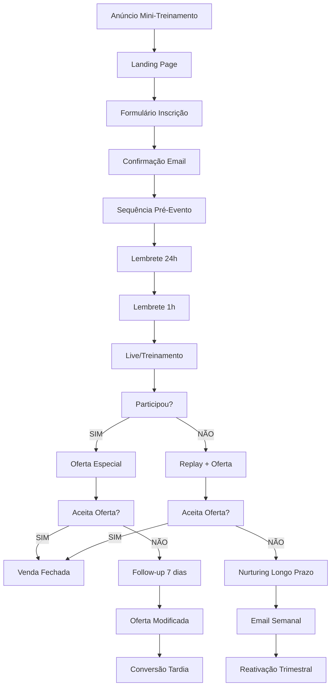
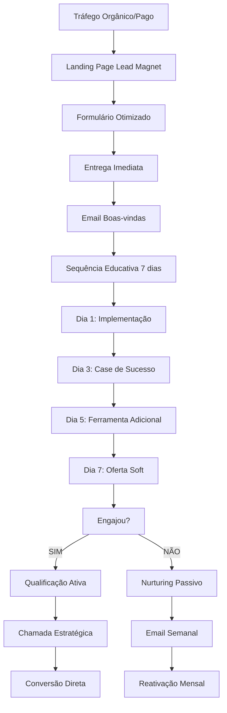
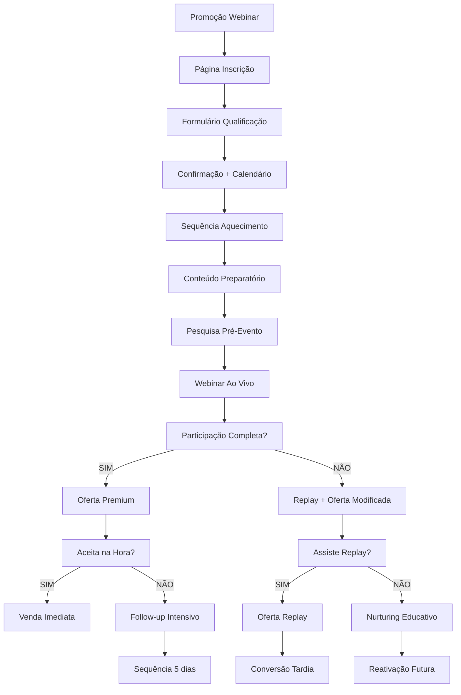
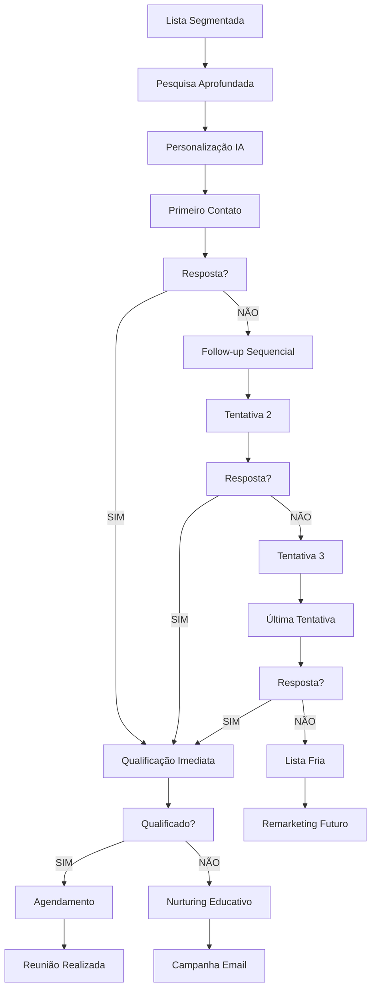
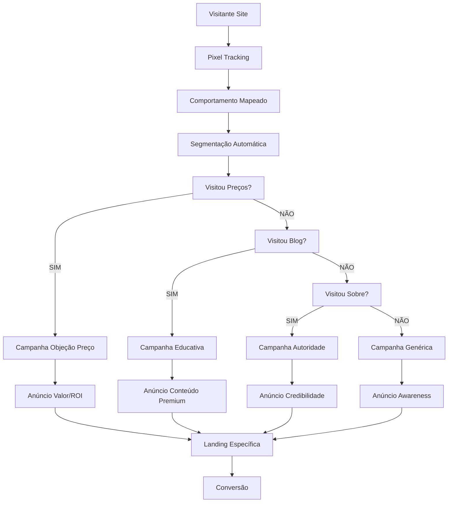
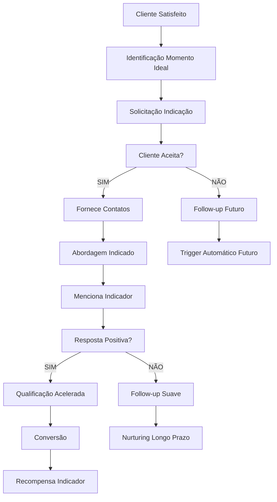
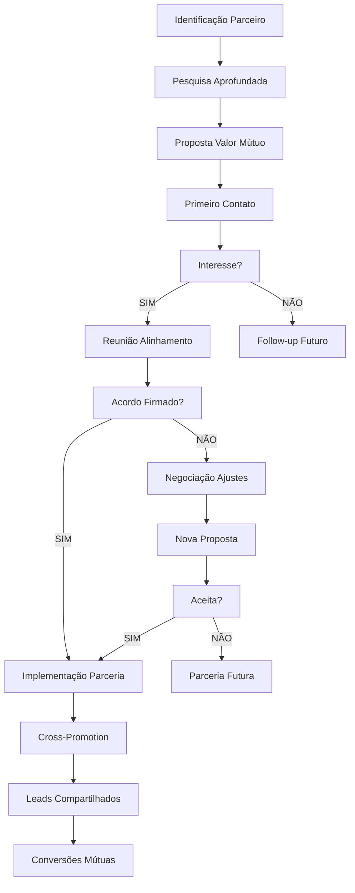
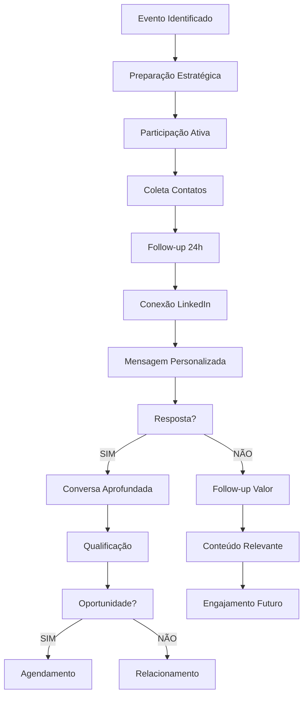
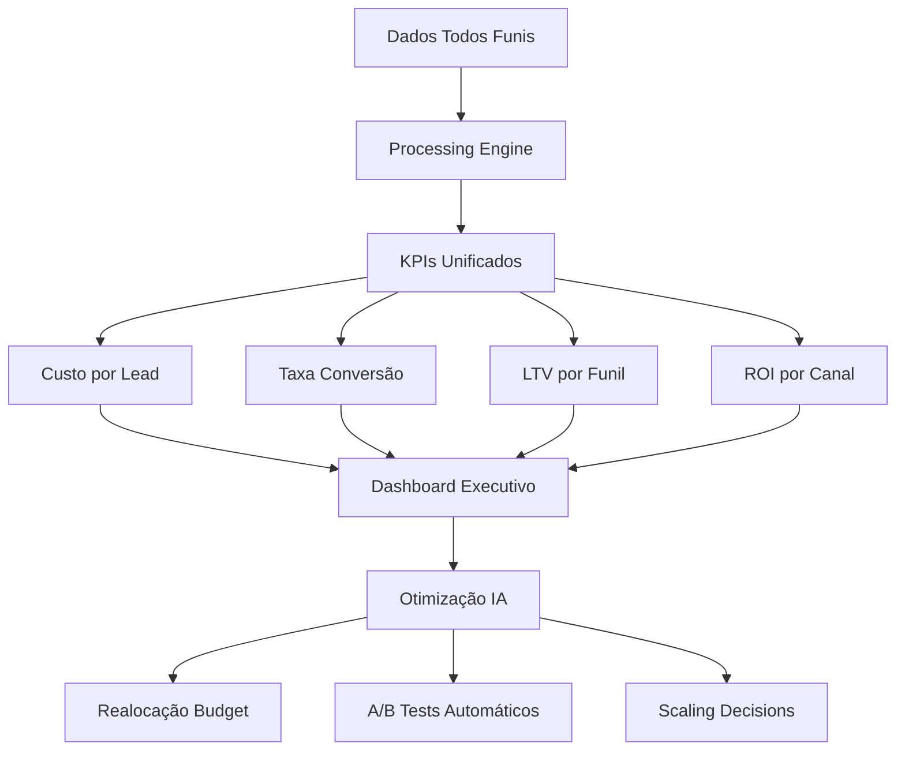

# Fluxogramas Completos - Marketing e Vendas Mottivme
## Todos os Funis Mapeados e Automatizados

---

## 🎯 ÍNDICE DE FUNIS AUTOMATIZADOS

1. **[Social Selling Principal](#social-selling-principal)** ⭐ *Já detalhado*
2. **[Mini-Treinamento Gratuito](#mini-treinamento-gratuito)**
3. **[Lead Magnet - E-book/Checklist](#lead-magnet)**
4. **[Webinar/Live Educativa](#webinar-live)**
5. **[Outbound Direto](#outbound-direto)**
6. **[Remarketing/Retargeting](#remarketing)**
7. **[Indicações/Referrals](#indicacoes)**
8. **[Parcerias Estratégicas](#parcerias)**
9. **[Eventos/Networking](#eventos)**

---

## 📊 FUNIL 2: MINI-TREINAMENTO GRATUITO

### **FLUXOGRAMA COMPLETO:**



### **AUTOMAÇÕES ESPECÍFICAS:**

#### **PRÉ-EVENTO (3 DIAS):**
```javascript
const sequenciaPreEvento = {
    confirmacao: {
        trigger: "inscrição_confirmada",
        delay: "imediato",
        template: "Confirmação + Calendário + Bônus Antecipado",
        anexos: ["calendario.ics", "bonus_pdf.pdf"]
    },
    
    dia_anterior: {
        trigger: "24h_antes",
        template: "Lembrete + Agenda + Dica Prévia",
        canal: ["email", "whatsapp"],
        personalizacao: "nome + interesse_declarado"
    },
    
    uma_hora_antes: {
        trigger: "1h_antes",
        template: "Link Direto + Urgência + Expectativa",
        canal: ["email", "sms", "push"],
        cta: "Entrar Agora"
    }
};
```

#### **DURANTE O EVENTO:**
```javascript
const automacoesDuranteEvento = {
    entrada: {
        trigger: "usuario_entrou",
        acao: "tag_participante_ativo",
        bonus: "material_exclusivo"
    },
    
    engajamento: {
        trigger: "comentario_chat",
        acao: "score_engajamento++",
        resposta_automatica: "resposta_personalizada_ia"
    },
    
    saida_precoce: {
        trigger: "usuario_saiu_antes_oferta",
        acao: "tag_saida_precoce",
        follow_up: "email_replay_imediato"
    }
};
```

#### **PÓS-EVENTO (CONVERSÃO):**
```javascript
const conversaoPos = {
    participantes_ativos: {
        delay: "5_minutos_pos_evento",
        template: "Oferta Especial Participantes",
        desconto: "50%",
        urgencia: "24h",
        bonus: ["consultoria_gratuita", "template_exclusivo"]
    },
    
    nao_participantes: {
        delay: "2h_pos_evento",
        template: "Replay + Oferta Modificada",
        desconto: "30%",
        urgencia: "48h",
        bonus: ["acesso_gravacao", "material_complementar"]
    }
};
```

### **MÉTRICAS E OTIMIZAÇÃO:**

| Etapa | KPI | Meta | Automação |
|-------|-----|------|-----------|
| **Inscrições** | CTR Anúncio | >3% | A/B Test Automático |
| **Confirmação** | Taxa Confirmação | >80% | Email Duplo Opt-in |
| **Participação** | Show-up Rate | >45% | Sequência Lembretes |
| **Engajamento** | Tempo Médio | >35min | Gamificação |
| **Conversão** | Taxa Conversão | >15% | Oferta Dinâmica |

---

## 🎁 FUNIL 3: LEAD MAGNET (E-BOOK/CHECKLIST)

### **FLUXOGRAMA ESTRATÉGICO:**



### **LEAD MAGNETS SEGMENTADOS:**

```javascript
const leadMagnets = {
    iniciantes: {
        titulo: "Checklist: Primeiros Passos para Vender Online",
        formato: "PDF + Vídeo Explicativo",
        sequencia: "educativa_basica",
        oferta_posterior: "curso_fundamentos"
    },
    
    intermediarios: {
        titulo: "Template: Funil de Vendas que Converte 25%+",
        formato: "Planilha + Tutorial",
        sequencia: "estrategica_avancada",
        oferta_posterior: "mentoria_individual"
    },
    
    avancados: {
        titulo: "Framework: Automação Completa de Vendas",
        formato: "Masterclass + Templates",
        sequencia: "consultiva_premium",
        oferta_posterior: "consultoria_empresarial"
    }
};
```

### **SEQUÊNCIA EDUCATIVA AUTOMATIZADA:**

```javascript
const sequenciaEducativa = {
    dia1: {
        assunto: "Seu [LEAD MAGNET] + Como Implementar Hoje",
        conteudo: "implementacao_pratica",
        cta: "Implementar e Compartilhar Resultado",
        tracking: "abertura + cliques + implementacao"
    },
    
    dia3: {
        assunto: "Case Real: Como [NOME] Conseguiu [RESULTADO]",
        conteudo: "prova_social_relevante",
        cta: "Quer Resultado Similar?",
        tracking: "engajamento + interesse"
    },
    
    dia5: {
        assunto: "Ferramenta Bônus: [FERRAMENTA COMPLEMENTAR]",
        conteudo: "valor_adicional",
        cta: "Download Ferramenta",
        tracking: "download + uso"
    },
    
    dia7: {
        assunto: "Próximo Passo: Como Acelerar Seus Resultados",
        conteudo: "oferta_consultiva",
        cta: "Agendar Conversa Estratégica",
        tracking: "interesse_comercial"
    }
};
```

---

## 🎥 FUNIL 4: WEBINAR/LIVE EDUCATIVA

### **FLUXOGRAMA AVANÇADO:**



### **ESTRATÉGIA DE AQUECIMENTO:**

```javascript
const aquecimentoWebinar = {
    inscricao: {
        trigger: "confirmacao_inscricao",
        entrega: ["calendario", "material_preparatorio", "grupo_vip"],
        tag: "inscrito_webinar"
    },
    
    dia_7_antes: {
        assunto: "Prepare-se: Material Exclusivo para o Webinar",
        conteudo: "checklist_preparacao",
        objetivo: "aumentar_expectativa"
    },
    
    dia_3_antes: {
        assunto: "Últimas Vagas: Grupo VIP do Webinar",
        conteudo: "acesso_grupo_telegram",
        objetivo: "criar_comunidade"
    },
    
    dia_1_antes: {
        assunto: "Amanhã é o Dia: Sua Agenda + Dica Secreta",
        conteudo: "agenda_detalhada + bonus_antecipado",
        objetivo: "garantir_presenca"
    },
    
    hora_antes: {
        assunto: "🔴 AO VIVO em 1 hora: Link Direto",
        conteudo: "link_direto + expectativa_final",
        objetivo: "maximizar_presenca"
    }
};
```

### **ESTRUTURA DO WEBINAR:**

```javascript
const estruturaWebinar = {
    abertura: {
        duracao: "10min",
        conteudo: "apresentacao + agenda + expectativas",
        automacao: "tracking_entrada + tag_participante"
    },
    
    conteudo_educativo: {
        duracao: "40min",
        estrutura: "problema + agitacao + solucao + prova",
        automacao: "tracking_engajamento + score_interesse"
    },
    
    oferta: {
        duracao: "15min",
        estrutura: "apresentacao + bonus + urgencia + garantia",
        automacao: "tracking_interesse_comercial"
    },
    
    qa: {
        duracao: "15min",
        objetivo: "objecoes + relacionamento",
        automacao: "identificacao_objecoes + follow_up_personalizado"
    }
};
```

---

## 🎯 FUNIL 5: OUTBOUND DIRETO

### **FLUXOGRAMA OUTBOUND INTELIGENTE:**



### **SEGMENTAÇÃO INTELIGENTE:**

```javascript
const segmentacaoOutbound = {
    perfil_ideal: {
        criterios: ["cargo_decisor", "empresa_tamanho_ideal", "setor_target"],
        score_minimo: 80,
        abordagem: "consultiva_premium"
    },
    
    perfil_potencial: {
        criterios: ["cargo_influenciador", "empresa_crescimento", "dor_identificada"],
        score_minimo: 60,
        abordagem: "educativa_valor"
    },
    
    perfil_desenvolvimento: {
        criterios: ["cargo_operacional", "empresa_pequena", "interesse_crescimento"],
        score_minimo: 40,
        abordagem: "educativa_basica"
    }
};
```

### **TEMPLATES OUTBOUND PERSONALIZADOS:**

```javascript
const templatesOutbound = {
    primeiro_contato: {
        ceo_grande_empresa: "Olá {nome}, vi que a {empresa} está {situacao_atual}. Tenho ajudado CEOs como você a {resultado_especifico}. Vale uma conversa de 15min?",
        
        diretor_medio_porte: "Oi {nome}, parabéns pelo crescimento da {empresa}! Imagino que com essa expansão, {dor_provavel} deve ser um desafio. Posso compartilhar como resolvemos isso para empresas similares?",
        
        gerente_operacional: "Olá {nome}, vi seu perfil e fiquei impressionado com sua experiência em {area}. Tenho uma estratégia que pode otimizar {processo_especifico} em até 40%. Toparia conhecer?"
    },
    
    follow_up_2: {
        valor_adicional: "Oi {nome}, sei que deve estar corrido aí. Deixa eu compartilhar algo rápido que pode te interessar: {case_relevante}. Faz sentido pra realidade da {empresa}?",
        
        pergunta_diferente: "Oi {nome}, mudando de assunto: como vocês estão lidando com {desafio_setor} atualmente? Tenho visto empresas como a {empresa} enfrentando isso.",
        
        referencia_mutua: "Oi {nome}, o {nome_conexao_mutua} sugeriu que conversássemos. Ele disse que você poderia se interessar por {solucao_especifica}."
    }
};
```

---

## 🔄 FUNIL 6: REMARKETING/RETARGETING

### **FLUXOGRAMA REMARKETING AVANÇADO:**



### **AUDIÊNCIAS SEGMENTADAS:**

```javascript
const audienciasRemarketing = {
    alta_intencao: {
        criterios: ["visitou_precos", "tempo_site_5min+", "multiplas_visitas"],
        campanha: "oferta_irresistivel",
        orcamento: "40%_total",
        frequencia: "3x_dia"
    },
    
    media_intencao: {
        criterios: ["leu_blog", "baixou_material", "seguiu_social"],
        campanha: "educativa_avancada",
        orcamento: "35%_total",
        frequencia: "2x_dia"
    },
    
    baixa_intencao: {
        criterios: ["visitou_homepage", "tempo_site_30s+"],
        campanha: "awareness_valor",
        orcamento: "25%_total",
        frequencia: "1x_dia"
    }
};
```

---

## 👥 FUNIL 7: INDICAÇÕES/REFERRALS

### **FLUXOGRAMA PROGRAMA INDICAÇÕES:**



### **AUTOMAÇÃO PROGRAMA REFERRALS:**

```javascript
const programaReferrals = {
    identificacao_momento: {
        triggers: [
            "nps_score_9_10",
            "depoimento_positivo",
            "renovacao_contrato",
            "resultado_excepcional"
        ],
        delay: "24h_apos_trigger"
    },
    
    solicitacao_automatica: {
        template: "Oi {nome}, que alegria ver seu resultado com {solucao}! Você conhece alguém que poderia se beneficiar da mesma forma? Tenho uma proposta especial para indicações.",
        incentivo: "desconto_proximo_servico + comissao_indicacao"
    },
    
    abordagem_indicado: {
        template: "Oi {nome_indicado}, o {nome_indicador} sugeriu que conversássemos. Ele conseguiu {resultado_indicador} e achou que você poderia se interessar. Vale uma conversa?",
        credibilidade: "resultado_indicador + depoimento"
    }
};
```

---

## 🤝 FUNIL 8: PARCERIAS ESTRATÉGICAS

### **FLUXOGRAMA PARCERIAS:**



### **TIPOS DE PARCERIAS:**

```javascript
const tiposParcerias = {
    complementares: {
        exemplo: "agencia_trafego + consultoria_vendas",
        modelo: "cross_selling_reciproco",
        comissao: "20%_primeira_venda"
    },
    
    verticais: {
        exemplo: "consultores_mesmo_nicho",
        modelo: "indicacao_overflow",
        comissao: "15%_venda_indicada"
    },
    
    horizontais: {
        exemplo: "influenciadores_setor",
        modelo: "promocao_cruzada",
        comissao: "produto_gratuito + comissao"
    }
};
```

---

## 🎪 FUNIL 9: EVENTOS/NETWORKING

### **FLUXOGRAMA EVENTOS:**



### **AUTOMAÇÃO PÓS-EVENTO:**

```javascript
const automacaoEventos = {
    coleta_dados: {
        ferramenta: "app_scanner_cartao + formulario_digital",
        campos: ["nome", "empresa", "cargo", "interesse", "dor_principal"]
    },
    
    follow_up_imediato: {
        delay: "2h_pos_evento",
        template: "Oi {nome}, que prazer te conhecer no {evento}! Adorei nossa conversa sobre {topico_conversa}. Vamos continuar?",
        anexo: "material_prometido"
    },
    
    sequencia_relacionamento: {
        dia_3: "artigo_relevante_setor",
        dia_7: "case_sucesso_similar",
        dia_14: "convite_evento_proprio",
        dia_30: "check_in_situacao"
    }
};
```

---

## 📊 DASHBOARD UNIFICADO - TODOS OS FUNIS

### **MÉTRICAS CONSOLIDADAS:**



### **COMPARATIVO PERFORMANCE:**

| Funil | CPL | Taxa Conv. | LTV | ROI | Prioridade |
|-------|-----|------------|-----|-----|------------|
| **Social Selling** | R$ 45 | 28% | R$ 8.500 | 700% | 🔥 Alta |
| **Mini-Treinamento** | R$ 35 | 15% | R$ 4.200 | 450% | 🔥 Alta |
| **Lead Magnet** | R$ 25 | 8% | R$ 3.800 | 380% | ⚡ Média |
| **Webinar** | R$ 85 | 35% | R$ 12.000 | 850% | 🔥 Alta |
| **Outbound** | R$ 120 | 45% | R$ 15.000 | 900% | 🔥 Alta |
| **Remarketing** | R$ 40 | 12% | R$ 5.500 | 420% | ⚡ Média |
| **Indicações** | R$ 15 | 65% | R$ 18.000 | 1200% | 🚀 Máxima |
| **Parcerias** | R$ 30 | 25% | R$ 9.500 | 650% | 🔥 Alta |
| **Eventos** | R$ 200 | 35% | R$ 16.000 | 600% | ⚡ Média |

---

## 🚀 IMPLEMENTAÇÃO INTEGRADA

### **CRONOGRAMA EXECUÇÃO (12 SEMANAS):**

#### **SEMANAS 1-2: FUNDAÇÃO**
- ✅ Setup tecnológico unificado
- ✅ Integrações CRM/Automação
- ✅ Dashboards básicos
- ✅ Funis prioritários (Social + Outbound)

#### **SEMANAS 3-4: EXPANSÃO**
- 🔄 Mini-treinamentos automatizados
- 🔄 Lead magnets segmentados
- 🔄 Webinars estruturados
- 🔄 Remarketing inteligente

#### **SEMANAS 5-8: OTIMIZAÇÃO**
- 🆕 Programa indicações
- 🆕 Parcerias estratégicas
- 🆕 Eventos sistematizados
- 🆕 IA avançada todos funis

#### **SEMANAS 9-12: ESCALA**
- 🚀 Otimização contínua IA
- 🚀 Scaling automático
- 🚀 Novos canais
- 🚀 Expansão internacional

### **INVESTIMENTO TOTAL:**
- **Tecnologia**: R$ 25.000
- **Desenvolvimento**: R$ 35.000
- **Tráfego Pago**: R$ 40.000
- **Equipe**: R$ 20.000
- **TOTAL**: R$ 120.000

### **ROI PROJETADO (12 MESES):**
- **Receita Adicional**: R$ 1.200.000
- **ROI**: 1000%
- **Payback**: 3 meses

**A Mottivme terá o ecossistema de funis mais avançado e automatizado do mercado brasileiro!** 🚀🎯