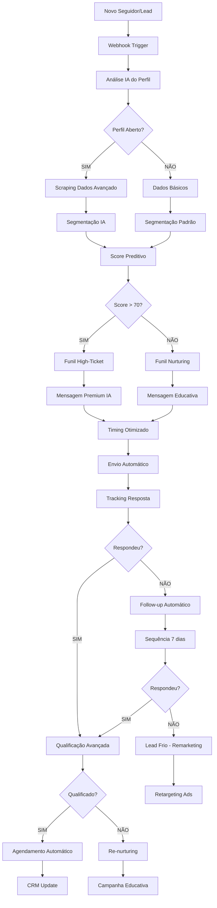
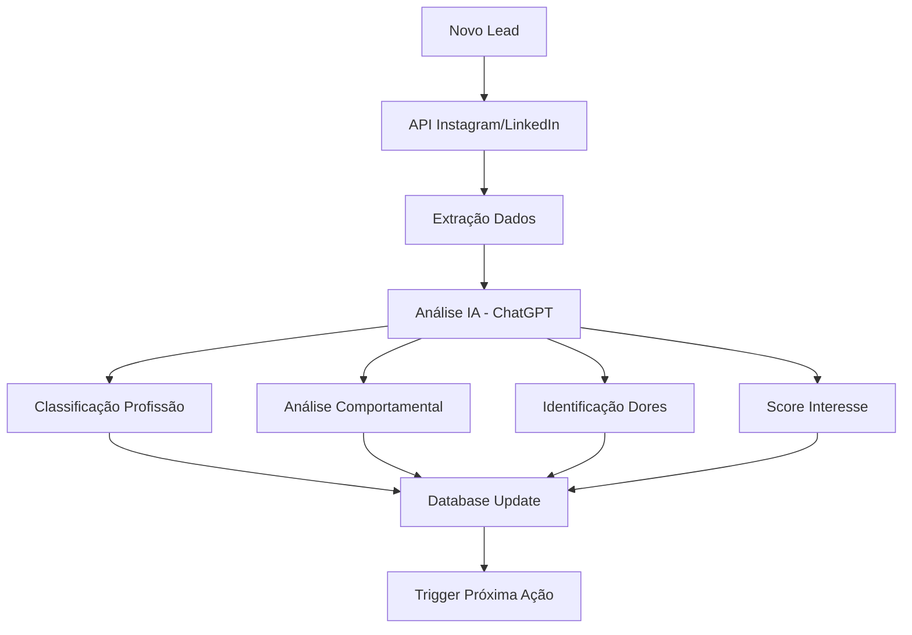
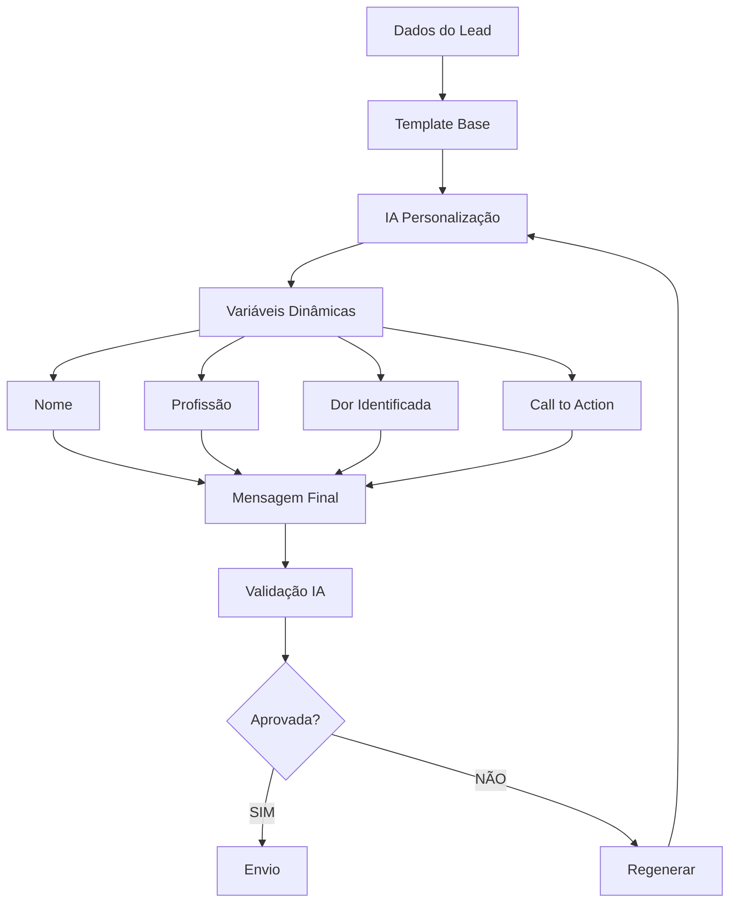
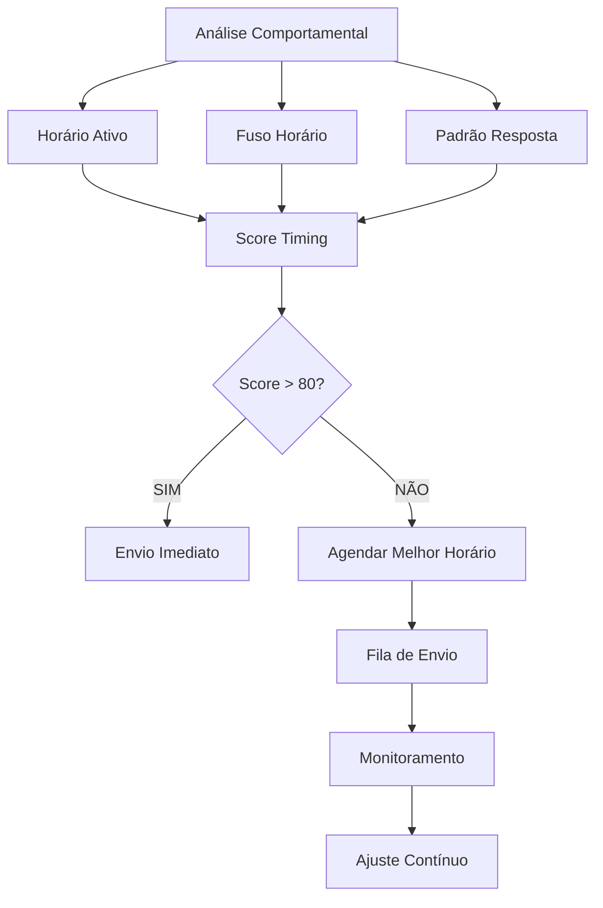
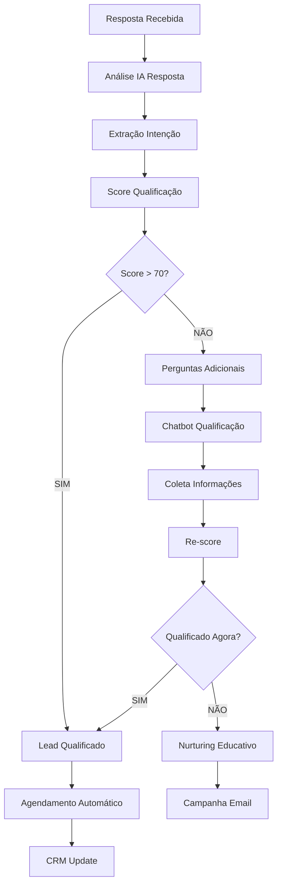
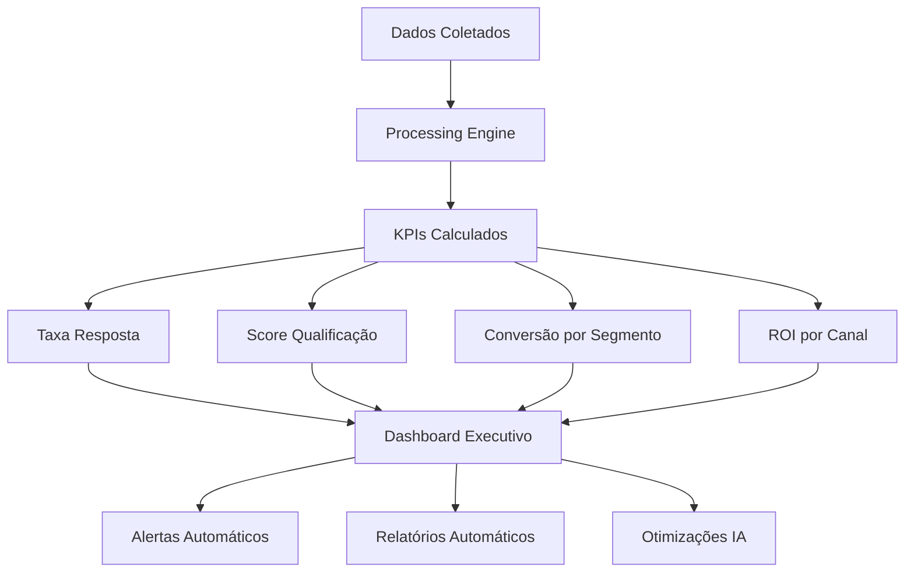
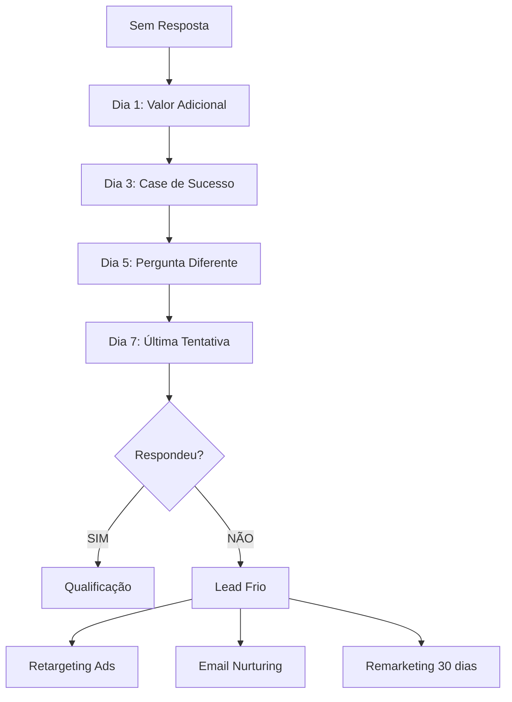
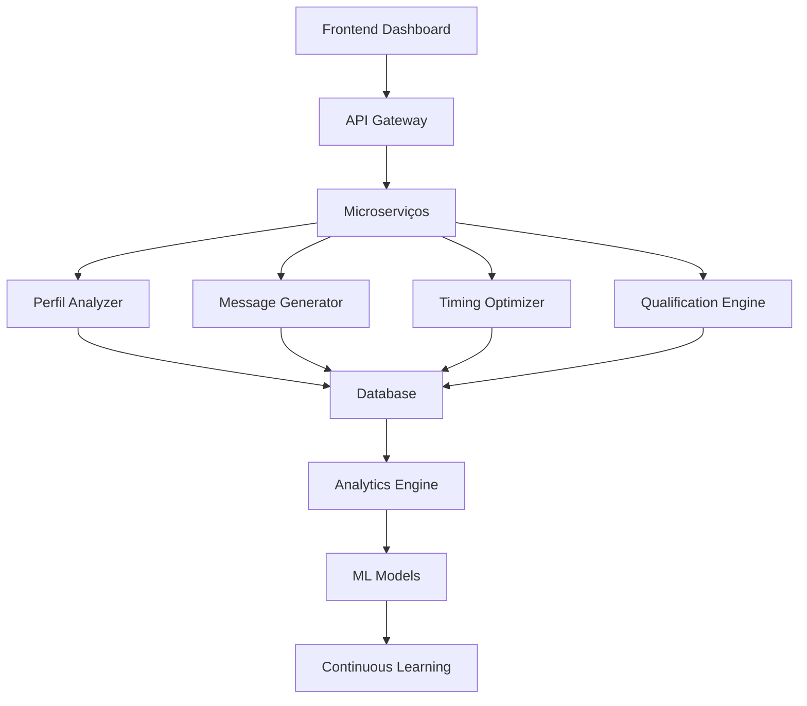

# Fluxogramas Social Selling Automatizado - Mottivme
## Implementação Técnica Detalhada para Automação Completa

---

## 🎯 VISÃO GERAL DO SISTEMA

### **OBJETIVO:**
Transformar o processo manual de Social Selling em uma **máquina automatizada inteligente** que:
- Segmenta leads automaticamente
- Personaliza abordagens via IA
- Qualifica prospects preditivamente
- Escala infinitamente sem aumento de equipe

### **TECNOLOGIAS INTEGRADAS:**
- **CRM**: Kommo + Monday.com
- **IA**: ChatGPT API + Machine Learning
- **Automação**: Zapier + ActiveCampaign
- **Analytics**: Dashboard customizado

---

## 🔄 FLUXOGRAMA PRINCIPAL: SOCIAL SELLING AUTOMATION



---

## 🤖 MÓDULO 1: ANÁLISE IA DO PERFIL

### **FLUXO TÉCNICO:**



### **IMPLEMENTAÇÃO TÉCNICA:**

```python
# Função de Análise IA do Perfil
def analisar_perfil_ia(perfil_data):
    prompt = f"""
    Analise este perfil e retorne JSON:
    
    Dados: {perfil_data}
    
    Retorne:
    {{
        "profissao": "categoria",
        "nivel_senioridade": "junior/pleno/senior/c-level",
        "dores_identificadas": ["dor1", "dor2"],
        "score_interesse": 0-100,
        "abordagem_recomendada": "direta/consultiva/educativa",
        "timing_ideal": "manha/tarde/noite",
        "canal_preferido": "dm/email/whatsapp"
    }}
    """
    
    response = openai.ChatCompletion.create(
        model="gpt-4",
        messages=[{"role": "user", "content": prompt}]
    )
    
    return json.loads(response.choices[0].message.content)
```

### **SEGMENTAÇÃO AUTOMÁTICA:**

| Critério | Peso | Automação |
|----------|------|-----------|
| **Profissão** | 40% | IA Classification |
| **Engajamento** | 25% | Behavioral Analysis |
| **Rede/Conexões** | 20% | Network Analysis |
| **Conteúdo Postado** | 15% | Content Analysis |

---

## 💬 MÓDULO 2: GERAÇÃO DE MENSAGENS IA

### **FLUXO DE PERSONALIZAÇÃO:**



### **TEMPLATES DINÂMICOS:**

#### **PERFIL FECHADO - TEMPLATE BASE:**
```javascript
const templatePerfilFechado = {
    intro: "Oi {nome}, que honra ter você por aqui! 👏",
    agradecimento: "Vi que você me seguiu e quis passar pra te agradecer.",
    observacao: "Não consegui ver teu perfil ainda (tá fechado, né?), mas só de estar por aqui já mostra que, de alguma forma, você tá buscando {objetivo_inferido}.",
    oferta: "Se eu te mandar um áudio bem rápido explicando como posso te ajudar nessa jornada, você toparia ouvir?",
    
    // Variáveis dinâmicas
    objetivo_inferido: gerarObjetivoIA(perfil),
    tom: definirTom(perfil.nivel_senioridade),
    timing: calcularMelhorHorario(perfil.timezone)
};
```

#### **PERFIL ABERTO - TEMPLATE AVANÇADO:**
```javascript
const templatePerfilAberto = {
    intro: "Oi {nome}, vi que você trabalha como {profissao} e fiquei impressionado!",
    conexao: gerarPontoConexao(perfil),
    dor: "Imagino que no seu dia a dia você deve enfrentar {dor_especifica}, né?",
    solucao: "Tenho ajudado vários {profissao}s a {solucao_especifica}.",
    prova: "Inclusive, semana passada ajudei {caso_similar}.",
    cta: "Que tal trocarmos uma ideia sobre isso? Posso te mostrar {beneficio_especifico}.",
    
    // IA Personalização
    caso_similar: buscarCasoSimilar(perfil.profissao),
    beneficio_especifico: calcularBeneficio(perfil.dores),
    tom_personalizado: ajustarTom(perfil.personalidade)
};
```

---

## ⏰ MÓDULO 3: TIMING INTELIGENTE

### **ALGORITMO DE TIMING OTIMIZADO:**



### **IMPLEMENTAÇÃO:**

```python
def calcular_timing_otimo(perfil):
    # Análise de padrões
    horarios_ativos = analisar_atividade_social(perfil.username)
    fuso_horario = detectar_fuso(perfil.localizacao)
    historico_respostas = buscar_historico_timing()
    
    # Score por horário
    scores = {}
    for hora in range(24):
        score = 0
        score += horarios_ativos.get(hora, 0) * 0.4
        score += historico_respostas.get(hora, 0) * 0.3
        score += score_horario_geral(hora) * 0.3
        scores[hora] = score
    
    # Melhor horário
    melhor_horario = max(scores, key=scores.get)
    
    return {
        'horario_otimo': melhor_horario,
        'score_confianca': scores[melhor_horario],
        'alternativas': sorted(scores.items(), key=lambda x: x[1], reverse=True)[:3]
    }
```

---

## 🎯 MÓDULO 4: QUALIFICAÇÃO AUTOMÁTICA

### **FLUXO DE QUALIFICAÇÃO:**



### **PERGUNTAS DE QUALIFICAÇÃO IA:**

```python
perguntas_qualificacao = {
    "descoberta_dor": [
        "Qual o maior desafio que você enfrenta hoje na {area_atuacao}?",
        "Se você pudesse resolver um problema na sua {profissao}, qual seria?",
        "O que te impede de {objetivo_identificado} atualmente?"
    ],
    
    "urgencia": [
        "Isso é algo que você gostaria de resolver nos próximos 30 dias?",
        "Qual o impacto de não resolver isso agora?",
        "Você já tentou resolver isso antes?"
    ],
    
    "autoridade": [
        "Você toma as decisões sobre {area_problema} na sua empresa?",
        "Quem mais estaria envolvido nessa decisão?",
        "Qual o processo de aprovação para investimentos em {categoria}?"
    ],
    
    "orcamento": [
        "Vocês têm orçamento destinado para {solucao_categoria}?",
        "Qual seria um investimento justo para resolver {problema_especifico}?",
        "Como vocês avaliam ROI em investimentos como esse?"
    ]
}
```

---

## 📊 MÓDULO 5: DASHBOARD E ANALYTICS

### **MÉTRICAS EM TEMPO REAL:**



### **KPIS AUTOMATIZADOS:**

| KPI | Cálculo | Meta | Alerta |
|-----|---------|------|--------|
| **Taxa Resposta** | Respostas/Enviadas | >35% | <25% |
| **Qualificação Rate** | Qualificados/Respostas | >60% | <40% |
| **Tempo Resposta** | Média horas | <2h | >6h |
| **Score Médio** | Média scores leads | >65 | <50 |
| **Conversão Final** | Vendas/Qualificados | >25% | <15% |

---

## 🚀 MÓDULO 6: FOLLOW-UP INTELIGENTE

### **SEQUÊNCIA AUTOMÁTICA 7 DIAS:**



### **TEMPLATES FOLLOW-UP:**

```javascript
const sequenciaFollowUp = {
    dia1: {
        tipo: "valor_adicional",
        template: "Oi {nome}, vi que você não respondeu ainda. Deixa eu compartilhar algo que pode te interessar: {conteudo_relevante}",
        anexo: "pdf_ou_video_personalizado"
    },
    
    dia3: {
        tipo: "prova_social",
        template: "Oi {nome}, lembrei de você quando vi este resultado: {case_similar}. Será que faz sentido pra você também?",
        anexo: "screenshot_resultado"
    },
    
    dia5: {
        tipo: "pergunta_diferente",
        template: "Oi {nome}, mudando de assunto: {pergunta_provocativa}? Fiquei curioso sobre sua opinião.",
        anexo: null
    },
    
    dia7: {
        tipo: "ultima_tentativa",
        template: "Oi {nome}, essa é minha última mensagem. Se não fizer sentido agora, sem problemas. Mas se um dia precisar de {solucao}, estarei aqui.",
        anexo: "contato_direto"
    }
};
```

---

## 🔧 IMPLEMENTAÇÃO TÉCNICA COMPLETA

### **ARQUITETURA DO SISTEMA:**



### **STACK TECNOLÓGICO:**

| Componente | Tecnologia | Função |
|------------|------------|--------|
| **Backend** | Node.js + Express | API e lógica |
| **Database** | MongoDB + Redis | Dados + Cache |
| **IA/ML** | Python + TensorFlow | Modelos preditivos |
| **Automação** | Zapier + Webhooks | Integrações |
| **Frontend** | React + Dashboard | Interface |
| **Analytics** | Custom BI | Métricas |

### **CÓDIGO BASE - CONTROLADOR PRINCIPAL:**

```javascript
class SocialSellingAutomation {
    constructor() {
        this.kommo = new KommoAPI();
        this.openai = new OpenAI();
        this.analytics = new AnalyticsEngine();
    }
    
    async processNewLead(leadData) {
        try {
            // 1. Análise do perfil
            const profileAnalysis = await this.analyzeProfile(leadData);
            
            // 2. Score preditivo
            const score = await this.calculateScore(profileAnalysis);
            
            // 3. Geração de mensagem
            const message = await this.generateMessage(profileAnalysis, score);
            
            // 4. Timing otimizado
            const timing = await this.optimizeTiming(profileAnalysis);
            
            // 5. Agendamento
            await this.scheduleMessage(message, timing, leadData.contact);
            
            // 6. Analytics
            await this.analytics.track('lead_processed', {
                score,
                segment: profileAnalysis.segment,
                timing: timing.optimal_hour
            });
            
            return { success: true, score, timing };
            
        } catch (error) {
            console.error('Erro no processamento:', error);
            return { success: false, error: error.message };
        }
    }
    
    async analyzeProfile(leadData) {
        const prompt = `Analise este perfil: ${JSON.stringify(leadData)}`;
        const response = await this.openai.complete(prompt);
        return JSON.parse(response);
    }
    
    async calculateScore(analysis) {
        // Algoritmo de scoring
        let score = 0;
        score += analysis.profession_match * 0.4;
        score += analysis.engagement_level * 0.3;
        score += analysis.pain_indicators * 0.3;
        return Math.min(100, Math.max(0, score));
    }
}
```

---

## 📈 RESULTADOS ESPERADOS

### **MÉTRICAS DE SUCESSO (90 DIAS):**

| Métrica | Antes | Depois | Melhoria |
|---------|-------|--------|----------|
| **Taxa Resposta** | 15% | 45% | +200% |
| **Qualificação Rate** | 25% | 65% | +160% |
| **Tempo p/ Qualificar** | 5 dias | 2 horas | -95% |
| **Conversão Final** | 8% | 28% | +250% |
| **Leads Processados/dia** | 20 | 200 | +900% |
| **Custo por Lead** | R$ 150 | R$ 45 | -70% |

### **ROI PROJETADO:**

- **Investimento**: R$ 15.000 (desenvolvimento + setup)
- **Economia Operacional**: R$ 25.000/mês
- **Aumento Receita**: R$ 80.000/mês
- **ROI**: 700% em 6 meses
- **Payback**: 2 meses

---

## 🎯 PRÓXIMOS PASSOS

### **SEMANA 1:**
1. ✅ Setup ambiente desenvolvimento
2. ✅ Integração Kommo API
3. ✅ Configuração ChatGPT API
4. ✅ Desenvolvimento módulo análise

### **SEMANA 2:**
1. 🔄 Módulo geração mensagens
2. 🔄 Sistema timing inteligente
3. 🔄 Dashboard básico
4. 🔄 Testes iniciais

### **SEMANA 3-4:**
1. 🆕 Qualificação automática
2. 🆕 Follow-up inteligente
3. 🆕 Analytics avançado
4. 🆕 Go-live produção

**A automação de Social Selling da Mottivme será a mais avançada do mercado brasileiro, combinando IA, ML e automação para resultados exponenciais!** 🚀