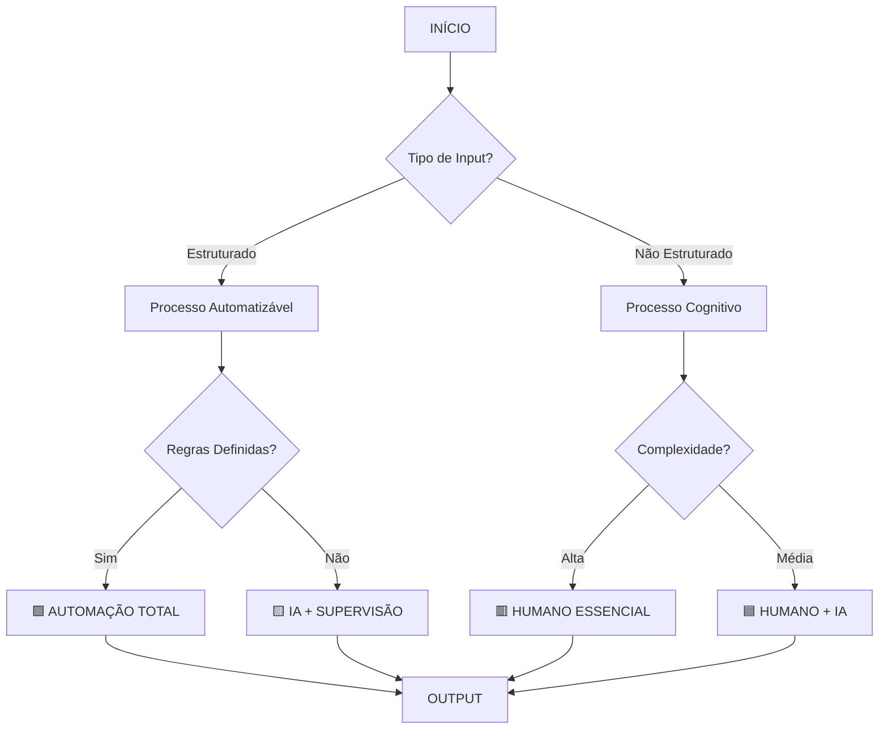

# 🔬 Framework de Análise Clínica de Processos Empresariais
## Metodologia Especializada para Mapeamento e Automação - Mottivme Sales

---

## 🎯 **VISÃO CLÍNICA ESPECIALIZADA**

### 📋 Princípios da Análise Clínica
1. **Observação Sistemática**: Cada processo é dissecado em micro-atividades
2. **Diagnóstico Preciso**: Identificação de sintomas de ineficiência
3. **Prescrição Direcionada**: Soluções específicas para cada tipo de atividade
4. **Prognóstico Tecnológico**: Previsão de evolução com automação/IA

---

## 🔍 **METODOLOGIA DE MAPEAMENTO CLÍNICO**

### **Fase 1: Anamnese do Processo** 📝
```
┌─────────────────────────────────────────────────────────┐
│ QUESTIONÁRIO CLÍNICO INICIAL                            │
├─────────────────────────────────────────────────────────┤
│ • Qual o objetivo final do processo?                   │
│ • Quem são os stakeholders envolvidos?                 │
│ • Qual a frequência de execução?                       │
│ • Quais os pontos de dor atuais?                       │
│ • Onde ocorrem os maiores gargalos?                    │
│ • Quais dados são gerados/consumidos?                  │
│ • Qual o nível de padronização atual?                  │
└─────────────────────────────────────────────────────────┘
```

### **Fase 2: Exame Físico do Processo** 🔬
```
ANATOMIA DO PROCESSO:
├── INPUT (Entradas)
│   ├── Dados estruturados
│   ├── Dados não estruturados
│   ├── Decisões humanas
│   └── Triggers externos
├── PROCESSAMENTO (Transformação)
│   ├── Atividades cognitivas
│   ├── Atividades operacionais
│   ├── Atividades de validação
│   └── Atividades de comunicação
└── OUTPUT (Saídas)
    ├── Resultados mensuráveis
    ├── Comunicações
    ├── Decisões
    └── Dados para próximos processos
```

---

## 🏥 **CLASSIFICAÇÃO CLÍNICA DAS ATIVIDADES**

### **Tipo A: ATIVIDADES COGNITIVAS COMPLEXAS** 🧠
- **Características**: Requer julgamento, criatividade, experiência
- **Exemplos**: Estratégia, negociação complexa, resolução de conflitos
- **Diagnóstico**: 🟥 **HUMANO ESSENCIAL**
- **Prescrição**: Manter humano + IA como assistente

### **Tipo B: ATIVIDADES COGNITIVAS ESTRUTURADAS** 🤖
- **Características**: Lógica definida, padrões identificáveis
- **Exemplos**: Qualificação de leads, análise de dados, relatórios
- **Diagnóstico**: 🟨 **IA CANDIDATA**
- **Prescrição**: Automação com IA + supervisão humana

### **Tipo C: ATIVIDADES OPERACIONAIS REPETITIVAS** ⚙️
- **Características**: Regras claras, alta repetição, baixa variação
- **Exemplos**: Envio de emails, atualização de CRM, agendamentos
- **Diagnóstico**: 🟩 **AUTOMAÇÃO TOTAL**
- **Prescrição**: RPA/Automação completa

### **Tipo D: ATIVIDADES DE INTERFACE HUMANA** 👥
- **Características**: Relacionamento, empatia, persuasão
- **Exemplos**: Atendimento VIP, negociação final, relacionamento
- **Diagnóstico**: 🟦 **HUMANO + IA ASSISTENTE**
- **Prescrição**: Humano potencializado por IA

---

## 📊 **TEMPLATE DE FLUXOGRAMA CLÍNICO**

### **Estrutura Padrão de Mapeamento**


### **Legenda de Símbolos Clínicos**
- 🔴 **Ponto de Dor**: Gargalo identificado
- 🟡 **Ponto de Atenção**: Possível melhoria
- 🟢 **Ponto Forte**: Processo eficiente
- ⚡ **Automação Imediata**: Candidato prioritário
- 🤖 **IA Aplicável**: Inteligência artificial viável
- 👤 **Humano Necessário**: Intervenção humana obrigatória

---

## 📋 **TEMPLATE DE POP CLÍNICO**

### **Estrutura Detalhada de Procedimento**
```
┌─────────────────────────────────────────────────────────┐
│ POP-XXX: [NOME DO PROCESSO]                            │
├─────────────────────────────────────────────────────────┤
│ OBJETIVO: [Descrição clara do resultado esperado]      │
│ ESCOPO: [Onde inicia e onde termina]                   │
│ RESPONSÁVEL: [Papel/Cargo responsável]                 │
│ FREQUÊNCIA: [Quando é executado]                       │
│ TEMPO ESTIMADO: [Duração média]                        │
├─────────────────────────────────────────────────────────┤
│ INPUTS NECESSÁRIOS:                                     │
│ ├── [Input 1] - Tipo: [Manual/Sistema/IA]             │
│ ├── [Input 2] - Tipo: [Manual/Sistema/IA]             │
│ └── [Input N] - Tipo: [Manual/Sistema/IA]             │
├─────────────────────────────────────────────────────────┤
│ PASSOS DETALHADOS:                                      │
│                                                         │
│ 1. [AÇÃO] - [RESPONSÁVEL] - [TEMPO] - [TIPO]          │
│    ├── Descrição detalhada                            │
│    ├── Critérios de qualidade                         │
│    ├── Pontos de controle                             │
│    └── 🔬 DIAGNÓSTICO: [Humano/IA/Automação]          │
│                                                         │
│ 2. [AÇÃO] - [RESPONSÁVEL] - [TEMPO] - [TIPO]          │
│    ├── Descrição detalhada                            │
│    ├── Critérios de qualidade                         │
│    ├── Pontos de controle                             │
│    └── 🔬 DIAGNÓSTICO: [Humano/IA/Automação]          │
│                                                         │
│ [Continuar para todos os passos...]                    │
├─────────────────────────────────────────────────────────┤
│ OUTPUTS GERADOS:                                        │
│ ├── [Output 1] - Destino: [Sistema/Pessoa/Processo]   │
│ ├── [Output 2] - Destino: [Sistema/Pessoa/Processo]   │
│ └── [Output N] - Destino: [Sistema/Pessoa/Processo]   │
├─────────────────────────────────────────────────────────┤
│ MÉTRICAS DE CONTROLE:                                   │
│ ├── Tempo de execução: [X minutos]                    │
│ ├── Taxa de erro: [X%]                                │
│ ├── Satisfação: [Escala 1-10]                         │
│ └── Custo por execução: [R$ X]                        │
├─────────────────────────────────────────────────────────┤
│ ANÁLISE CLÍNICA:                                        │
│ ├── 🟥 Atividades Humanas Essenciais: [X%]            │
│ ├── 🟨 Candidatas à IA: [X%]                          │
│ ├── 🟩 Automatizáveis: [X%]                           │
│ └── 🟦 Humano + IA: [X%]                              │
├─────────────────────────────────────────────────────────┤
│ PRESCRIÇÃO TECNOLÓGICA:                                 │
│ ├── Prioridade: [Alta/Média/Baixa]                    │
│ ├── Complexidade: [Simples/Média/Complexa]            │
│ ├── ROI Estimado: [Alto/Médio/Baixo]                  │
│ └── Prazo de Implementação: [X meses]                 │
└─────────────────────────────────────────────────────────┘
```

---

## 🎯 **MATRIZ DE DECISÃO CLÍNICA**

### **Critérios de Classificação**
| Critério | Humano | IA | Automação | Híbrido |
|----------|--------|----|-----------|---------| 
| **Complexidade Cognitiva** | Alta | Média | Baixa | Média-Alta |
| **Variabilidade** | Alta | Média | Baixa | Média |
| **Criatividade Necessária** | Sim | Limitada | Não | Sim |
| **Julgamento Ético** | Sim | Não | Não | Sim |
| **Relacionamento Humano** | Sim | Limitado | Não | Sim |
| **Velocidade Requerida** | Baixa | Alta | Muito Alta | Média |
| **Precisão Requerida** | Variável | Alta | Muito Alta | Alta |
| **Volume de Dados** | Baixo | Alto | Médio | Alto |

### **Algoritmo de Decisão**
```python
def classificar_atividade(atividade):
    score_humano = 0
    score_ia = 0
    score_automacao = 0
    
    # Análise de critérios...
    if complexidade_cognitiva == "alta":
        score_humano += 3
    elif complexidade_cognitiva == "media":
        score_ia += 2
    else:
        score_automacao += 3
    
    # [Continuar lógica para todos os critérios]
    
    return max(score_humano, score_ia, score_automacao)
```

---

## 📈 **INDICADORES DE SAÚDE DO PROCESSO**

### **KPIs Clínicos Essenciais**
1. **Eficiência Operacional**
   - Tempo médio de execução
   - Taxa de retrabalho
   - Utilização de recursos

2. **Qualidade do Output**
   - Taxa de erro
   - Satisfação do cliente interno
   - Conformidade com padrões

3. **Potencial de Automação**
   - % de atividades automatizáveis
   - ROI estimado da automação
   - Complexidade de implementação

4. **Saúde Organizacional**
   - Satisfação da equipe
   - Curva de aprendizado
   - Resistência à mudança

---

## 🚀 **ROADMAP DE IMPLEMENTAÇÃO**

### **Fase 1: Diagnóstico (Semanas 1-2)**
- [ ] Mapeamento completo dos processos atuais
- [ ] Classificação clínica de cada atividade
- [ ] Identificação de quick wins

### **Fase 2: Prescrição (Semanas 3-4)**
- [ ] Priorização por ROI e complexidade
- [ ] Definição de arquitetura tecnológica
- [ ] Planejamento de mudança organizacional

### **Fase 3: Implementação (Meses 2-6)**
- [ ] Automações simples (RPA)
- [ ] Implementação de IA assistiva
- [ ] Treinamento e adaptação

### **Fase 4: Monitoramento (Contínuo)**
- [ ] Acompanhamento de KPIs
- [ ] Ajustes e otimizações
- [ ] Evolução tecnológica

---

## 🔧 **FERRAMENTAS CLÍNICAS RECOMENDADAS**

### **Para Mapeamento**
- **Lucidchart/Draw.io**: Fluxogramas detalhados
- **Miro/Mural**: Workshops colaborativos
- **Process Street**: POPs digitais

### **Para Análise**
- **Power BI/Tableau**: Dashboards de KPIs
- **Python/R**: Análise estatística
- **Excel Avançado**: Matrizes de decisão

### **Para Implementação**
- **UiPath/Automation Anywhere**: RPA
- **Microsoft Power Platform**: Low-code
- **APIs e Integrações**: Conectividade

---

**📅 Criado em:** $(date +"%d/%m/%Y")  
**👨‍⚕️ Especialista:** Análise Clínica de Processos  
**🎯 Foco:** Automação e IA Empresarial