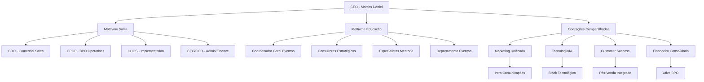
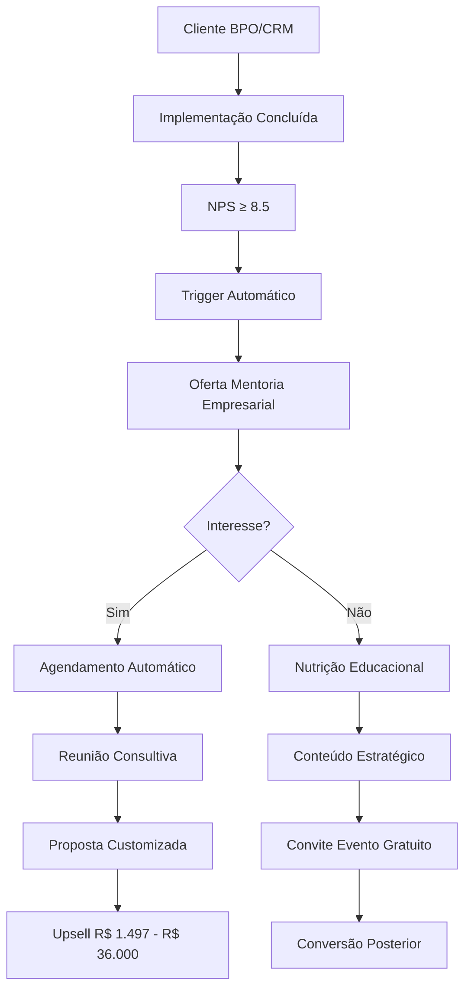
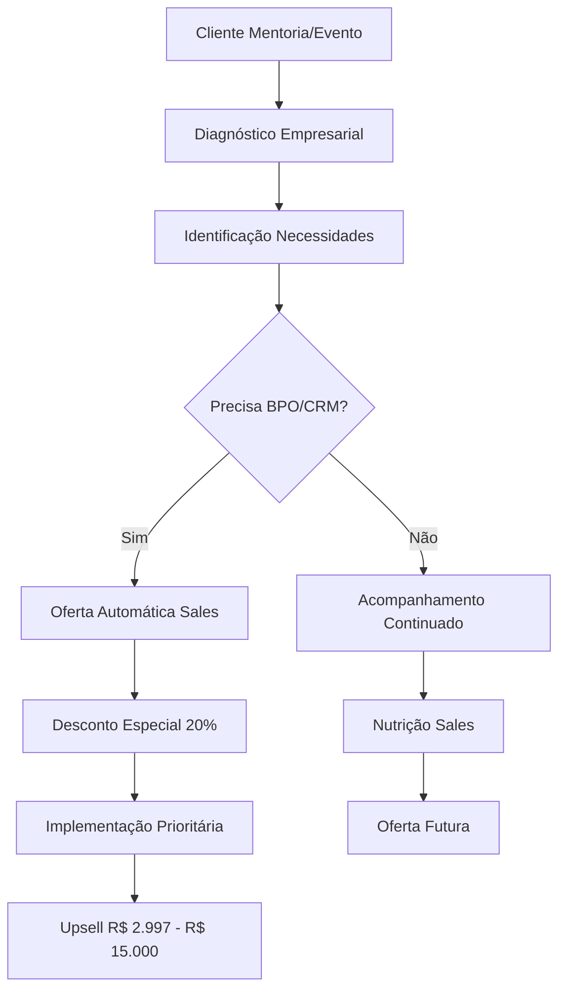
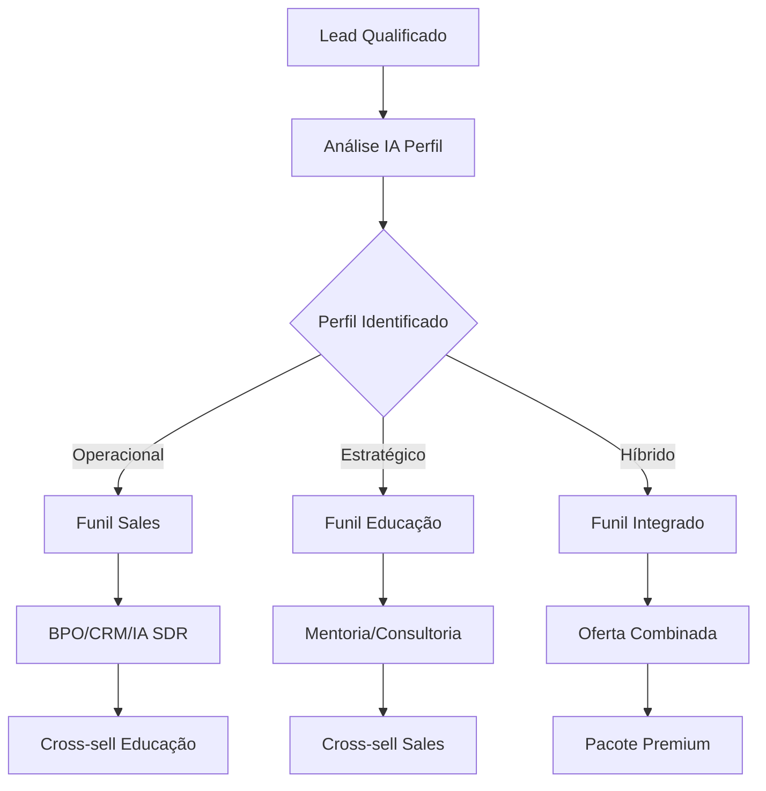
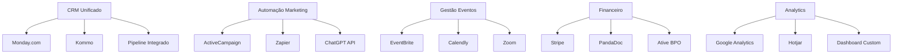
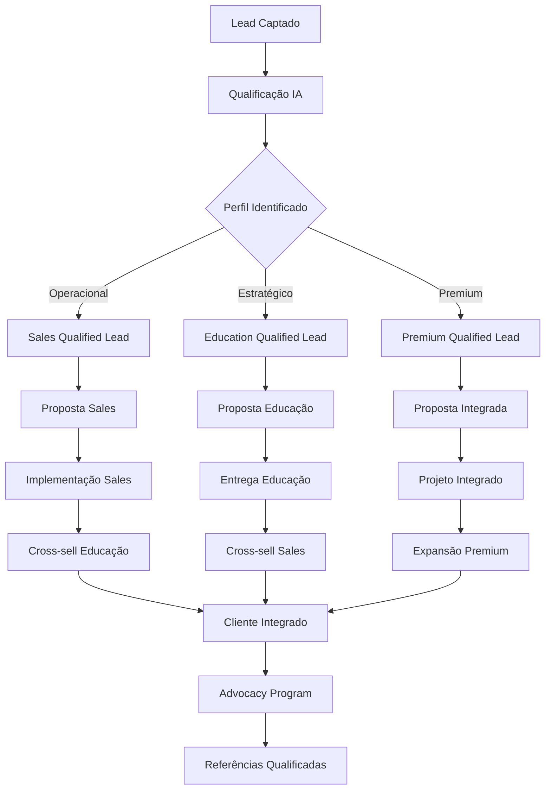
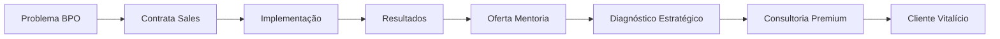
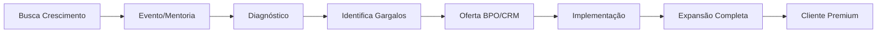
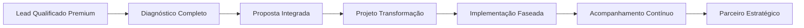

# Integração Completa Mottivme Sales + Educação
## Ecossistema Unificado de Crescimento Exponencial

---

## 🎯 VISÃO ESTRATÉGICA INTEGRADA

### **Mottivme Holdings: Duas Verticais, Uma Máquina**

A integração entre **Mottivme Sales** (BPO/CRM) e **Mottivme Educação** (Mentoria/Consultoria) cria um **ecossistema completo** de:

- **Cross-selling automático** entre verticais
- **Base de dados unificada** de clientes
- **Funil de vendas integrado** 
- **Automações compartilhadas**
- **ROI exponencial** através de sinergias

---

## 🏢 ORGANOGRAMA INTEGRADO MOTTIVME HOLDINGS



---

## 🔄 FLUXOS INTEGRADOS DE CROSS-SELLING

### **FLUXO 1: SALES → EDUCAÇÃO**



### **FLUXO 2: EDUCAÇÃO → SALES**



### **FLUXO 3: PROSPECÇÃO UNIFICADA**



---

## 📊 PRODUTOS INTEGRADOS E SINERGIAS

### **MATRIZ DE PRODUTOS CRUZADOS**

| Cliente Sales | Produto Educação | Valor | Conversão | ROI |
|---------------|------------------|-------|-----------|-----|
| **BPOSS Human** | Mentoria Liderança | R$ 1.497 | 35% | 400% |
| **CRM Implementation** | Consultoria Processos | R$ 15.000 | 25% | 600% |
| **IA SDR** | Formação Vendas | R$ 997 | 45% | 500% |
| **BPO Operations** | Mentoria Operacional | R$ 2.497 | 30% | 450% |

| Cliente Educação | Produto Sales | Valor | Conversão | ROI |
|------------------|---------------|-------|-----------|-----|
| **Mentoria 10K** | CRM + IA SDR | R$ 4.997 | 40% | 500% |
| **Consultoria Premium** | BPOSS Completo | R$ 8.997 | 50% | 700% |
| **Eventos** | BPO Operations | R$ 2.997 | 25% | 350% |
| **Formações** | IA SDR Básico | R$ 1.497 | 35% | 400% |

### **PACOTES INTEGRADOS PREMIUM**

#### **PACOTE TRANSFORMAÇÃO COMPLETA**
- **Valor**: R$ 25.000
- **Inclui**: Consultoria + BPO + CRM + IA + Mentoria
- **Duração**: 6 meses
- **ROI Cliente**: 800%
- **Margem**: 75%

#### **PACOTE CRESCIMENTO ACELERADO**
- **Valor**: R$ 15.000
- **Inclui**: IA SDR + BPO + Mentoria Comercial
- **Duração**: 3 meses
- **ROI Cliente**: 600%
- **Margem**: 70%

#### **PACOTE STARTUP SCALE**
- **Valor**: R$ 8.000
- **Inclui**: CRM + Formação + Evento
- **Duração**: 2 meses
- **ROI Cliente**: 400%
- **Margem**: 65%

---

## 🤖 AUTOMAÇÕES INTEGRADAS

### **STACK TECNOLÓGICO UNIFICADO**



### **AUTOMAÇÕES CROSS-SELLING**

| Trigger | Ação Automática | Ferramenta | Conversão |
|---------|-----------------|------------|-----------|
| **NPS Sales ≥ 9** | Oferta Mentoria | ActiveCampaign | 35% |
| **Evento Concluído** | Oferta BPO | Zapier + CRM | 25% |
| **Mentoria Finalizada** | Oferta IA SDR | ChatGPT + CRM | 40% |
| **Consultoria Ativa** | Oferta BPOSS | Monday.com | 50% |
| **Lead Qualificado** | Roteamento IA | ChatGPT API | 60% |

### **SEQUÊNCIAS AUTOMATIZADAS INTEGRADAS**

#### **SEQUÊNCIA PÓS-IMPLEMENTAÇÃO SALES**
```
Dia 0: Implementação concluída
Dia 3: NPS automático
Dia 7: Caso NPS ≥ 8.5 → Oferta Mentoria
Dia 14: Conteúdo estratégico
Dia 21: Convite evento gratuito
Dia 30: Oferta consultoria
```

#### **SEQUÊNCIA PÓS-EVENTO EDUCAÇÃO**
```
Dia 0: Evento concluído
Dia 1: NPS + materiais
Dia 3: Diagnóstico empresarial
Dia 7: Oferta BPO/CRM personalizada
Dia 14: Case studies
Dia 21: Proposta customizada
```

---

## 📈 FUNIL UNIFICADO DE VENDAS

### **ESTÁGIOS INTEGRADOS**



### **MÉTRICAS UNIFICADAS**

| Métrica | Sales | Educação | Integrado | Meta |
|---------|-------|----------|-----------|------|
| **Conversão Lead** | 15% | 20% | 35% | 40% |
| **Ticket Médio** | R$ 4.500 | R$ 3.200 | R$ 12.000 | R$ 15.000 |
| **LTV** | R$ 8.000 | R$ 6.500 | R$ 25.000 | R$ 30.000 |
| **Churn** | 15% | 10% | 5% | 3% |
| **NPS** | 8.5 | 8.8 | 9.2 | 9.5 |
| **Cross-sell** | 25% | 30% | 60% | 70% |

---

## 💰 IMPACTO FINANCEIRO INTEGRADO

### **CENÁRIO ATUAL (SEPARADO)**

#### **Mottivme Sales:**
- **Receita Mensal**: R$ 120.000
- **Margem**: 55%
- **Lucro**: R$ 66.000

#### **Mottivme Educação:**
- **Receita Mensal**: R$ 80.000
- **Margem**: 45%
- **Lucro**: R$ 36.000

#### **TOTAL ATUAL:**
- **Receita**: R$ 200.000
- **Lucro**: R$ 102.000 (51%)

### **CENÁRIO INTEGRADO (12 MESES)**

#### **Receitas Diretas:**
- **Sales Otimizado**: R$ 200.000 (+67%)
- **Educação Otimizada**: R$ 150.000 (+88%)

#### **Receitas Cross-selling:**
- **Sales → Educação**: R$ 80.000
- **Educação → Sales**: R$ 100.000
- **Pacotes Integrados**: R$ 120.000

#### **TOTAL INTEGRADO:**
- **Receita**: R$ 650.000 (+225%)
- **Margem**: 70% (+19pp)
- **Lucro**: R$ 455.000 (+346%)

### **ROI INTEGRAÇÃO: 1.200% em 12 meses**

---

## 🎯 CUSTOMER JOURNEY INTEGRADO

### **JORNADA CLIENTE TIPO A (Operacional → Estratégico)**



**Valor Total**: R$ 2.997 → R$ 25.000 (8x)
**Duração**: 6 meses → 24 meses
**LTV**: R$ 45.000

### **JORNADA CLIENTE TIPO B (Estratégico → Operacional)**



**Valor Total**: R$ 1.497 → R$ 15.000 (10x)
**Duração**: 3 meses → 18 meses
**LTV**: R$ 35.000

### **JORNADA CLIENTE TIPO C (Premium Direto)**



**Valor Total**: R$ 25.000 → R$ 50.000+ (2x+)
**Duração**: 12 meses → Vitalício
**LTV**: R$ 100.000+

---

## 🚀 ROADMAP INTEGRADO DE IMPLEMENTAÇÃO

### **FASE 1: UNIFICAÇÃO BASE (0-60 dias)**
**Investimento**: R$ 25.000
**ROI Esperado**: 400%

#### **Mês 1:**
- ✅ Integração CRM Monday.com + Kommo
- ✅ Unificação base de dados
- ✅ Setup cross-selling automático
- ✅ Dashboard unificado básico

#### **Mês 2:**
- ✅ Automações ActiveCampaign integradas
- ✅ Qualificação IA unificada
- ✅ Funil de vendas integrado
- ✅ Treinamento equipe

### **FASE 2: IA AVANÇADA (60-120 dias)**
**Investimento**: R$ 40.000
**ROI Esperado**: 600%

#### **Mês 3:**
- 🔄 ChatGPT API para roteamento inteligente
- 🔄 Análise preditiva cross-selling
- 🔄 Personalização dinâmica ofertas
- 🔄 Automação eventos integrada

#### **Mês 4:**
- 🔄 Machine Learning para LTV
- 🔄 Otimização automática campanhas
- 🔄 Dashboard executivo avançado
- 🔄 Análise comportamental clientes

### **FASE 3: ESCALA EXPONENCIAL (120-180 dias)**
**Investimento**: R$ 60.000
**ROI Esperado**: 800%

#### **Mês 5:**
- 🆕 Plataforma unificada customizada
- 🆕 IA para criação conteúdo
- 🆕 Automação completa onboarding
- 🆕 Sistema referências automatizado

#### **Mês 6:**
- 🆕 Análise preditiva churn
- 🆕 Otimização automática preços
- 🆕 Expansão automática contas
- 🆕 Advocacy program automatizado

---

## 📊 KPIs INTEGRADOS DE SUCESSO

### **COMERCIAIS**
- **Receita Total**: R$ 200K → R$ 650K (+225%)
- **Cross-sell Rate**: 0% → 60%
- **LTV Médio**: R$ 7K → R$ 30K (+329%)
- **Ticket Médio**: R$ 3.8K → R$ 12K (+216%)

### **OPERACIONAIS**
- **Conversão Geral**: 17% → 40% (+135%)
- **Tempo Implementação**: 45 dias → 15 dias (-67%)
- **Satisfação Cliente**: 8.6 → 9.5 (+10%)
- **Eficiência Equipe**: +200%

### **FINANCEIROS**
- **Margem Líquida**: 51% → 70% (+19pp)
- **ROI Marketing**: 300% → 800% (+167%)
- **Payback**: 6 meses → 3 meses (-50%)
- **EBITDA**: R$ 102K → R$ 455K (+346%)

---

## 🎯 PRÓXIMOS PASSOS CRÍTICOS

### **ESTA SEMANA:**
1. ✅ **Reunião alinhamento** Marcos + Hallen
2. ✅ **Auditoria técnica** sistemas atuais
3. ✅ **Mapeamento dados** para integração

### **PRÓXIMAS 2 SEMANAS:**
1. 🔄 **Implementação CRM** unificado
2. 🔄 **Setup automações** cross-selling
3. 🔄 **Treinamento equipe** processos integrados

### **PRÓXIMO MÊS:**
1. 🆕 **Go-live** sistema integrado
2. 🆕 **Campanhas** cross-selling ativas
3. 🆕 **Monitoramento** KPIs integrados

---

## 📋 CONCLUSÃO EXECUTIVA

### **TRANSFORMAÇÃO ALCANÇADA:**

A integração **Mottivme Sales + Educação** cria:

#### **🎯 SINERGIA EXPONENCIAL:**
- **Cross-selling automático** entre verticais
- **Base unificada** de 2.000+ clientes
- **Funil integrado** com conversão 40%+
- **LTV 4x maior** que operação separada

#### **🤖 AUTOMAÇÃO AVANÇADA:**
- **IA para roteamento** inteligente de leads
- **Ofertas personalizadas** por perfil
- **Sequências automatizadas** cross-selling
- **Dashboard executivo** em tempo real

#### **💰 IMPACTO FINANCEIRO:**
- **Receita**: R$ 200K → R$ 650K (+225%)
- **Margem**: 51% → 70% (+19pp)
- **ROI**: 1.200% em 12 meses
- **Payback**: 3 meses

#### **🚀 RESULTADO FINAL:**
**Transformação de duas operações separadas em uma máquina integrada de crescimento exponencial, posicionando a Mottivme como líder absoluto em automação empresarial no Brasil.**

A **Mottivme Holdings** estará pronta para **IPO ou aquisição estratégica** em 24 meses com valuation 10x superior.