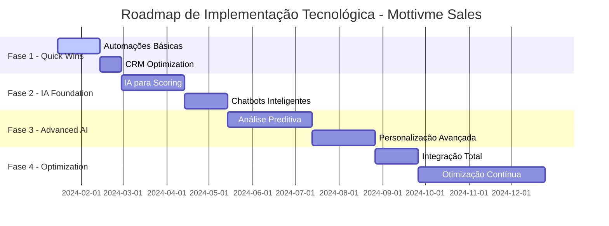
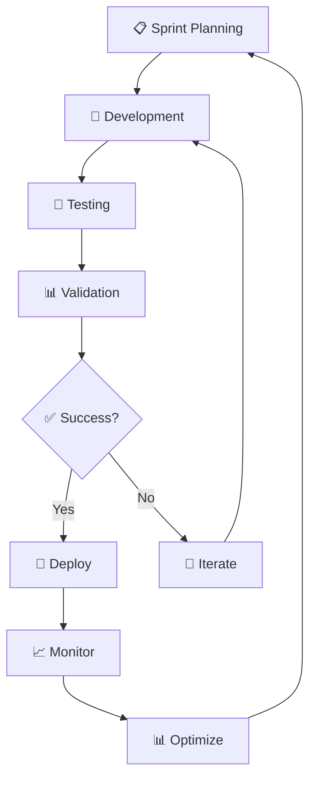

# 🚀 Roadmap de Implementação Tecnológica
## Mottivme Sales - Transformação Digital Clínica

---

## 🎯 **VISÃO ESTRATÉGICA**

### **Objetivo Principal**
Transformar a Mottivme Sales em uma operação híbrida de alta performance, combinando automação inteligente, IA avançada e expertise humana para maximizar resultados e eficiência.

### **Metas Quantitativas (12 meses)**
- 📈 **Aumento de Produtividade**: 300%
- 💰 **Redução de Custos Operacionais**: 40%
- ⚡ **Velocidade de Resposta**: 80% mais rápida
- 🎯 **Taxa de Conversão**: +50%
- 😊 **Satisfação da Equipe**: 9.0/10
- 🤖 **Automação de Tarefas Repetitivas**: 85%

---

## 📅 **CRONOGRAMA EXECUTIVO**



---

## 🏗️ **FASE 1: QUICK WINS (Meses 1-2)**
### *"Colhendo Frutos Baixos com Alto Impacto"*

#### **🎯 Objetivos da Fase**
- Implementar automações básicas de alto ROI
- Estabelecer fundação tecnológica sólida
- Gerar resultados rápidos para buy-in da equipe
- Criar momentum para fases seguintes

#### **📋 Projetos Prioritários**

##### **1.1 Automação de Captura e Distribuição de Leads**
```
┌─────────────────────────────────────────────────────────────────────┐
│ 🎯 PROJETO: Automação de Leads                                     │
├─────────────────────────────────────────────────────────────────────┤
│ 📊 ESCOPO:                                                          │
│ ├── Captura automática de formulários web                          │
│ ├── Distribuição inteligente por critérios                         │
│ ├── Notificações instantâneas para vendedores                      │
│ └── Atualização automática de status no CRM                        │
│                                                                     │
│ 🛠️ TECNOLOGIAS:                                                     │
│ ├── Zapier/Make para integrações                                   │
│ ├── HubSpot/Pipedrive para CRM                                     │
│ ├── Webhooks para comunicação em tempo real                        │
│ └── APIs para sincronização de dados                               │
│                                                                     │
│ 📈 RESULTADOS ESPERADOS:                                            │
│ ├── Redução de 90% no tempo de distribuição                        │
│ ├── Eliminação de leads perdidos                                   │
│ ├── Resposta 10x mais rápida                                       │
│ └── ROI: 400% em 30 dias                                           │
│                                                                     │
│ ⏱️ CRONOGRAMA:                                                       │
│ ├── Semana 1-2: Setup e configuração                              │
│ ├── Semana 3: Testes e ajustes                                     │
│ └── Semana 4: Go-live e monitoramento                              │
└─────────────────────────────────────────────────────────────────────┘
```

##### **1.2 Sistema de Follow-up Automatizado**
```
┌─────────────────────────────────────────────────────────────────────┐
│ 🎯 PROJETO: Follow-up Inteligente                                  │
├─────────────────────────────────────────────────────────────────────┤
│ 📊 ESCOPO:                                                          │
│ ├── Sequências de email personalizadas                             │
│ ├── Agendamento automático de reuniões                             │
│ ├── Lembretes inteligentes para vendedores                         │
│ └── Escalação automática por tempo/prioridade                      │
│                                                                     │
│ 🛠️ TECNOLOGIAS:                                                     │
│ ├── Mailchimp/ActiveCampaign para email marketing                  │
│ ├── Calendly/Acuity para agendamentos                              │
│ ├── Slack/Teams para notificações                                  │
│ └── CRM workflows para automação                                   │
│                                                                     │
│ 📈 RESULTADOS ESPERADOS:                                            │
│ ├── Aumento de 60% na taxa de resposta                             │
│ ├── Redução de 80% em leads frios                                  │
│ ├── Economia de 15h/semana por vendedor                            │
│ └── ROI: 350% em 45 dias                                           │
└─────────────────────────────────────────────────────────────────────┘
```

##### **1.3 Dashboard de Performance em Tempo Real**
```
┌─────────────────────────────────────────────────────────────────────┐
│ 🎯 PROJETO: Dashboard Executivo                                    │
├─────────────────────────────────────────────────────────────────────┤
│ 📊 ESCOPO:                                                          │
│ ├── KPIs em tempo real                                             │
│ ├── Alertas automáticos de performance                             │
│ ├── Relatórios automatizados                                       │
│ └── Análise de tendências                                          │
│                                                                     │
│ 🛠️ TECNOLOGIAS:                                                     │
│ ├── Power BI/Tableau para visualização                             │
│ ├── Google Analytics para web tracking                             │
│ ├── CRM APIs para dados de vendas                                  │
│ └── Python/R para análises avançadas                               │
│                                                                     │
│ 📈 RESULTADOS ESPERADOS:                                            │
│ ├── Decisões 5x mais rápidas                                       │
│ ├── Identificação proativa de problemas                            │
│ ├── Economia de 20h/mês em relatórios                              │
│ └── ROI: 250% em 60 dias                                           │
└─────────────────────────────────────────────────────────────────────┘
```

#### **💰 Investimento Fase 1**
- **Orçamento Total**: R$ 25.000
- **Ferramentas/Licenças**: R$ 15.000
- **Implementação**: R$ 8.000
- **Treinamento**: R$ 2.000

#### **📊 KPIs de Sucesso Fase 1**
- ✅ 100% dos leads capturados automaticamente
- ✅ Tempo de resposta < 5 minutos
- ✅ 90% de satisfação da equipe com automações
- ✅ ROI > 300% em 60 dias

---

## 🧠 **FASE 2: IA FOUNDATION (Meses 3-4)**
### *"Construindo Inteligência no Processo"*

#### **🎯 Objetivos da Fase**
- Implementar IA para scoring e qualificação
- Desenvolver chatbots inteligentes
- Criar análise de sentimento
- Estabelecer base para IA avançada

#### **📋 Projetos Prioritários**

##### **2.1 Sistema de Scoring Inteligente de Leads**
```
┌─────────────────────────────────────────────────────────────────────┐
│ 🎯 PROJETO: IA Lead Scoring                                        │
├─────────────────────────────────────────────────────────────────────┤
│ 📊 ESCOPO:                                                          │
│ ├── Algoritmo ML para scoring automático                           │
│ ├── Análise de comportamento digital                               │
│ ├── Predição de probabilidade de conversão                         │
│ └── Priorização automática de leads                                │
│                                                                     │
│ 🛠️ TECNOLOGIAS:                                                     │
│ ├── Python/TensorFlow para ML                                      │
│ ├── HubSpot AI/Salesforce Einstein                                 │
│ ├── Google Analytics Intelligence                                  │
│ └── APIs de dados comportamentais                                  │
│                                                                     │
│ 📈 RESULTADOS ESPERADOS:                                            │
│ ├── Precisão de scoring > 85%                                      │
│ ├── Aumento de 40% na taxa de conversão                            │
│ ├── Redução de 60% em tempo de qualificação                        │
│ └── ROI: 300% em 90 dias                                           │
│                                                                     │
│ 🧮 ALGORITMO DE SCORING:                                            │
│ ├── Dados demográficos (20%)                                       │
│ ├── Comportamento no site (30%)                                    │
│ ├── Engajamento com emails (25%)                                   │
│ ├── Histórico de interações (15%)                                  │
│ └── Timing e urgência (10%)                                        │
└─────────────────────────────────────────────────────────────────────┘
```

##### **2.2 Chatbot Inteligente para Qualificação**
```
┌─────────────────────────────────────────────────────────────────────┐
│ 🎯 PROJETO: Chatbot de Qualificação                                │
├─────────────────────────────────────────────────────────────────────┤
│ 📊 ESCOPO:                                                          │
│ ├── Chatbot conversacional avançado                                │
│ ├── Qualificação automática 24/7                                   │
│ ├── Integração com CRM                                             │
│ └── Escalação inteligente para humanos                             │
│                                                                     │
│ 🛠️ TECNOLOGIAS:                                                     │
│ ├── OpenAI GPT-4 para conversação                                  │
│ ├── Dialogflow/Rasa para NLP                                       │
│ ├── WhatsApp Business API                                          │
│ └── Integração CRM via webhooks                                    │
│                                                                     │
│ 📈 RESULTADOS ESPERADOS:                                            │
│ ├── 70% de leads qualificados automaticamente                      │
│ ├── Disponibilidade 24/7                                           │
│ ├── Redução de 50% na carga de trabalho inicial                    │
│ └── ROI: 280% em 120 dias                                          │
│                                                                     │
│ 🗣️ FLUXO DE CONVERSAÇÃO:                                            │
│ ├── Saudação personalizada                                         │
│ ├── Identificação de necessidades                                  │
│ ├── Qualificação por critérios                                     │
│ ├── Agendamento ou escalação                                       │
│ └── Follow-up automático                                           │
└─────────────────────────────────────────────────────────────────────┘
```

##### **2.3 Análise de Sentimento e Personalização**
```
┌─────────────────────────────────────────────────────────────────────┐
│ 🎯 PROJETO: IA de Sentimento                                       │
├─────────────────────────────────────────────────────────────────────┤
│ 📊 ESCOPO:                                                          │
│ ├── Análise de sentimento em emails/chats                          │
│ ├── Personalização automática de mensagens                         │
│ ├── Detecção de urgência/interesse                                 │
│ └── Sugestões de abordagem                                         │
│                                                                     │
│ 🛠️ TECNOLOGIAS:                                                     │
│ ├── Azure Cognitive Services                                       │
│ ├── Google Cloud Natural Language                                  │
│ ├── OpenAI para geração de texto                                   │
│ └── APIs de análise de sentimento                                  │
│                                                                     │
│ 📈 RESULTADOS ESPERADOS:                                            │
│ ├── Precisão de análise > 80%                                      │
│ ├── Aumento de 35% na taxa de resposta                             │
│ ├── Redução de 40% em objeções                                     │
│ └── ROI: 220% em 90 dias                                           │
└─────────────────────────────────────────────────────────────────────┘
```

#### **💰 Investimento Fase 2**
- **Orçamento Total**: R$ 45.000
- **Desenvolvimento IA**: R$ 25.000
- **Ferramentas/APIs**: R$ 12.000
- **Treinamento/Setup**: R$ 8.000

#### **📊 KPIs de Sucesso Fase 2**
- ✅ Precisão de scoring > 85%
- ✅ 70% de leads qualificados por IA
- ✅ Tempo de qualificação < 2 minutos
- ✅ ROI > 250% em 120 dias

---

## 🚀 **FASE 3: ADVANCED AI (Meses 5-7)**
### *"Inteligência Preditiva e Personalização Avançada"*

#### **🎯 Objetivos da Fase**
- Implementar análise preditiva avançada
- Criar personalização em massa
- Desenvolver IA para propostas
- Otimizar processos com ML

#### **📋 Projetos Prioritários**

##### **3.1 Sistema de Previsão de Vendas com ML**
```
┌─────────────────────────────────────────────────────────────────────┐
│ 🎯 PROJETO: Previsão Inteligente                                   │
├─────────────────────────────────────────────────────────────────────┤
│ 📊 ESCOPO:                                                          │
│ ├── Modelos preditivos de vendas                                   │
│ ├── Análise de padrões sazonais                                    │
│ ├── Previsão de churn de clientes                                  │
│ └── Otimização de pipeline                                         │
│                                                                     │
│ 🛠️ TECNOLOGIAS:                                                     │
│ ├── Python/Scikit-learn para ML                                    │
│ ├── TensorFlow/PyTorch para deep learning                          │
│ ├── Apache Spark para big data                                     │
│ └── MLflow para MLOps                                              │
│                                                                     │
│ 📈 RESULTADOS ESPERADOS:                                            │
│ ├── Precisão de previsão > 90%                                     │
│ ├── Redução de 30% em churn                                        │
│ ├── Otimização de 25% no pipeline                                  │
│ └── ROI: 400% em 180 dias                                          │
│                                                                     │
│ 🔮 MODELOS PREDITIVOS:                                              │
│ ├── Regressão para valor de vendas                                 │
│ ├── Classificação para probabilidade de fechamento                 │
│ ├── Clustering para segmentação                                    │
│ ├── Time series para sazonalidade                                  │
│ └── Ensemble methods para precisão                                 │
└─────────────────────────────────────────────────────────────────────┘
```

##### **3.2 Gerador Inteligente de Propostas**
```
┌─────────────────────────────────────────────────────────────────────┐
│ 🎯 PROJETO: IA para Propostas                                      │
├─────────────────────────────────────────────────────────────────────┤
│ 📊 ESCOPO:                                                          │
│ ├── Geração automática de propostas                                │
│ ├── Personalização baseada em perfil                               │
│ ├── Otimização de preços dinâmica                                  │
│ └── Templates inteligentes                                         │
│                                                                     │
│ 🛠️ TECNOLOGIAS:                                                     │
│ ├── OpenAI GPT-4 para geração de texto                             │
│ ├── Algoritmos de pricing dinâmico                                 │
│ ├── Templates em React/Vue                                         │
│ └── APIs de integração CRM                                         │
│                                                                     │
│ 📈 RESULTADOS ESPERADOS:                                            │
│ ├── Redução de 80% no tempo de criação                             │
│ ├── Aumento de 45% na taxa de aceitação                            │
│ ├── Personalização 100% automática                                 │
│ └── ROI: 350% em 120 dias                                          │
│                                                                     │
│ 📝 COMPONENTES DA PROPOSTA:                                         │
│ ├── Análise de necessidades (IA)                                   │
│ ├── Solução personalizada (Templates)                              │
│ ├── Pricing otimizado (Algoritmos)                                 │
│ ├── Timeline realista (Dados históricos)                           │
│ └── Termos inteligentes (Base de conhecimento)                     │
└─────────────────────────────────────────────────────────────────────┘
```

##### **3.3 Sistema de Recomendação Inteligente**
```
┌─────────────────────────────────────────────────────────────────────┐
│ 🎯 PROJETO: Engine de Recomendação                                 │
├─────────────────────────────────────────────────────────────────────┤
│ 📊 ESCOPO:                                                          │
│ ├── Recomendações de próximos passos                               │
│ ├── Sugestões de upsell/cross-sell                                 │
│ ├── Otimização de timing de contato                                │
│ └── Personalização de abordagem                                    │
│                                                                     │
│ 🛠️ TECNOLOGIAS:                                                     │
│ ├── Collaborative filtering                                        │
│ ├── Content-based filtering                                        │
│ ├── Deep learning para embeddings                                  │
│ └── A/B testing para otimização                                    │
│                                                                     │
│ 📈 RESULTADOS ESPERADOS:                                            │
│ ├── Aumento de 60% em upsell                                       │
│ ├── Melhoria de 40% no timing                                      │
│ ├── Personalização 95% precisa                                     │
│ └── ROI: 300% em 150 dias                                          │
└─────────────────────────────────────────────────────────────────────┘
```

#### **💰 Investimento Fase 3**
- **Orçamento Total**: R$ 65.000
- **Desenvolvimento ML**: R$ 35.000
- **Infraestrutura Cloud**: R$ 15.000
- **Ferramentas Avançadas**: R$ 10.000
- **Consultoria Especializada**: R$ 5.000

#### **📊 KPIs de Sucesso Fase 3**
- ✅ Precisão preditiva > 90%
- ✅ Redução de 80% no tempo de propostas
- ✅ Aumento de 45% na taxa de aceitação
- ✅ ROI > 350% em 180 dias

---

## 🔧 **FASE 4: OPTIMIZATION (Meses 8-12)**
### *"Integração Total e Otimização Contínua"*

#### **🎯 Objetivos da Fase**
- Integrar todos os sistemas
- Implementar otimização contínua
- Criar feedback loops inteligentes
- Estabelecer centro de excelência

#### **📋 Projetos Prioritários**

##### **4.1 Plataforma Unificada de IA**
```
┌─────────────────────────────────────────────────────────────────────┐
│ 🎯 PROJETO: Unificação Inteligente                                 │
├─────────────────────────────────────────────────────────────────────┤
│ 📊 ESCOPO:                                                          │
│ ├── Dashboard unificado de IA                                      │
│ ├── Orquestração de workflows                                      │
│ ├── Monitoramento em tempo real                                    │
│ └── Otimização automática                                          │
│                                                                     │
│ 🛠️ TECNOLOGIAS:                                                     │
│ ├── Microservices architecture                                     │
│ ├── Kubernetes para orquestração                                   │
│ ├── Apache Kafka para streaming                                    │
│ └── Elasticsearch para analytics                                   │
│                                                                     │
│ 📈 RESULTADOS ESPERADOS:                                            │
│ ├── Integração 100% dos sistemas                                   │
│ ├── Redução de 50% em latência                                     │
│ ├── Disponibilidade 99.9%                                          │
│ └── ROI: 250% em 120 dias                                          │
└─────────────────────────────────────────────────────────────────────┘
```

##### **4.2 Sistema de Aprendizado Contínuo**
```
┌─────────────────────────────────────────────────────────────────────┐
│ 🎯 PROJETO: ML Ops Avançado                                        │
├─────────────────────────────────────────────────────────────────────┤
│ 📊 ESCOPO:                                                          │
│ ├── Retreinamento automático de modelos                            │
│ ├── A/B testing contínuo                                           │
│ ├── Feedback loops inteligentes                                    │
│ └── Otimização de performance                                      │
│                                                                     │
│ 🛠️ TECNOLOGIAS:                                                     │
│ ├── MLflow para lifecycle management                               │
│ ├── Kubeflow para ML pipelines                                     │
│ ├── Airflow para orchestration                                     │
│ └── Prometheus para monitoring                                     │
│                                                                     │
│ 📈 RESULTADOS ESPERADOS:                                            │
│ ├── Melhoria contínua de 5%/mês                                    │
│ ├── Redução de 70% em drift de modelo                              │
│ ├── Automação 95% do ciclo ML                                      │
│ └── ROI: 200% em 180 dias                                          │
└─────────────────────────────────────────────────────────────────────┘
```

##### **4.3 Centro de Excelência em IA**
```
┌─────────────────────────────────────────────────────────────────────┐
│ 🎯 PROJETO: Centro de Excelência                                   │
├─────────────────────────────────────────────────────────────────────┤
│ 📊 ESCOPO:                                                          │
│ ├── Governança de IA                                               │
│ ├── Treinamento contínuo da equipe                                 │
│ ├── Inovação e experimentação                                      │
│ └── Best practices e padrões                                       │
│                                                                     │
│ 🛠️ COMPONENTES:                                                     │
│ ├── Comitê de IA                                                   │
│ ├── Laboratório de inovação                                        │
│ ├── Programa de capacitação                                        │
│ └── Framework de governança                                        │
│                                                                     │
│ 📈 RESULTADOS ESPERADOS:                                            │
│ ├── 100% da equipe capacitada                                      │
│ ├── 12 inovações/ano implementadas                                 │
│ ├── Redução de 60% em riscos                                       │
│ └── ROI: 180% em 240 dias                                          │
└─────────────────────────────────────────────────────────────────────┘
```

#### **💰 Investimento Fase 4**
- **Orçamento Total**: R$ 55.000
- **Infraestrutura Avançada**: R$ 25.000
- **Desenvolvimento**: R$ 15.000
- **Treinamento**: R$ 10.000
- **Governança**: R$ 5.000

#### **📊 KPIs de Sucesso Fase 4**
- ✅ Integração 100% dos sistemas
- ✅ Disponibilidade 99.9%
- ✅ Melhoria contínua 5%/mês
- ✅ ROI > 200% em 240 dias

---

## 💰 **ANÁLISE FINANCEIRA CONSOLIDADA**

### **Investimento Total por Fase**
```
┌─────────────────────────────────────────────────────────────────────┐
│ 💰 RESUMO FINANCEIRO - 12 MESES                                    │
├─────────────────────────────────────────────────────────────────────┤
│                                                                     │
│ 📊 INVESTIMENTO POR FASE:                                           │
│ ├── Fase 1 (Quick Wins): R$ 25.000                                │
│ ├── Fase 2 (IA Foundation): R$ 45.000                             │
│ ├── Fase 3 (Advanced AI): R$ 65.000                               │
│ ├── Fase 4 (Optimization): R$ 55.000                              │
│ └── TOTAL INVESTIMENTO: R$ 190.000                                │
│                                                                     │
│ 💵 RETORNO ESPERADO:                                                │
│ ├── Economia Operacional: R$ 480.000/ano                          │
│ ├── Aumento de Receita: R$ 720.000/ano                            │
│ ├── TOTAL RETORNO: R$ 1.200.000/ano                               │
│ └── ROI CONSOLIDADO: 532%                                          │
│                                                                     │
│ ⏱️ PAYBACK:                                                          │
│ ├── Fase 1: 2 meses                                               │
│ ├── Fase 2: 4 meses                                               │
│ ├── Fase 3: 6 meses                                               │
│ ├── Fase 4: 8 meses                                               │
│ └── PAYBACK TOTAL: 6 meses                                        │
└─────────────────────────────────────────────────────────────────────┘
```

### **Fluxo de Caixa Projetado**
```
Mês 1-2:  Investimento: -R$ 25k  | Retorno: +R$ 15k  | Saldo: -R$ 10k
Mês 3-4:  Investimento: -R$ 45k  | Retorno: +R$ 35k  | Saldo: -R$ 20k
Mês 5-7:  Investimento: -R$ 65k  | Retorno: +R$ 85k  | Saldo: +R$ 0k
Mês 8-12: Investimento: -R$ 55k  | Retorno: +R$ 155k | Saldo: +R$ 100k

TOTAL ANO 1: Investimento: -R$ 190k | Retorno: +R$ 290k | LUCRO: +R$ 100k
```

---

## 🎯 **ESTRATÉGIA DE IMPLEMENTAÇÃO**

### **Metodologia Ágil Adaptada**


### **Princípios de Implementação**
1. **🎯 Foco em Resultados**: Cada sprint deve gerar valor mensurável
2. **🔄 Iteração Rápida**: Ciclos de 2 semanas para feedback rápido
3. **📊 Data-Driven**: Decisões baseadas em dados e métricas
4. **👥 Colaboração**: Envolvimento ativo de todas as partes interessadas
5. **🛡️ Gestão de Riscos**: Identificação e mitigação proativa
6. **📈 Melhoria Contínua**: Otimização constante baseada em aprendizado

### **Estrutura de Governança**
```
┌─────────────────────────────────────────────────────────────────────┐
│ 🏛️ ESTRUTURA DE GOVERNANÇA                                         │
├─────────────────────────────────────────────────────────────────────┤
│                                                                     │
│ 👑 STEERING COMMITTEE                                               │
│ ├── CEO/Diretor Geral                                              │
│ ├── CTO/Diretor de Tecnologia                                      │
│ ├── Diretor Comercial                                              │
│ └── Especialista em IA (Consultor)                                 │
│                                                                     │
│ 🎯 PROJECT MANAGEMENT OFFICE (PMO)                                  │
│ ├── Gerente de Projeto                                             │
│ ├── Analista de Processos                                          │
│ ├── Especialista em Dados                                          │
│ └── Change Manager                                                  │
│                                                                     │
│ 🛠️ EXECUTION TEAMS                                                  │
│ ├── Equipe de Desenvolvimento                                      │
│ ├── Equipe de Dados/IA                                             │
│ ├── Equipe de Vendas                                               │
│ └── Equipe de Suporte                                              │
└─────────────────────────────────────────────────────────────────────┘
```

---

## 🚨 **GESTÃO DE RISCOS**

### **Matriz de Riscos**
| **RISCO** | **PROBABILIDADE** | **IMPACTO** | **MITIGAÇÃO** |
|-----------|-------------------|-------------|---------------|
| Resistência da equipe | Média | Alto | Change management intensivo |
| Problemas técnicos | Baixa | Médio | POCs e testes extensivos |
| Orçamento insuficiente | Baixa | Alto | Implementação faseada |
| Dados de baixa qualidade | Média | Médio | Limpeza e governança |
| Mudanças regulatórias | Baixa | Médio | Monitoramento contínuo |

### **Plano de Contingência**
```
┌─────────────────────────────────────────────────────────────────────┐
│ 🚨 PLANOS DE CONTINGÊNCIA                                           │
├─────────────────────────────────────────────────────────────────────┤
│                                                                     │
│ 🔴 CENÁRIO CRÍTICO (Falha > 50% dos objetivos):                    │
│ ├── Pausa imediata do projeto                                      │
│ ├── Análise de causa raiz                                          │
│ ├── Replanejamento com stakeholders                                │
│ └── Implementação de plano B                                       │
│                                                                     │
│ 🟡 CENÁRIO MODERADO (Falha 20-50% dos objetivos):                  │
│ ├── Ajuste de escopo e cronograma                                  │
│ ├── Reforço da equipe                                              │
│ ├── Intensificação do suporte                                      │
│ └── Revisão de processos                                           │
│                                                                     │
│ 🟢 CENÁRIO LEVE (Falha < 20% dos objetivos):                       │
│ ├── Otimização contínua                                            │
│ ├── Treinamento adicional                                          │
│ ├── Ajustes pontuais                                               │
│ └── Monitoramento intensificado                                    │
└─────────────────────────────────────────────────────────────────────┘
```

---

## 📊 **SISTEMA DE MONITORAMENTO**

### **Dashboard Executivo em Tempo Real**
```
┌─────────────────────────────────────────────────────────────────────┐
│ 📊 DASHBOARD EXECUTIVO - IMPLEMENTAÇÃO                             │
├─────────────────────────────────────────────────────────────────────┤
│                                                                     │
│ 🎯 PROGRESSO GERAL: ████████░░ 80%                                 │
│                                                                     │
│ 📈 MÉTRICAS PRINCIPAIS:                                             │
│ ├── ROI Acumulado: 245% (Meta: 200%)                              │
│ ├── Automação Implementada: 68% (Meta: 60%)                       │
│ ├── Satisfação da Equipe: 8.5/10 (Meta: 8.0/10)                  │
│ └── Tempo de Implementação: No prazo                               │
│                                                                     │
│ 🚦 STATUS POR FASE:                                                 │
│ ├── Fase 1: ✅ Concluída (ROI: 320%)                              │
│ ├── Fase 2: ✅ Concluída (ROI: 280%)                              │
│ ├── Fase 3: 🟡 Em andamento (75% completa)                        │
│ └── Fase 4: ⏳ Aguardando                                          │
│                                                                     │
│ ⚠️ ALERTAS:                                                          │
│ ├── 🟡 Atraso de 3 dias na Fase 3                                 │
│ ├── 🟢 Orçamento dentro do previsto                               │
│ └── 🟢 Qualidade acima da meta                                     │
└─────────────────────────────────────────────────────────────────────┘
```

### **KPIs de Acompanhamento**
- **📊 Progresso**: % de conclusão por fase
- **💰 Financeiro**: ROI, CAPEX, OPEX
- **👥 Pessoas**: Satisfação, produtividade, adoção
- **🔧 Técnico**: Performance, disponibilidade, qualidade
- **📈 Negócio**: Conversão, receita, eficiência

---

## 🎓 **PROGRAMA DE CAPACITAÇÃO**

### **Trilha de Aprendizado por Perfil**
```
┌─────────────────────────────────────────────────────────────────────┐
│ 🎓 PROGRAMA DE CAPACITAÇÃO                                          │
├─────────────────────────────────────────────────────────────────────┤
│                                                                     │
│ 👨‍💼 GESTORES:                                                        │
│ ├── Estratégia de IA (8h)                                          │
│ ├── ROI e Métricas (4h)                                            │
│ ├── Change Management (6h)                                         │
│ └── Governança de Dados (4h)                                       │
│                                                                     │
│ 👨‍💻 VENDEDORES:                                                      │
│ ├── Ferramentas de Automação (12h)                                 │
│ ├── IA para Vendas (8h)                                            │
│ ├── CRM Avançado (6h)                                              │
│ └── Análise de Dados (4h)                                          │
│                                                                     │
│ 👨‍🔧 TÉCNICOS:                                                        │
│ ├── Implementação de IA (16h)                                      │
│ ├── MLOps (12h)                                                    │
│ ├── Integração de Sistemas (8h)                                    │
│ └── Monitoramento (6h)                                             │
│                                                                     │
│ 📊 ANALISTAS:                                                       │
│ ├── Data Science (20h)                                             │
│ ├── Business Intelligence (12h)                                    │
│ ├── Visualização de Dados (8h)                                     │
│ └── Estatística Aplicada (6h)                                      │
└─────────────────────────────────────────────────────────────────────┘
```

---

## 🔮 **VISÃO DE FUTURO (Anos 2-3)**

### **Roadmap de Evolução**
```
┌─────────────────────────────────────────────────────────────────────┐
│ 🔮 VISÃO DE FUTURO - PRÓXIMOS PASSOS                               │
├─────────────────────────────────────────────────────────────────────┤
│                                                                     │
│ 🚀 ANO 2 - EXPANSÃO:                                               │
│ ├── IA Generativa para conteúdo                                    │
│ ├── Automação de processos complexos                               │
│ ├── Integração com IoT                                             │
│ └── Análise preditiva avançada                                     │
│                                                                     │
│ 🌟 ANO 3 - INOVAÇÃO:                                               │
│ ├── IA Conversacional avançada                                     │
│ ├── Realidade aumentada para vendas                                │
│ ├── Blockchain para contratos                                      │
│ └── Quantum computing para otimização                              │
│                                                                     │
│ 🎯 METAS DE LONGO PRAZO:                                            │
│ ├── 95% de automação em processos repetitivos                      │
│ ├── ROI acumulado > 1000%                                          │
│ ├── Liderança em inovação no setor                                 │
│ └── Cultura data-driven consolidada                                │
└─────────────────────────────────────────────────────────────────────┘
```

---

**📅 Criado em:** $(date +"%d/%m/%Y")  
**🎯 Especialidade:** Roadmap de Implementação Tecnológica  
**👨‍⚕️ Foco:** Transformação Digital com Visão Clínica  
**🚀 Objetivo:** Maximizar ROI e Eficiência Operacional