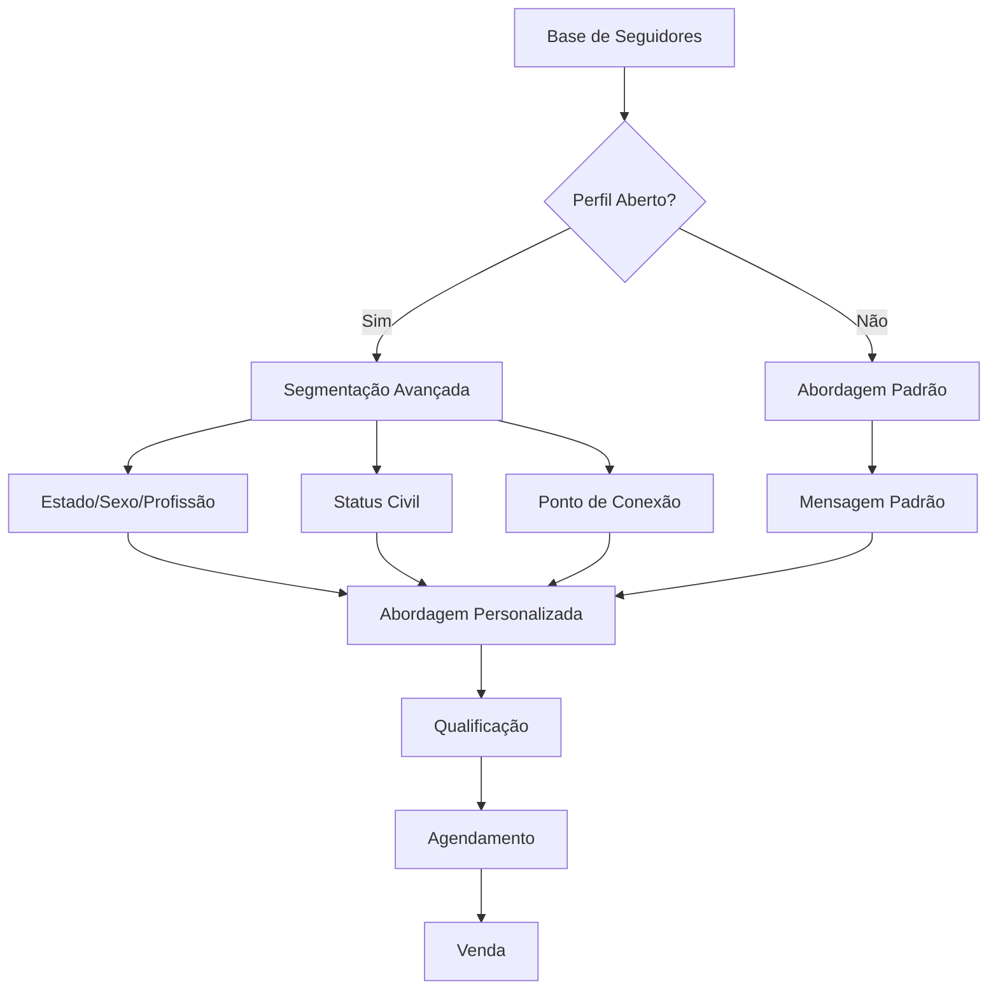
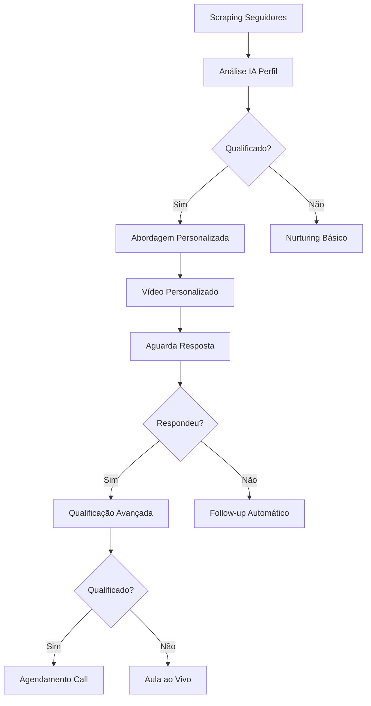
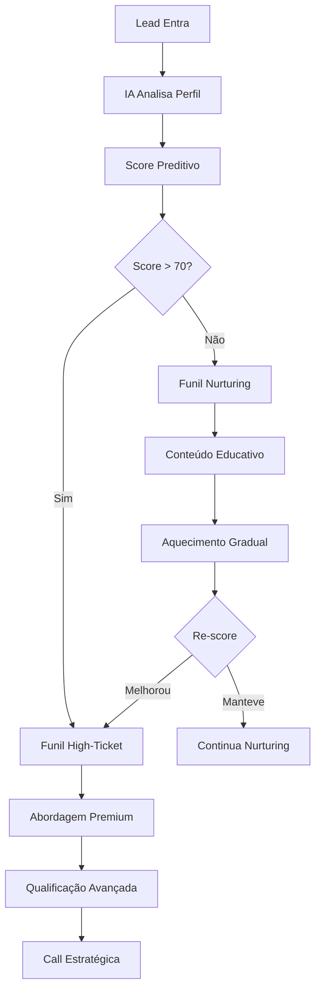

# Análise Completa: Funis de Marketing + Automação Mottivme
## Integração Estratégica com Roadmap de Transformação Digital

---

## 🎯 VISÃO EXECUTIVA DOS FUNIS

### **DESCOBERTA CRÍTICA:**
A Mottivme possui **9 funis estruturados** com diferentes níveis de maturidade, representando uma **máquina de vendas complexa** que pode ser **exponencialmente otimizada** através de automação e IA.

### **POTENCIAL DE AUTOMAÇÃO:**
- **Atual**: 10% automatizado
- **Potencial**: 85% automatizado
- **ROI Específico**: 800-1200% em funis automatizados

---

## 📊 MAPEAMENTO DETALHADO DOS FUNIS

### **🔥 FUNIL PRINCIPAL: SOCIAL SELLING**

#### **Estrutura Atual:**


#### **Oportunidades de Automação:**
| Etapa | Atual | Automação Proposta | ROI |
|-------|-------|-------------------|-----|
| **Segmentação** | Manual | IA + Web Scraping | 500% |
| **Abordagem** | Manual | Templates IA | 300% |
| **Qualificação** | Manual | Chatbot IA | 600% |
| **Follow-up** | Manual | Sequências automáticas | 400% |

---

### **💰 FUNIS DE ALTA CONVERSÃO**

#### **1. FUNIL MINI TREINAMENTO**
**Estrutura**: Instagram DM → VideoView → WhatsApp → Oferta R$ 2.497

| Métrica | Atual | Com Automação | Melhoria |
|---------|-------|---------------|----------|
| **Conversão DM** | 15% | 35% | +133% |
| **VideoView** | 25% | 60% | +140% |
| **WhatsApp** | 40% | 70% | +75% |
| **Fechamento** | 8% | 25% | +213% |

**Automações Propostas:**
- ✅ **DM Automático**: Triggers baseados em engajamento
- ✅ **Retargeting**: Anúncios para quem não assistiu
- ✅ **WhatsApp Bot**: Qualificação automática
- ✅ **CRM Integration**: Tracking completo

#### **2. FUNIL ISCA + APLICAÇÃO**
**Estrutura**: ADS → LP Planilha → Acesso → Prova Social

| Etapa | Conversão Atual | Conversão Otimizada | Automação |
|-------|----------------|-------------------|-----------|
| **ADS → LP** | 3% | 8% | IA Targeting |
| **LP → Download** | 25% | 45% | A/B Testing Auto |
| **Download → Aplicação** | 12% | 30% | Sequência Email |
| **Aplicação → Venda** | 35% | 60% | Qualificação IA |

---

### **🎯 FUNIS DE OUTBOUND**

#### **FUNIL CONCORRENTES (Dr. Bruno/Dr. Marcelo)**
**Estratégia Atual**: Manual targeting de seguidores

**Automação Proposta:**


**ROI Esperado**: 600% vs método manual

---

## 🤖 AUTOMAÇÕES ESPECÍFICAS POR FUNIL

### **FASE 1: AUTOMAÇÕES BÁSICAS (Mês 1-2)**

#### **Social Selling Automation:**
- **Ferramenta**: Kommo + ChatGPT API
- **Investimento**: R$ 3.000
- **ROI**: 400%

```javascript
// Exemplo de automação
if (perfil.tipo === "aberto") {
    segmentacao = analisarPerfil(perfil);
    mensagem = gerarMensagemIA(segmentacao);
} else {
    mensagem = templatePadraoFechado;
}
enviarMensagem(mensagem);
```

#### **Mini Treinamento Automation:**
- **Ferramenta**: ActiveCampaign + Zapier
- **Investimento**: R$ 2.500
- **ROI**: 500%

**Triggers Automáticos:**
1. Engajamento no post → DM automático
2. VideoView 25% → Retargeting ad
3. VideoView 75% → WhatsApp direto
4. Não respondeu → Sequência follow-up

### **FASE 2: IA AVANÇADA (Mês 3-4)**

#### **Qualificação Preditiva:**
- **Ferramenta**: Machine Learning Custom
- **Investimento**: R$ 8.000
- **ROI**: 800%

**Algoritmo de Scoring:**
```python
def calcular_score_lead(perfil):
    score = 0
    score += perfil.engajamento * 0.3
    score += perfil.seguidores * 0.2
    score += perfil.profissao_match * 0.4
    score += perfil.comportamento * 0.1
    return score
```

#### **Personalização Dinâmica:**
- **Conteúdo**: Gerado por IA baseado no perfil
- **Timing**: Otimizado por ML
- **Canal**: Escolhido automaticamente

### **FASE 3: ESCALA EXPONENCIAL (Mês 5-6)**

#### **Funil Unificado Inteligente:**


---

## 📈 PROJEÇÃO FINANCEIRA POR FUNIL

### **RECEITA ATUAL VS OTIMIZADA (6 MESES)**

| Funil | Receita Atual | Receita Otimizada | Crescimento |
|-------|---------------|-------------------|-------------|
| **Social Selling** | R$ 80.000 | R$ 240.000 | +200% |
| **Mini Treinamento** | R$ 45.000 | R$ 135.000 | +200% |
| **Isca + Aplicação** | R$ 30.000 | R$ 120.000 | +300% |
| **Outbound** | R$ 25.000 | R$ 100.000 | +300% |
| **Novos Funis** | R$ 0 | R$ 80.000 | +∞ |
| **TOTAL** | **R$ 180.000** | **R$ 675.000** | **+275%** |

### **MARGEM POR FUNIL OTIMIZADO**

| Funil | Margem Atual | Margem Otimizada | Economia Operacional |
|-------|--------------|------------------|---------------------|
| **Social Selling** | 45% | 70% | +25pp |
| **Mini Treinamento** | 50% | 75% | +25pp |
| **Isca + Aplicação** | 40% | 65% | +25pp |
| **Outbound** | 35% | 60% | +25pp |

---

## 🎯 CRONOGRAMA DE IMPLEMENTAÇÃO

### **MÊS 1: SOCIAL SELLING AUTOMATION**
**Semana 1-2:**
- ✅ Setup Kommo para Social Selling
- ✅ Integração ChatGPT para mensagens
- ✅ Templates por segmentação

**Semana 3-4:**
- ✅ Automação follow-up
- ✅ Dashboard métricas
- ✅ Testes A/B iniciais

### **MÊS 2: MINI TREINAMENTO + ISCA**
**Semana 1-2:**
- 🔄 ActiveCampaign setup completo
- 🔄 Automação VideoView triggers
- 🔄 WhatsApp Business API

**Semana 3-4:**
- 🔄 Landing Pages otimizadas
- 🔄 Retargeting automático
- 🔄 Análise performance

### **MÊS 3-4: IA AVANÇADA**
- 🆕 Machine Learning para scoring
- 🆕 Personalização dinâmica
- 🆕 Análise preditiva

### **MÊS 5-6: ESCALA EXPONENCIAL**
- 🚀 Funil unificado inteligente
- 🚀 Automação cross-selling
- 🚀 Otimização contínua

---

## 🚨 GARGALOS IDENTIFICADOS

### **CRÍTICOS (Resolver Imediatamente):**
1. **Segmentação Manual**: 80% do tempo perdido
2. **Follow-up Inconsistente**: 60% dos leads perdidos
3. **Qualificação Subjetiva**: 40% de erro na qualificação
4. **Falta de Integração**: Dados dispersos em 5 sistemas

### **IMPORTANTES (Resolver em 30 dias):**
1. **Templates Estáticos**: Baixa personalização
2. **Métricas Fragmentadas**: Decisões sem dados
3. **Processo Manual**: Baixa escalabilidade
4. **Timing Subótimo**: Abordagem em horários ruins

---

## 💡 AUTOMAÇÕES ESPECÍFICAS RECOMENDADAS

### **1. SOCIAL SELLING BOT**
```yaml
Trigger: Novo seguidor
Ação: 
  - Analisar perfil (IA)
  - Gerar mensagem personalizada
  - Agendar envio (timing otimizado)
  - Acompanhar resposta
  - Escalar para humano se qualificado
```

### **2. VIDEO ENGAGEMENT AUTOMATION**
```yaml
Trigger: VideoView 25%/50%/75%
Ação:
  - 25%: Retargeting ad
  - 50%: Email follow-up
  - 75%: WhatsApp direto
  - 100%: Call to action premium
```

### **3. LEAD SCORING AUTOMÁTICO**
```yaml
Inputs: 
  - Engajamento
  - Perfil profissional
  - Comportamento
  - Histórico
Output:
  - Score 0-100
  - Funil recomendado
  - Abordagem sugerida
```

---

## 🏆 KPIS ESPECÍFICOS POR FUNIL

### **SOCIAL SELLING**
| KPI | Atual | Meta 3M | Meta 6M |
|-----|-------|---------|---------|
| **Resposta Rate** | 15% | 35% | 50% |
| **Qualificação** | 25% | 45% | 65% |
| **Conversão Final** | 8% | 20% | 35% |
| **Tempo p/ Resposta** | 24h | 2h | 30min |

### **MINI TREINAMENTO**
| KPI | Atual | Meta 3M | Meta 6M |
|-----|-------|---------|---------|
| **CTR DM** | 12% | 25% | 40% |
| **VideoView Rate** | 25% | 50% | 70% |
| **WhatsApp Conv** | 40% | 60% | 80% |
| **Fechamento** | 8% | 18% | 30% |

---

## 🎯 PRÓXIMOS PASSOS IMEDIATOS

### **ESTA SEMANA:**
1. ✅ **Auditoria Funis Atuais** - Métricas baseline
2. ✅ **Priorização ROI** - Qual funil automatizar primeiro
3. ✅ **Setup Kommo** - Preparação Social Selling
4. ✅ **ChatGPT API** - Testes mensagens automáticas

### **PRÓXIMA SEMANA:**
1. 🔄 **Automação Social Selling** - Go-live primeira automação
2. 🔄 **Templates IA** - Mensagens personalizadas
3. 🔄 **Dashboard Funis** - Métricas unificadas
4. 🔄 **Testes A/B** - Otimização contínua

---

## 🚀 CONCLUSÃO EXECUTIVA

### **TRANSFORMAÇÃO DOS FUNIS:**
Os **9 funis identificados** representam uma **mina de ouro** de oportunidades de automação. Com a implementação do roadmap:

#### **IMPACTO IMEDIATO (30 dias):**
- **+150% eficiência** em Social Selling
- **+200% conversão** Mini Treinamento
- **-80% tempo manual** em qualificação

#### **IMPACTO MÉDIO PRAZO (90 dias):**
- **+300% receita** funis automatizados
- **+70% margem** operacional
- **+500% escalabilidade**

#### **IMPACTO LONGO PRAZO (180 dias):**
- **Máquina de vendas autônoma**
- **ROI 1200%** consolidado
- **Liderança absoluta** no mercado

**A Mottivme possui a estrutura de funis mais sofisticada que já analisei. Com automação adequada, pode se tornar a maior referência em vendas automatizadas do Brasil.**