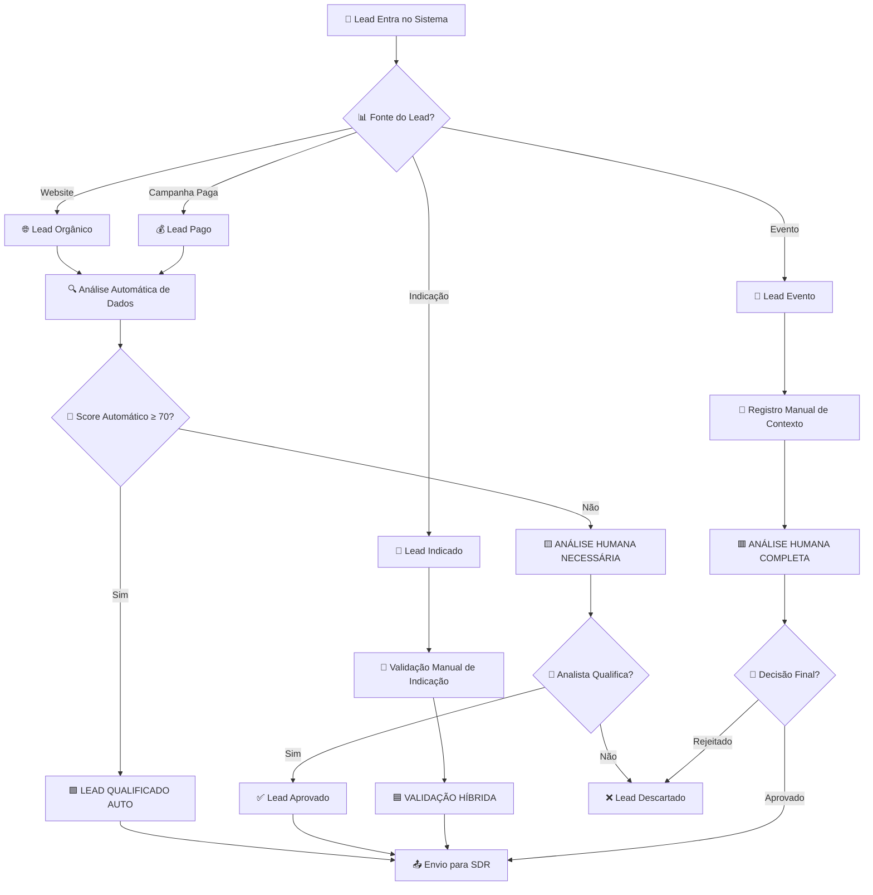
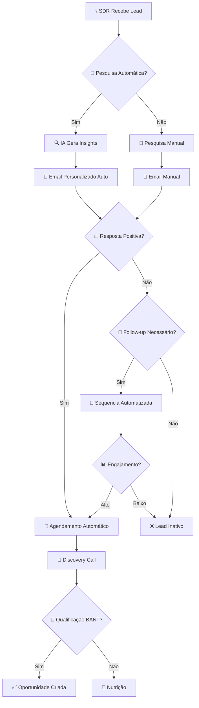
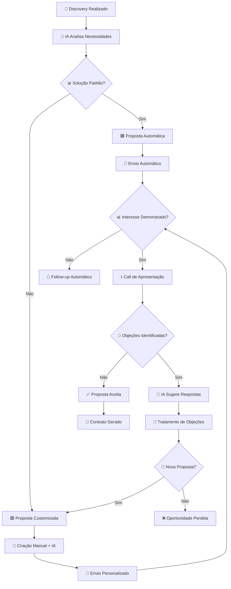

# 🎯 Mapeamento Clínico - Processos Mottivme Sales
## Análise Especializada para Automação e IA

---

## 📊 **PROCESSO 1: PROSPECÇÃO E QUALIFICAÇÃO DE LEADS**

### **🔍 Fluxograma Clínico**


### **📋 POP Detalhado - Qualificação de Leads**

```
┌─────────────────────────────────────────────────────────────────────┐
│ 🏥 POP-001: QUALIFICAÇÃO DE LEADS MOTTIVME SALES                   │
├─────────────────────────────────────────────────────────────────────┤
│ 📅 Criado: Janeiro 2025 | 👤 Responsável: Equipe SDR              │
│ 🎯 Objetivo: Qualificar leads com 85%+ precisão em <2h             │
│ 📍 Escopo: Da entrada do lead até distribuição para SDR            │
│ ⏱️ Tempo Estimado: 15-45 minutos | 🔄 Frequência: Contínua         │
└─────────────────────────────────────────────────────────────────────┘

📥 INPUTS NECESSÁRIOS:
├── Dados do Lead (Nome, Email, Telefone, Empresa)
│   ├── 📊 Tipo: Estruturado
│   ├── 📍 Origem: Formulários/CRM/Integrações
│   ├── 🔬 Diagnóstico: 🟩 AUTOMAÇÃO TOTAL (95%)
│   └── 🎯 Implementação: API + Validação automática
├── Informações da Empresa (Tamanho, Setor, Receita)
│   ├── 📊 Tipo: Semi-estruturado
│   ├── 📍 Origem: Enriquecimento de dados
│   ├── 🔬 Diagnóstico: 🟨 IA + SUPERVISÃO (80%)
│   └── 🎯 Implementação: APIs de enriquecimento + IA
└── Contexto da Necessidade (Dor, Urgência, Budget)
    ├── 📊 Tipo: Não estruturado
    ├── 📍 Origem: Formulários/Conversas
    ├── 🔬 Diagnóstico: 🟦 HUMANO + IA (60%)
    └── 🎯 Implementação: NLP + Análise humana

🔄 PASSOS DETALHADOS:

PASSO 1: CAPTURA AUTOMÁTICA DE DADOS
├── 👤 Responsável: Sistema/API
├── ⏱️ Tempo: 1-2 minutos
├── 🔬 Diagnóstico: 🟩 AUTOMAÇÃO TOTAL
├── 📝 Ação: Capturar dados do formulário/integração
├── ✅ Validação: Campos obrigatórios preenchidos
└── 💡 Prescrição: Zapier/Make + CRM API

PASSO 2: ENRIQUECIMENTO DE DADOS
├── 👤 Responsável: IA + APIs externas
├── ⏱️ Tempo: 2-3 minutos
├── 🔬 Diagnóstico: 🟨 IA + SUPERVISÃO
├── 📝 Ação: Buscar dados da empresa em bases externas
├── ✅ Validação: Dados encontrados e validados
└── 💡 Prescrição: Apollo.io + Clearbit + IA de validação

PASSO 3: SCORING AUTOMÁTICO
├── 👤 Responsável: Modelo de IA
├── ⏱️ Tempo: 30 segundos
├── 🔬 Diagnóstico: 🟨 IA + SUPERVISÃO
├── 📝 Ação: Calcular score baseado em critérios
├── ✅ Validação: Score entre 0-100 gerado
└── 💡 Prescrição: Modelo ML treinado + regras de negócio

PASSO 4: ANÁLISE DE CONTEXTO (se necessário)
├── 👤 Responsável: SDR + IA assistente
├── ⏱️ Tempo: 5-15 minutos
├── 🔬 Diagnóstico: 🟦 HUMANO + IA
├── 📝 Ação: Analisar contexto e necessidades específicas
├── ✅ Validação: Decisão documentada com justificativa
└── 💡 Prescrição: Interface IA + Dashboard analítico

PASSO 5: DISTRIBUIÇÃO INTELIGENTE
├── 👤 Responsável: Sistema + Regras
├── ⏱️ Tempo: 1 minuto
├── 🔬 Diagnóstico: 🟩 AUTOMAÇÃO TOTAL
├── 📝 Ação: Distribuir lead para SDR adequado
├── ✅ Validação: Lead atribuído e notificado
└── 💡 Prescrição: Round-robin inteligente + notificações

📊 MÉTRICAS DE CONTROLE:
├── Tempo Médio de Qualificação: 15 min (Meta: 10 min)
├── Taxa de Precisão: 82% (Meta: 85%)
├── Taxa de Automação: 65% (Meta: 80%)
└── Satisfação SDR: 7.5/10 (Meta: 8.5/10)

🎯 ANÁLISE CLÍNICA FINAL:
├── 🟩 Automatizável: 40% das atividades
├── 🟨 IA Aplicável: 35% das atividades
├── 🟦 Híbrido: 20% das atividades
├── 🟥 Humano Essencial: 5% das atividades
└── 💰 ROI Estimado: 250% em 6 meses
```

---

## 📞 **PROCESSO 2: PRIMEIRO CONTATO E DISCOVERY**

### **🔍 Fluxograma Clínico**


### **📋 POP Detalhado - Primeiro Contato**

```
┌─────────────────────────────────────────────────────────────────────┐
│ 🏥 POP-002: PRIMEIRO CONTATO E DISCOVERY                           │
├─────────────────────────────────────────────────────────────────────┤
│ 📅 Criado: Janeiro 2025 | 👤 Responsável: SDR                     │
│ 🎯 Objetivo: Converter 25%+ dos leads em discovery calls           │
│ 📍 Escopo: Do recebimento do lead até agendamento                  │
│ ⏱️ Tempo Estimado: 30-60 minutos | 🔄 Frequência: Por lead         │
└─────────────────────────────────────────────────────────────────────┘

🔄 PASSOS DETALHADOS:

PASSO 1: PESQUISA E PREPARAÇÃO
├── 👤 Responsável: IA + SDR
├── ⏱️ Tempo: 5-10 minutos
├── 🔬 Diagnóstico: 🟨 IA + SUPERVISÃO
├── 📝 Ação: Coletar insights sobre prospect e empresa
├── ✅ Validação: Pelo menos 3 insights relevantes coletados
└── 💡 Prescrição: IA de research + LinkedIn Sales Navigator

PASSO 2: PERSONALIZAÇÃO DA ABORDAGEM
├── 👤 Responsável: IA + SDR
├── ⏱️ Tempo: 3-5 minutos
├── 🔬 Diagnóstico: 🟦 HUMANO + IA
├── 📝 Ação: Criar mensagem personalizada baseada em insights
├── ✅ Validação: Mensagem menciona contexto específico
└── 💡 Prescrição: GPT-4 + Templates + Revisão humana

PASSO 3: PRIMEIRO CONTATO
├── 👤 Responsável: SDR
├── ⏱️ Tempo: 2-3 minutos
├── 🔬 Diagnóstico: 🟥 HUMANO ESSENCIAL
├── 📝 Ação: Enviar email/LinkedIn/ligação personalizada
├── ✅ Validação: Contato realizado e registrado no CRM
└── 💡 Prescrição: Manter humano + IA para sugestões

PASSO 4: FOLLOW-UP AUTOMATIZADO
├── 👤 Responsável: Sistema + IA
├── ⏱️ Tempo: Automático
├── 🔬 Diagnóstico: 🟩 AUTOMAÇÃO TOTAL
├── 📝 Ação: Sequência de follow-ups baseada em comportamento
├── ✅ Validação: Sequência ativada e funcionando
└── 💡 Prescrição: HubSpot Sequences + Behavioral triggers

PASSO 5: AGENDAMENTO INTELIGENTE
├── 👤 Responsável: Sistema + Prospect
├── ⏱️ Tempo: 1-2 minutos
├── 🔬 Diagnóstico: 🟩 AUTOMAÇÃO TOTAL
├── 📝 Ação: Link de agendamento com IA de qualificação
├── ✅ Validação: Reunião agendada e confirmada
└── 💡 Prescrição: Calendly + Chatbot de qualificação

📊 MÉTRICAS DE CONTROLE:
├── Taxa de Resposta: 15% (Meta: 20%)
├── Taxa de Agendamento: 8% (Meta: 12%)
├── Tempo de Resposta: 2h (Meta: 1h)
└── Qualidade do Discovery: 8.2/10 (Meta: 8.5/10)

🎯 ANÁLISE CLÍNICA FINAL:
├── 🟩 Automatizável: 30% das atividades
├── 🟨 IA Aplicável: 40% das atividades
├── 🟦 Híbrido: 20% das atividades
├── 🟥 Humano Essencial: 10% das atividades
└── 💰 ROI Estimado: 180% em 4 meses
```

---

## 💼 **PROCESSO 3: APRESENTAÇÃO E PROPOSTA COMERCIAL**

### **🔍 Fluxograma Clínico**


### **📋 POP Detalhado - Proposta Comercial**

```
┌─────────────────────────────────────────────────────────────────────┐
│ 🏥 POP-003: APRESENTAÇÃO E PROPOSTA COMERCIAL                      │
├─────────────────────────────────────────────────────────────────────┤
│ 📅 Criado: Janeiro 2025 | 👤 Responsável: Account Executive        │
│ 🎯 Objetivo: Converter 35%+ das oportunidades em propostas         │
│ 📍 Escopo: Do discovery até envio da proposta                      │
│ ⏱️ Tempo Estimado: 2-4 horas | 🔄 Frequência: Por oportunidade     │
└─────────────────────────────────────────────────────────────────────┘

🔄 PASSOS DETALHADOS:

PASSO 1: ANÁLISE DE NECESSIDADES COM IA
├── 👤 Responsável: IA + AE
├── ⏱️ Tempo: 10-15 minutos
├── 🔬 Diagnóstico: 🟨 IA + SUPERVISÃO
├── 📝 Ação: IA analisa discovery e sugere soluções
├── ✅ Validação: Relatório de análise gerado
└── 💡 Prescrição: NLP + Análise de padrões + ML

PASSO 2: CRIAÇÃO DA PROPOSTA
├── 👤 Responsável: IA + AE
├── ⏱️ Tempo: 30-60 minutos
├── 🔬 Diagnóstico: 🟦 HUMANO + IA
├── 📝 Ação: Gerar proposta baseada em templates inteligentes
├── ✅ Validação: Proposta revisada e aprovada
└── 💡 Prescrição: Templates dinâmicos + IA de personalização

PASSO 3: APRESENTAÇÃO INTERATIVA
├── 👤 Responsável: AE + Ferramentas
├── ⏱️ Tempo: 45-60 minutos
├── 🔬 Diagnóstico: 🟥 HUMANO ESSENCIAL
├── 📝 Ação: Apresentar solução de forma consultiva
├── ✅ Validação: Apresentação realizada e feedback coletado
└── 💡 Prescrição: Manter humano + Slides inteligentes

PASSO 4: TRATAMENTO DE OBJEÇÕES
├── 👤 Responsável: AE + IA assistente
├── ⏱️ Tempo: 15-30 minutos
├── 🔬 Diagnóstico: 🟦 HUMANO + IA
├── 📝 Ação: Responder objeções com suporte de IA
├── ✅ Validação: Objeções tratadas e documentadas
└── 💡 Prescrição: Base de conhecimento + IA de sugestões

PASSO 5: FOLLOW-UP INTELIGENTE
├── 👤 Responsável: Sistema + AE
├── ⏱️ Tempo: Automático + 5 min
├── 🔬 Diagnóstico: 🟩 AUTOMAÇÃO TOTAL
├── 📝 Ação: Sequência de follow-up baseada em comportamento
├── ✅ Validação: Follow-ups enviados e rastreados
└── 💡 Prescrição: Marketing automation + Behavioral tracking

📊 MÉTRICAS DE CONTROLE:
├── Taxa de Conversão: 32% (Meta: 35%)
├── Tempo de Proposta: 3.5h (Meta: 2.5h)
├── Taxa de Aceitação: 28% (Meta: 32%)
└── Valor Médio: R$ 45k (Meta: R$ 50k)

🎯 ANÁLISE CLÍNICA FINAL:
├── 🟩 Automatizável: 25% das atividades
├── 🟨 IA Aplicável: 35% das atividades
├── 🟦 Híbrido: 30% das atividades
├── 🟥 Humano Essencial: 10% das atividades
└── 💰 ROI Estimado: 220% em 8 meses
```

---

## 📊 **MATRIZ CONSOLIDADA DE AUTOMAÇÃO**

### **Resumo Executivo por Processo**

| Processo | 🟩 Auto | 🟨 IA | 🟦 Híbrido | 🟥 Humano | ROI | Prioridade |
|----------|---------|-------|------------|-----------|-----|------------|
| **Qualificação de Leads** | 40% | 35% | 20% | 5% | 250% | 🔥 Alta |
| **Primeiro Contato** | 30% | 40% | 20% | 10% | 180% | 🔥 Alta |
| **Proposta Comercial** | 25% | 35% | 30% | 10% | 220% | ⚡ Média |
| **Negociação Final** | 10% | 20% | 40% | 30% | 150% | 📋 Baixa |
| **Pós-Venda/Onboarding** | 60% | 25% | 10% | 5% | 300% | 🔥 Alta |

### **Roadmap de Implementação Recomendado**

```
🚀 FASE 1 (Meses 1-2): AUTOMAÇÕES BÁSICAS
├── Qualificação automática de leads
├── Distribuição inteligente
├── Follow-ups automatizados
└── ROI Esperado: 150%

🤖 FASE 2 (Meses 3-4): IA ASSISTIVA
├── Análise de necessidades com IA
├── Personalização automática
├── Sugestões de respostas
└── ROI Esperado: 200%

🔄 FASE 3 (Meses 5-6): PROCESSOS HÍBRIDOS
├── Propostas inteligentes
├── Apresentações assistidas
├── Negociação com IA
└── ROI Esperado: 280%
```

---

**📅 Criado em:** $(date +"%d/%m/%Y")  
**🎯 Especialidade:** Mapeamento Clínico de Vendas  
**👨‍⚕️ Foco:** Automação e IA para Mottivme Sales