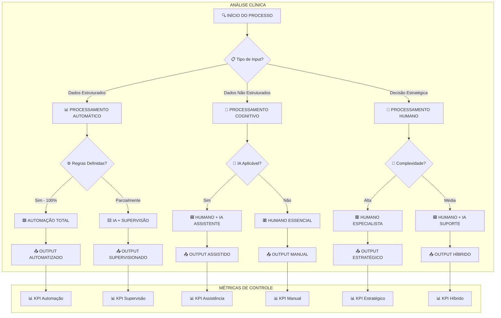

# 📊 Templates Detalhados - Fluxogramas e POPs Clínicos
## Mottivme Sales - Análise Especializada para Automação

---

## 🎯 **TEMPLATE 1: FLUXOGRAMA CLÍNICO COMPLETO**

### **Estrutura Base do Fluxograma**


### **Legenda Clínica Detalhada**
| Símbolo | Significado | Ação Recomendada | Prioridade |
|---------|-------------|-------------------|------------|
| 🟩 | **Automação Total** | Implementar RPA/API | 🔥 Alta |
| 🟨 | **IA + Supervisão** | Desenvolver IA com checkpoints | 🔥 Alta |
| 🟦 | **Humano + IA** | IA como assistente/copiloto | ⚡ Média |
| 🟥 | **Humano Essencial** | Manter processo manual otimizado | 📋 Baixa |
| ⚠️ | **Ponto de Dor** | Investigar causa raiz | 🔥 Crítica |
| ✅ | **Processo Saudável** | Monitorar e manter | 📋 Baixa |

---

## 📋 **TEMPLATE 2: POP CLÍNICO ULTRA-DETALHADO**

### **Cabeçalho Padrão**
```
┌─────────────────────────────────────────────────────────────────────┐
│ 🏥 POP-[CÓDIGO]: [NOME DO PROCESSO]                                │
├─────────────────────────────────────────────────────────────────────┤
│ 📅 Criado: [DATA] | 👤 Responsável: [NOME] | 🔄 Versão: [X.X]     │
│ 🎯 Objetivo: [DESCRIÇÃO CLARA E MENSURÁVEL]                        │
│ 📍 Escopo: De [PONTO INICIAL] até [PONTO FINAL]                    │
│ ⏱️ Tempo Estimado: [X] minutos | 🔄 Frequência: [PERIODICIDADE]    │
│ 👥 Stakeholders: [LISTA DE ENVOLVIDOS]                             │
└─────────────────────────────────────────────────────────────────────┘
```

### **Seção de Inputs Detalhada**
```
┌─────────────────────────────────────────────────────────────────────┐
│ 📥 INPUTS NECESSÁRIOS                                               │
├─────────────────────────────────────────────────────────────────────┤
│ Input 1: [NOME DO INPUT]                                           │
│ ├── 📊 Tipo: [Estruturado/Não Estruturado/Decisão]               │
│ ├── 📍 Origem: [Sistema/Pessoa/Processo Anterior]                 │
│ ├── 📏 Formato: [Especificação técnica]                           │
│ ├── ✅ Critérios de Qualidade: [Lista de validações]              │
│ ├── 🔬 Diagnóstico Clínico: [Humano/IA/Automação]                 │
│ └── 🎯 Potencial de Automação: [0-100%]                           │
│                                                                     │
│ Input 2: [NOME DO INPUT]                                           │
│ ├── 📊 Tipo: [Estruturado/Não Estruturado/Decisão]               │
│ ├── 📍 Origem: [Sistema/Pessoa/Processo Anterior]                 │
│ ├── 📏 Formato: [Especificação técnica]                           │
│ ├── ✅ Critérios de Qualidade: [Lista de validações]              │
│ ├── 🔬 Diagnóstico Clínico: [Humano/IA/Automação]                 │
│ └── 🎯 Potencial de Automação: [0-100%]                           │
└─────────────────────────────────────────────────────────────────────┘
```

### **Seção de Passos Ultra-Detalhada**
```
┌─────────────────────────────────────────────────────────────────────┐
│ 🔄 PASSO [N]: [NOME DA AÇÃO]                                       │
├─────────────────────────────────────────────────────────────────────┤
│ 👤 Responsável: [Cargo/Sistema]                                     │
│ ⏱️ Tempo Estimado: [X] minutos                                      │
│ 🎯 Objetivo: [O que deve ser alcançado]                            │
│                                                                     │
│ 📝 DESCRIÇÃO DETALHADA:                                            │
│ [Explicação passo a passo do que deve ser feito, incluindo         │
│  screenshots, exemplos, e especificações técnicas]                 │
│                                                                     │
│ 📊 INPUTS ESPECÍFICOS:                                              │
│ ├── Input A: [Descrição] - Fonte: [Local]                         │
│ ├── Input B: [Descrição] - Fonte: [Local]                         │
│ └── Input C: [Descrição] - Fonte: [Local]                         │
│                                                                     │
│ ⚙️ AÇÕES ESPECÍFICAS:                                               │
│ 1. [Ação detalhada 1]                                              │
│    ├── Como fazer: [Instruções específicas]                       │
│    ├── Onde fazer: [Sistema/Local]                                 │
│    └── Validação: [Como confirmar que foi feito corretamente]      │
│                                                                     │
│ 2. [Ação detalhada 2]                                              │
│    ├── Como fazer: [Instruções específicas]                       │
│    ├── Onde fazer: [Sistema/Local]                                 │
│    └── Validação: [Como confirmar que foi feito corretamente]      │
│                                                                     │
│ ✅ CRITÉRIOS DE QUALIDADE:                                          │
│ ├── Critério 1: [Especificação mensurável]                        │
│ ├── Critério 2: [Especificação mensurável]                        │
│ └── Critério 3: [Especificação mensurável]                        │
│                                                                     │
│ 🚨 PONTOS DE CONTROLE:                                              │
│ ├── Checkpoint 1: [O que verificar]                               │
│ ├── Checkpoint 2: [O que verificar]                               │
│ └── Checkpoint 3: [O que verificar]                               │
│                                                                     │
│ 📤 OUTPUTS GERADOS:                                                 │
│ ├── Output A: [Descrição] - Destino: [Local/Sistema]              │
│ ├── Output B: [Descrição] - Destino: [Local/Sistema]              │
│ └── Output C: [Descrição] - Destino: [Local/Sistema]              │
│                                                                     │
│ 🔬 ANÁLISE CLÍNICA:                                                 │
│ ├── Tipo de Atividade: [Cognitiva/Operacional/Interface]          │
│ ├── Complexidade: [Baixa/Média/Alta]                              │
│ ├── Variabilidade: [Baixa/Média/Alta]                             │
│ ├── Criatividade Necessária: [Sim/Não/Parcial]                   │
│ ├── Julgamento Humano: [Essencial/Útil/Desnecessário]             │
│ └── Relacionamento Humano: [Crítico/Importante/Irrelevante]       │
│                                                                     │
│ 🎯 DIAGNÓSTICO FINAL:                                               │
│ ├── Classificação: [🟥 Humano/🟨 IA/🟩 Automação/🟦 Híbrido]      │
│ ├── Confiança do Diagnóstico: [0-100%]                            │
│ ├── Prioridade de Implementação: [Alta/Média/Baixa]               │
│ └── ROI Estimado: [Alto/Médio/Baixo]                              │
│                                                                     │
│ 💡 PRESCRIÇÃO TECNOLÓGICA:                                          │
│ ├── Solução Recomendada: [Descrição da tecnologia]                │
│ ├── Complexidade de Implementação: [Simples/Média/Complexa]       │
│ ├── Tempo de Implementação: [X semanas/meses]                     │
│ ├── Recursos Necessários: [Equipe/Orçamento/Tecnologia]           │
│ └── Riscos Identificados: [Lista de riscos e mitigações]          │
└─────────────────────────────────────────────────────────────────────┘
```

### **Seção de Métricas e KPIs**
```
┌─────────────────────────────────────────────────────────────────────┐
│ 📊 MÉTRICAS DE CONTROLE E SAÚDE DO PROCESSO                        │
├─────────────────────────────────────────────────────────────────────┤
│ 🎯 EFICIÊNCIA OPERACIONAL:                                         │
│ ├── Tempo Médio de Execução: [X] minutos (Meta: [Y] minutos)      │
│ ├── Taxa de Conclusão no Prazo: [X]% (Meta: [Y]%)                 │
│ ├── Utilização de Recursos: [X]% (Meta: [Y]%)                     │
│ └── Custo por Execução: R$ [X] (Meta: R$ [Y])                     │
│                                                                     │
│ ✅ QUALIDADE DO OUTPUT:                                             │
│ ├── Taxa de Erro: [X]% (Meta: [Y]%)                               │
│ ├── Taxa de Retrabalho: [X]% (Meta: [Y]%)                         │
│ ├── Satisfação Cliente Interno: [X]/10 (Meta: [Y]/10)             │
│ └── Conformidade com Padrões: [X]% (Meta: [Y]%)                   │
│                                                                     │
│ 🤖 POTENCIAL DE AUTOMAÇÃO:                                          │
│ ├── % Atividades Automatizáveis: [X]%                             │
│ ├── % Atividades para IA: [X]%                                    │
│ ├── % Atividades Humanas: [X]%                                    │
│ └── ROI Estimado da Automação: [X]% em [Y] meses                  │
│                                                                     │
│ 👥 SAÚDE ORGANIZACIONAL:                                            │
│ ├── Satisfação da Equipe: [X]/10 (Meta: [Y]/10)                   │
│ ├── Tempo de Treinamento: [X] horas (Meta: [Y] horas)             │
│ ├── Taxa de Adoção: [X]% (Meta: [Y]%)                             │
│ └── Resistência à Mudança: [Baixa/Média/Alta]                     │
└─────────────────────────────────────────────────────────────────────┘
```

---

## 🎯 **TEMPLATE 3: MATRIZ DE DECISÃO CLÍNICA**

### **Tabela de Classificação Detalhada**
```
┌─────────────────────────────────────────────────────────────────────┐
│ 🔬 MATRIZ DE DECISÃO CLÍNICA - AUTOMAÇÃO vs IA vs HUMANO           │
├─────────────────────────────────────────────────────────────────────┤
│                                                                     │
│ CRITÉRIO                 │ PESO │ 🟥 HUMANO │ 🟨 IA │ 🟩 AUTO │ 🟦 HÍBRIDO │
│ ────────────────────────────────────────────────────────────────── │
│ Complexidade Cognitiva   │  25% │    9-10   │ 6-8  │  1-3   │   4-8    │
│ Variabilidade do Input   │  20% │    8-10   │ 5-7  │  1-3   │   4-7    │
│ Criatividade Necessária  │  15% │    8-10   │ 3-5  │   1    │   6-9    │
│ Julgamento Ético         │  15% │    9-10   │  1   │   1    │   8-10   │
│ Relacionamento Humano    │  10% │    9-10   │ 2-4  │   1    │   7-9    │
│ Velocidade Requerida     │  10% │    1-3    │ 8-9  │  10    │   6-8    │
│ Precisão Requerida       │   5% │    6-8    │ 9-10 │  10    │   8-10   │
│ ────────────────────────────────────────────────────────────────── │
│ TOTAL                    │ 100% │           │      │        │          │
└─────────────────────────────────────────────────────────────────────┘
```

### **Algoritmo de Pontuação**
```python
def calcular_score_clinico(atividade):
    """
    Calcula o score clínico para classificação da atividade
    """
    criterios = {
        'complexidade_cognitiva': {'peso': 0.25, 'valor': atividade.complexidade},
        'variabilidade_input': {'peso': 0.20, 'valor': atividade.variabilidade},
        'criatividade': {'peso': 0.15, 'valor': atividade.criatividade},
        'julgamento_etico': {'peso': 0.15, 'valor': atividade.etica},
        'relacionamento_humano': {'peso': 0.10, 'valor': atividade.relacionamento},
        'velocidade': {'peso': 0.10, 'valor': atividade.velocidade},
        'precisao': {'peso': 0.05, 'valor': atividade.precisao}
    }
    
    scores = {
        'humano': 0,
        'ia': 0,
        'automacao': 0,
        'hibrido': 0
    }
    
    for criterio, dados in criterios.items():
        peso = dados['peso']
        valor = dados['valor']
        
        # Lógica de pontuação baseada nos ranges da matriz
        if criterio == 'complexidade_cognitiva':
            if valor >= 9: scores['humano'] += peso * 10
            elif valor >= 6: scores['ia'] += peso * 7
            elif valor >= 4: scores['hibrido'] += peso * 6
            else: scores['automacao'] += peso * 10
            
        # [Continuar para todos os critérios...]
    
    return max(scores, key=scores.get), scores
```

---

## 📋 **TEMPLATE 4: CHECKLIST DE VALIDAÇÃO CLÍNICA**

### **Checklist Pré-Implementação**
```
┌─────────────────────────────────────────────────────────────────────┐
│ ✅ CHECKLIST DE VALIDAÇÃO CLÍNICA                                   │
├─────────────────────────────────────────────────────────────────────┤
│                                                                     │
│ 🔍 ANÁLISE INICIAL:                                                 │
│ ├── [ ] Processo mapeado completamente                             │
│ ├── [ ] Stakeholders identificados                                 │
│ ├── [ ] Inputs e outputs documentados                              │
│ ├── [ ] Métricas atuais coletadas                                  │
│ └── [ ] Pontos de dor identificados                                │
│                                                                     │
│ 🔬 DIAGNÓSTICO CLÍNICO:                                             │
│ ├── [ ] Cada atividade classificada (Humano/IA/Auto/Híbrido)       │
│ ├── [ ] Matriz de decisão aplicada                                 │
│ ├── [ ] Score de confiança > 80%                                   │
│ ├── [ ] Riscos identificados e mitigados                           │
│ └── [ ] ROI estimado calculado                                     │
│                                                                     │
│ 💡 PRESCRIÇÃO TECNOLÓGICA:                                          │
│ ├── [ ] Solução técnica definida                                   │
│ ├── [ ] Arquitetura desenhada                                      │
│ ├── [ ] Recursos necessários estimados                             │
│ ├── [ ] Timeline de implementação criada                           │
│ └── [ ] Plano de mudança organizacional                            │
│                                                                     │
│ 🎯 VALIDAÇÃO FINAL:                                                 │
│ ├── [ ] Aprovação dos stakeholders                                 │
│ ├── [ ] Orçamento aprovado                                         │
│ ├── [ ] Equipe de implementação definida                           │
│ ├── [ ] Métricas de sucesso estabelecidas                          │
│ └── [ ] Plano de rollback preparado                                │
└─────────────────────────────────────────────────────────────────────┘
```

---

## 🚀 **TEMPLATE 5: PLANO DE IMPLEMENTAÇÃO FASEADO**

### **Estrutura de Fases**
```
┌─────────────────────────────────────────────────────────────────────┐
│ 🚀 FASE 1: QUICK WINS (Semanas 1-4)                                │
├─────────────────────────────────────────────────────────────────────┤
│ 🎯 Objetivo: Implementar automações simples com alto ROI           │
│                                                                     │
│ 📋 Atividades:                                                      │
│ ├── Semana 1: Identificar processos 100% automatizáveis            │
│ ├── Semana 2: Implementar RPA para tarefas repetitivas             │
│ ├── Semana 3: Configurar integrações básicas                       │
│ └── Semana 4: Testar e validar automações                          │
│                                                                     │
│ 📊 Métricas de Sucesso:                                             │
│ ├── 3-5 processos automatizados                                    │
│ ├── 20-30% redução de tempo manual                                 │
│ ├── 0% taxa de erro nas automações                                 │
│ └── 90%+ satisfação da equipe                                      │
└─────────────────────────────────────────────────────────────────────┘

┌─────────────────────────────────────────────────────────────────────┐
│ 🤖 FASE 2: IA ASSISTIVA (Meses 2-4)                                │
├─────────────────────────────────────────────────────────────────────┤
│ 🎯 Objetivo: Implementar IA para apoiar decisões humanas           │
│                                                                     │
│ 📋 Atividades:                                                      │
│ ├── Mês 2: Desenvolver modelos de IA para classificação            │
│ ├── Mês 3: Implementar IA assistiva em processos-chave             │
│ ├── Mês 4: Treinar equipe e otimizar modelos                       │
│                                                                     │
│ 📊 Métricas de Sucesso:                                             │
│ ├── 2-3 modelos de IA em produção                                  │
│ ├── 40-50% melhoria na precisão de decisões                        │
│ ├── 15-25% redução de tempo de análise                             │
│ └── 85%+ adoção pela equipe                                        │
└─────────────────────────────────────────────────────────────────────┘

┌─────────────────────────────────────────────────────────────────────┐
│ 🔄 FASE 3: PROCESSOS HÍBRIDOS (Meses 5-8)                          │
├─────────────────────────────────────────────────────────────────────┤
│ 🎯 Objetivo: Criar sinergia perfeita entre humano e tecnologia     │
│                                                                     │
│ 📋 Atividades:                                                      │
│ ├── Mês 5-6: Desenvolver interfaces humano-IA                      │
│ ├── Mês 7: Implementar workflows híbridos                          │
│ ├── Mês 8: Otimizar e escalar soluções                             │
│                                                                     │
│ 📊 Métricas de Sucesso:                                             │
│ ├── 80%+ dos processos otimizados                                  │
│ ├── 60-70% redução de tempo total                                  │
│ ├── 95%+ qualidade dos outputs                                     │
│ └── ROI > 300% em 12 meses                                         │
└─────────────────────────────────────────────────────────────────────┘
```

---

**📅 Criado em:** $(date +"%d/%m/%Y")  
**🎯 Especialidade:** Templates Clínicos para Automação  
**👨‍⚕️ Foco:** Análise Detalhada e Implementação Prática