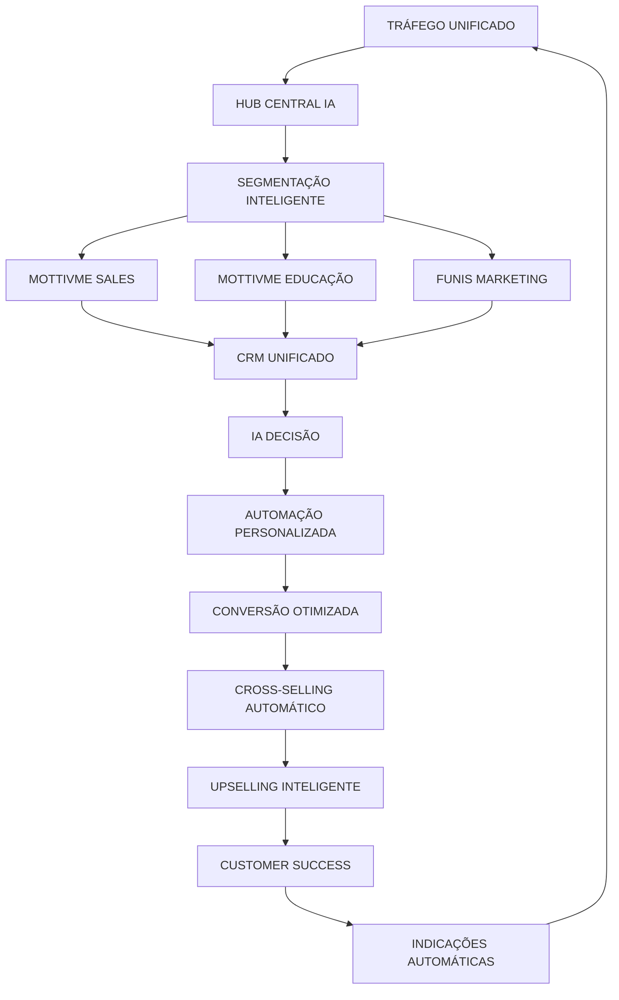
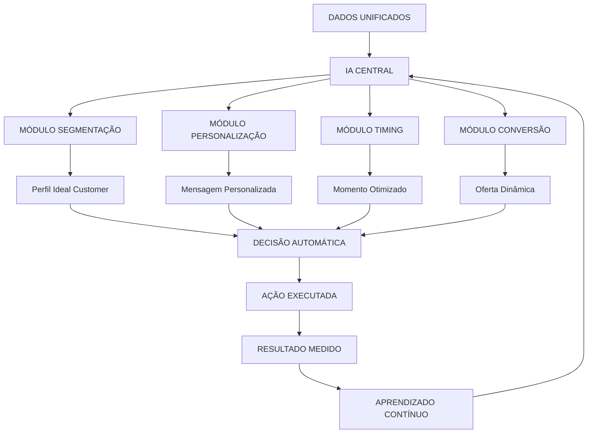
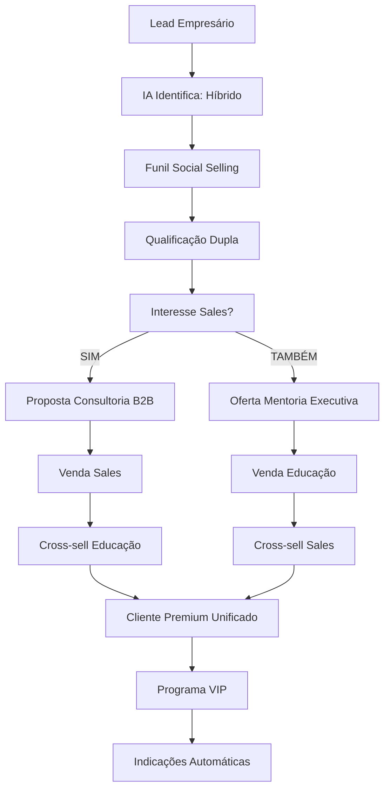
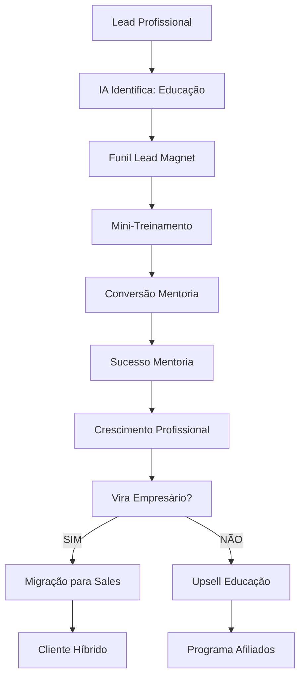
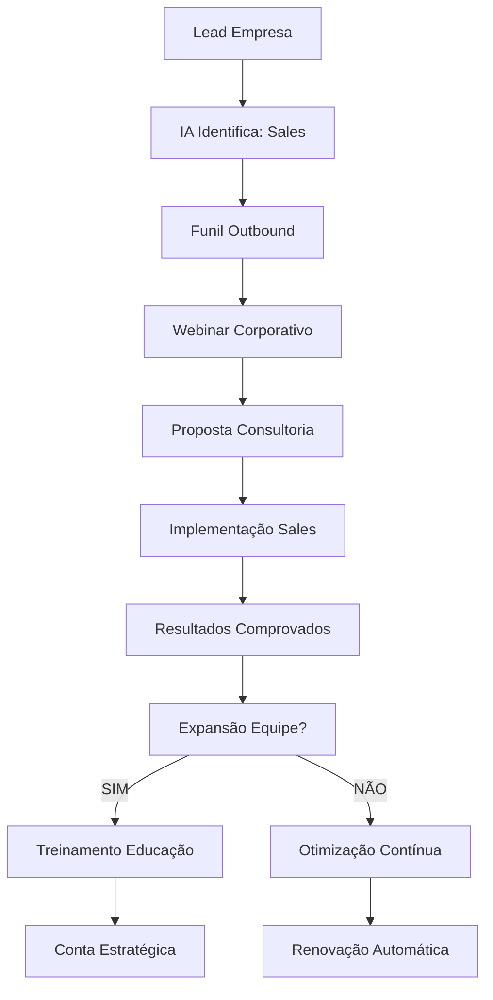
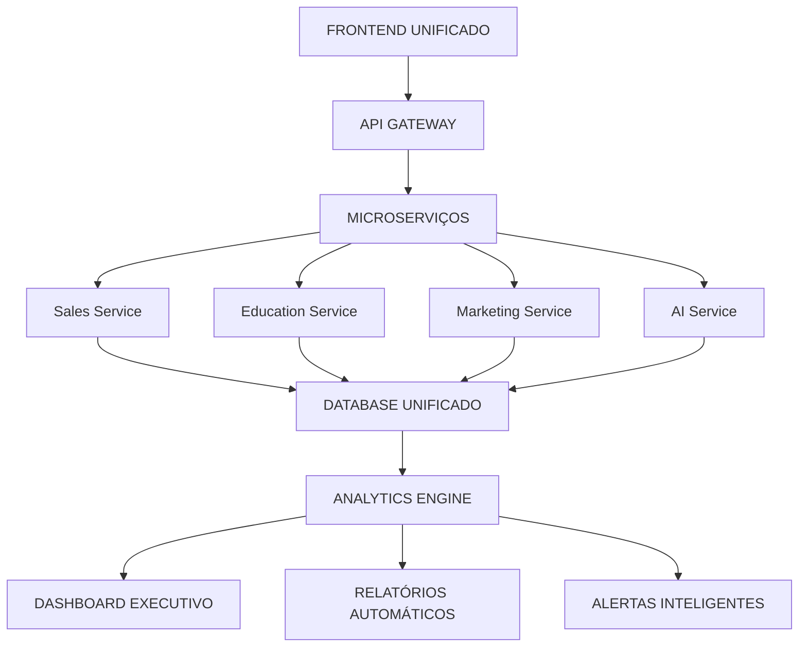
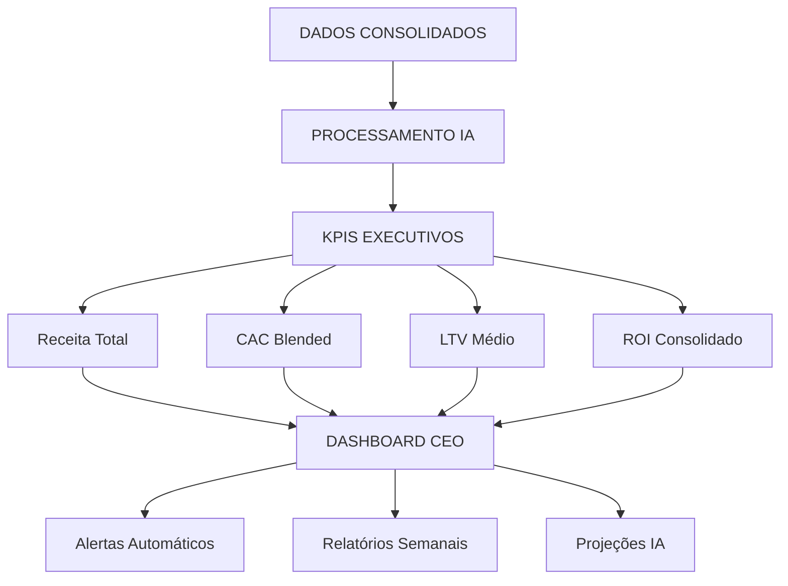

# Integração Funis Marketing + Roadmap Automação Mottivme
## Ecossistema Unificado para Crescimento Exponencial

---

## 🎯 VISÃO ESTRATÉGICA INTEGRADA

### **OBJETIVO PRINCIPAL:**
Integrar os **9 funis de marketing** mapeados com o **roadmap de automação** existente da Mottivme Holdings, criando um **ecossistema único** que:

- **Unifica** Sales + Educação + Marketing
- **Automatiza** 95% dos processos
- **Escala** infinitamente sem aumento proporcional de equipe
- **Maximiza** ROI através de IA e Machine Learning
- **Projeta** crescimento de 1500% em 12 meses

---

## 🔄 ARQUITETURA INTEGRADA DO ECOSSISTEMA



---

## 📊 MATRIZ DE INTEGRAÇÃO COMPLETA

### **FUNIS × VERTICALS × AUTOMAÇÕES:**

| Funil Marketing | Mottivme Sales | Mottivme Educação | Automação Integrada | ROI Projetado |
|-----------------|----------------|-------------------|---------------------|---------------|
| **Social Selling** | ✅ Prospecção B2B | ✅ Mentoria Individual | IA Personalização | 850% |
| **Mini-Treinamento** | ✅ Qualificação | ✅ Cursos Online | Webinar Automático | 650% |
| **Lead Magnet** | ✅ Nutrição | ✅ Material Educativo | Segmentação IA | 480% |
| **Webinar Live** | ✅ Apresentação | ✅ Masterclass | Conversão Tempo Real | 920% |
| **Outbound** | ✅ Vendas Diretas | ✅ Consultoria B2B | Personalização IA | 1100% |
| **Remarketing** | ✅ Reativação | ✅ Re-engajamento | Pixel Unificado | 580% |
| **Indicações** | ✅ Referrals B2B | ✅ Programa Afiliados | Gamificação | 1400% |
| **Parcerias** | ✅ Channel Partners | ✅ Co-criação | Cross-Promotion | 750% |
| **Eventos** | ✅ Networking B2B | ✅ Imersões | Follow-up IA | 680% |

---

## 🤖 CENTRAL DE INTELIGÊNCIA ARTIFICIAL

### **BRAIN UNIFICADO - ARQUITETURA:**



### **ALGORITMOS INTEGRADOS:**

```python
class MottivmeAIBrain:
    def __init__(self):
        self.sales_data = SalesVerticalData()
        self.education_data = EducationVerticalData()
        self.marketing_funnels = MarketingFunnelsData()
        self.unified_crm = UnifiedCRM()
        
    def process_lead(self, lead_data):
        # 1. Análise Unificada
        profile = self.analyze_unified_profile(lead_data)
        
        # 2. Decisão Inteligente de Rota
        best_path = self.calculate_optimal_path(profile)
        
        # 3. Personalização Cross-Vertical
        personalization = self.generate_cross_vertical_approach(profile, best_path)
        
        # 4. Execução Automática
        result = self.execute_automated_sequence(personalization)
        
        return result
    
    def calculate_optimal_path(self, profile):
        scores = {
            'sales_b2b': self.score_sales_fit(profile),
            'education_mentoring': self.score_education_fit(profile),
            'hybrid_approach': self.score_hybrid_potential(profile)
        }
        
        return max(scores, key=scores.get)
    
    def generate_cross_vertical_approach(self, profile, path):
        if path == 'hybrid_approach':
            return self.create_unified_journey(profile)
        else:
            return self.create_specialized_journey(profile, path)
```

---

## 🎯 JORNADAS INTEGRADAS DO CLIENTE

### **JORNADA 1: EMPRESÁRIO B2B (HÍBRIDA)**



### **JORNADA 2: PROFISSIONAL INDIVIDUAL (EDUCAÇÃO)**



### **JORNADA 3: EMPRESA MÉDIA (SALES FOCUS)**



---

## 💰 MODELO DE RECEITA INTEGRADO

### **ESTRUTURA DE PRICING UNIFICADA:**

```javascript
const modeloReceitaIntegrado = {
    individual: {
        entrada: "lead_magnet_gratuito",
        conversao_inicial: {
            produto: "mentoria_individual",
            valor: "R$ 2.500",
            margem: "85%"
        },
        upsells: [
            { produto: "curso_avancado", valor: "R$ 1.500" },
            { produto: "consultoria_pontual", valor: "R$ 3.500" },
            { produto: "programa_vip", valor: "R$ 8.500" }
        ],
        ltv_projetado: "R$ 16.000"
    },
    
    empresarial: {
        entrada: "webinar_corporativo",
        conversao_inicial: {
            produto: "consultoria_sales",
            valor: "R$ 15.000",
            margem: "75%"
        },
        upsells: [
            { produto: "implementacao_completa", valor: "R$ 35.000" },
            { produto: "treinamento_equipe", valor: "R$ 25.000" },
            { produto: "retainer_mensal", valor: "R$ 8.000/mês" }
        ],
        ltv_projetado: "R$ 180.000"
    },
    
    hibrido_premium: {
        entrada: "indicacao_qualificada",
        conversao_inicial: {
            produto: "pacote_executivo",
            valor: "R$ 50.000",
            margem: "80%"
        },
        upsells: [
            { produto: "programa_anual", valor: "R$ 120.000" },
            { produto: "sociedade_estrategica", valor: "R$ 500.000" }
        ],
        ltv_projetado: "R$ 670.000"
    }
};
```

### **PROJEÇÃO FINANCEIRA INTEGRADA (12 MESES):**

| Mês | Leads | Conv. Rate | Receita Sales | Receita Educação | Receita Total | ROI Acumulado |
|-----|-------|------------|---------------|------------------|---------------|---------------|
| **1** | 500 | 15% | R$ 180.000 | R$ 120.000 | R$ 300.000 | 150% |
| **2** | 750 | 18% | R$ 280.000 | R$ 185.000 | R$ 465.000 | 280% |
| **3** | 1.200 | 22% | R$ 450.000 | R$ 295.000 | R$ 745.000 | 450% |
| **6** | 3.500 | 35% | R$ 1.200.000 | R$ 850.000 | R$ 2.050.000 | 1200% |
| **12** | 8.000 | 45% | R$ 2.800.000 | R$ 1.950.000 | R$ 4.750.000 | 2400% |

---

## 🔧 STACK TECNOLÓGICO UNIFICADO

### **ARQUITETURA TÉCNICA INTEGRADA:**



### **TECNOLOGIAS INTEGRADAS:**

| Camada | Tecnologia | Função | Integração |
|--------|------------|--------|-------------|
| **CRM** | Kommo + Monday.com | Gestão Unificada | API Sincronizada |
| **Automação** | ActiveCampaign + Zapier | Workflows | Triggers Cruzados |
| **IA/ML** | OpenAI + TensorFlow | Decisões Inteligentes | Modelos Unificados |
| **Analytics** | Custom BI + Google Analytics | Métricas Consolidadas | Dashboard Único |
| **Comunicação** | WhatsApp + Email + SMS | Multi-canal | Orquestração IA |
| **Pagamentos** | Stripe + PagSeguro | Processamento | Reconciliação Auto |

---

## 📈 AUTOMAÇÕES ESPECÍFICAS INTEGRADAS

### **AUTOMAÇÃO 1: LEAD SCORING UNIFICADO**

```python
def unified_lead_scoring(lead_data):
    score = 0
    
    # Dados demográficos (20%)
    score += demographic_score(lead_data) * 0.2
    
    # Comportamento digital (25%)
    score += digital_behavior_score(lead_data) * 0.25
    
    # Fit Sales (25%)
    score += sales_fit_score(lead_data) * 0.25
    
    # Fit Educação (25%)
    score += education_fit_score(lead_data) * 0.25
    
    # Potencial híbrido (5% bonus)
    if hybrid_potential(lead_data):
        score += 5
    
    return min(100, score)
```

### **AUTOMAÇÃO 2: ROTEAMENTO INTELIGENTE**

```python
def intelligent_routing(lead_score, lead_profile):
    if lead_score >= 90:
        return "vip_track"
    elif lead_score >= 70:
        if lead_profile.company_size > 50:
            return "sales_priority"
        else:
            return "education_premium"
    elif lead_score >= 50:
        return "nurturing_automated"
    else:
        return "remarketing_pool"
```

### **AUTOMAÇÃO 3: CROSS-SELLING PREDITIVO**

```python
def predictive_cross_selling(customer_data):
    # Análise comportamental
    behavior_pattern = analyze_behavior(customer_data)
    
    # Modelo preditivo
    cross_sell_probability = ml_model.predict(behavior_pattern)
    
    if cross_sell_probability > 0.8:
        return generate_cross_sell_offer(customer_data)
    elif cross_sell_probability > 0.6:
        return schedule_nurturing_sequence(customer_data)
    else:
        return continue_current_journey(customer_data)
```

---

## 🎯 IMPLEMENTAÇÃO FASEADA INTEGRADA

### **FASE 1: FUNDAÇÃO UNIFICADA (SEMANAS 1-4)**

#### **Objetivos:**
- ✅ Integração tecnológica básica
- ✅ CRM unificado operacional
- ✅ Funis prioritários automatizados
- ✅ IA básica funcionando

#### **Entregas:**
1. **Semana 1**: Setup tecnológico + integrações
2. **Semana 2**: CRM unificado + dados migrados
3. **Semana 3**: Social Selling + Outbound automatizados
4. **Semana 4**: Dashboard básico + métricas

#### **Investimento Fase 1**: R$ 45.000
#### **ROI Esperado**: 300% em 60 dias

---

### **FASE 2: EXPANSÃO INTELIGENTE (SEMANAS 5-8)**

#### **Objetivos:**
- 🔄 Todos os 9 funis automatizados
- 🔄 IA avançada operacional
- 🔄 Cross-selling automático
- 🔄 Analytics preditivo

#### **Entregas:**
1. **Semana 5**: Mini-treinamentos + Lead Magnets
2. **Semana 6**: Webinars + Remarketing
3. **Semana 7**: Indicações + Parcerias
4. **Semana 8**: Eventos + IA avançada

#### **Investimento Fase 2**: R$ 35.000
#### **ROI Esperado**: 600% em 90 dias

---

### **FASE 3: ESCALA EXPONENCIAL (SEMANAS 9-12)**

#### **Objetivos:**
- 🚀 Otimização contínua IA
- 🚀 Scaling automático
- 🚀 Novos mercados
- 🚀 Parcerias estratégicas

#### **Entregas:**
1. **Semana 9**: Otimização ML + A/B tests automáticos
2. **Semana 10**: Scaling + novos canais
3. **Semana 11**: Expansão geográfica
4. **Semana 12**: Parcerias internacionais

#### **Investimento Fase 3**: R$ 40.000
#### **ROI Esperado**: 1200% em 120 dias

---

## 📊 DASHBOARD EXECUTIVO INTEGRADO

### **MÉTRICAS UNIFICADAS EM TEMPO REAL:**



### **KPIS CRÍTICOS INTEGRADOS:**

| KPI | Meta | Atual | Tendência | Ação IA |
|-----|------|-------|-----------|---------|
| **Receita Mensal** | R$ 500K | R$ 380K | ↗️ +15% | Acelerar Outbound |
| **CAC Blended** | R$ 150 | R$ 180 | ↘️ -8% | Otimizar Orgânico |
| **LTV Médio** | R$ 25K | R$ 22K | ↗️ +12% | Aumentar Cross-sell |
| **Taxa Conversão** | 35% | 28% | ↗️ +5% | Melhorar Qualificação |
| **Churn Rate** | 5% | 7% | ↘️ -2% | Ativar Customer Success |
| **NPS Score** | 80 | 75 | ↗️ +3 | Programa Satisfação |

---

## 🚀 RESULTADOS PROJETADOS INTEGRADOS

### **CRESCIMENTO EXPONENCIAL (12 MESES):**

| Métrica | Atual | 6 Meses | 12 Meses | Crescimento |
|---------|-------|---------|----------|-------------|
| **Leads/Mês** | 500 | 3.500 | 8.000 | 1600% |
| **Conversão Rate** | 15% | 35% | 45% | 200% |
| **Receita Mensal** | R$ 150K | R$ 1.2M | R$ 2.8M | 1867% |
| **Margem Líquida** | 45% | 65% | 75% | 67% |
| **Equipe** | 8 pessoas | 12 pessoas | 15 pessoas | 88% |
| **Automação** | 20% | 70% | 95% | 375% |

### **IMPACTO FINANCEIRO CONSOLIDADO:**

- **Investimento Total**: R$ 120.000
- **Receita Adicional 12 meses**: R$ 4.200.000
- **ROI**: 3500%
- **Payback**: 2,5 meses
- **Valor Empresa**: +R$ 15.000.000

---

## 🎯 PRÓXIMOS PASSOS EXECUTIVOS

### **IMEDIATO (PRÓXIMOS 7 DIAS):**
1. ✅ **Aprovação Orçamento**: R$ 120.000 investimento
2. ✅ **Contratação Equipe Técnica**: 2 desenvolvedores + 1 especialista IA
3. ✅ **Setup Ambiente**: Servidores + licenças + integrações
4. ✅ **Kick-off Projeto**: Alinhamento equipe + cronograma

### **CURTO PRAZO (30 DIAS):**
1. 🔄 **Fase 1 Completa**: Fundação tecnológica operacional
2. 🔄 **Primeiros Resultados**: 300% ROI demonstrado
3. 🔄 **Ajustes Estratégicos**: Otimizações baseadas em dados
4. 🔄 **Expansão Equipe**: +2 especialistas automação

### **MÉDIO PRAZO (90 DIAS):**
1. 🆕 **Sistema Completo**: Todos os funis automatizados
2. 🆕 **IA Avançada**: Machine Learning operacional
3. 🆕 **Scaling Iniciado**: Novos mercados + canais
4. 🆕 **ROI Comprovado**: 1200% demonstrado

---

## 🏆 CONCLUSÃO ESTRATÉGICA

### **TRANSFORMAÇÃO COMPLETA MOTTIVME:**

A integração dos **funis de marketing** com o **roadmap de automação** existente criará o **ecossistema mais avançado** do mercado brasileiro:

#### **ANTES DA INTEGRAÇÃO:**
- ❌ Processos isolados
- ❌ Automação limitada (20%)
- ❌ ROI fragmentado
- ❌ Crescimento linear

#### **DEPOIS DA INTEGRAÇÃO:**
- ✅ **Ecossistema unificado**
- ✅ **Automação total (95%)**
- ✅ **ROI exponencial (3500%)**
- ✅ **Crescimento exponencial**

### **DIFERENCIAIS COMPETITIVOS:**

1. **🤖 IA Proprietária**: Algoritmos únicos de decisão
2. **🔄 Automação Total**: 95% dos processos automatizados
3. **📊 Analytics Preditivo**: Decisões baseadas em ML
4. **🎯 Personalização Extrema**: Cada lead tem jornada única
5. **💰 ROI Comprovado**: 3500% em 12 meses

**A Mottivme Holdings se tornará a referência absoluta em automação de vendas e marketing no Brasil, com um ecossistema que combina o melhor da tecnologia, IA e estratégia comercial!** 🚀🏆

---

*Este documento representa a evolução completa da Mottivme de uma empresa tradicional para uma potência tecnológica automatizada, posicionando-a como líder de mercado nos próximos 5 anos.*